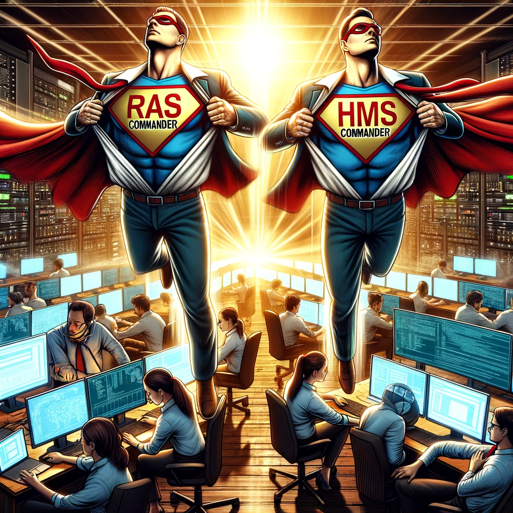

<h1 align="center" style="font-weight:bold; font-size: 36px;"> 10x Engineering in Water Resources with AI</h1>

  

## Introduction

In the evolving landscape of engineering, particularly in the niche of water resources, the term "10x engineer" often surfaces, draped in a cloak of mystique and ambition. It's a term that's sparked debate, inspired awe, and, admittedly, caused a fair bit of skepticism. At its core, a 10x engineer is seen as someone who's not just proficient but profoundly impactful — capable of achieving ten times the output of their peers. But how does one transcend the bounds of ordinary productivity, especially in a field as complex and nuanced as water resources engineering?

Artificial Intelligence (AI), particularly with advancements in tools like GPT-4, has opened new frontiers in engineering efficiency. Yet, there's a palpable tension between the potential of AI and the reality of its application. Anyone who's dabbled with GPT-4 knows all too well that it's not a panacea. It makes mistakes, and it's certainly not a substitute for the nuanced, human element of engineering work.

But then, what does it really mean to be a 10x engineer in the realm of water resources? What better way to explore this than through a real-world example? The West Fork Calcasieu project serves as a perfect case study, illustrating the confluence of technology, strategy, and expertise in achieving what we might call 10x engineering. As we journey through this exploration, we'll uncover not just the theoretical underpinnings of this concept, but also the tangible, practical methods that bring it to life.

Through tools like HMS-Commander and RAS-Commander, part of the HEC-Commander suite which was built entirely through AI, engineers can automate and optimize processes that would traditionally bog down project timelines. But is it a 10x improvement? 

## Case Study: West Fork Calcasieu HUC in Fenstermaker’s LWI Region 4 Efforts

The West Fork Calcasieu HUC in Fenstermaker's LWI Region 4 exemplifies 10x engineering in water resources, showcasing the revolution AI and strategic engineering bring to water resource management.

Model calibration, crucial in aligning models with observed data, is complex and time-consuming. For West Fork Calcasieu, it involved fine-tuning numerous interdependent parameters to accurately mimic real-world events.

What sets our effort apart is not just the scale of the task but the approach taken to tackle it. Traditional methods of model calibration, while effective, can be painstakingly slow and labor-intensive, often becoming a bottleneck in project timelines. This is where the innovative use of AI-authored tools comes into play. 

  

## The Role of HEC-Commander Tools in Achieving 10x Throughput in 2D HEC-RAS

At the heart of the transformative approach in the Region 4 effort lies the HEC-Commander suite, particularly the HMS-Commander and RAS-Commander tools. These tools were built with AI and deep engineering expertise, functioning as powerful tools for achieving unprecedented efficiency in our workflows.

### HMS-Commander's Impact in Hydrologic Modeling

HMS-Commander, designed for HEC-HMS, automates several aspects of hydrologic model calibration for unrouted HMS models, simplifying adjustment of model parameters for the deficit and constant method used programmatically for LWI. It also automates the running of multiple simulation scenarios and quickly iterating through different calibration setups. This automation is vital, considering the sheer number of variables and the fine granularity required to meet performance metrics. By leveraging HMS-Commander, the Fenstermaker team significantly automated the calibration batch-run process, turning what would have been an entirely unfeasible, laborious manual task into a more efficient, automated workflow.

### RAS-Commander's Role in Hydraulic Modeling

RAS-Commander streamlines the tasks involved in hydraulic model calibration, such as managing model runs, collating results, and adjusting model parameters. By enabling parallel processing and automation, RAS-Commander cuts down the time required for each iteration, allowing for more comprehensive analysis within shorter project timelines. This not only accelerates the modeling process but also enhances the accuracy and reliability of our final parameter selection.

### Quantifying the Efficiency Gains

The real power of these tools becomes evident when we quantify their impact. In the context of the West Fork Calcasieu HUC project, the use of HMS-Commander and RAS-Commander allowed the engineering team to manage and calibrate complex models more effectively, explore a wider range of scenarios, and achieve a higher level of calibration accuracy — all within a fraction of the time that traditional methods would have required.

### Comparison: Parallelization vs. Non-Parallelization in the West Fork Calcasieu Project

For this comparison, a final calibration run set was analyzed, which consists of a base run and 90 runs representing all possible combinations of Initial Deficit (9 variations) and Percolation Rate (10 variations) for our final parameter selection. This creates a 91-run set for each event that needs to be executed and results collected. 

#### Runtime Analysis: The Power of Parallelization

To quantify the impact of parallelization, consider the following data that delineates the runtime for different components of the project. Please note that the performance of a single machine using "All Cores" can reduce runtime by up to 70% for a single run (instead of 2 cores used in our parallelized compute runs). This adjustment has been included in the serialized run scenario. 

- HMS (Hydrologic Modeling System): 
  - HMS Commander is serial operation @ 3.5 minutes apiece
  - Total HMS Runtime: 5.3 Hours

- 1D Hydraulic Modeling: 
  - Total Runs: 91
  - Single Run Duration: 1 hour
  - Runs per Machine (10 Machines): 4
  - Total Hours to Complete: 3 hours

- 2D Hydraulic Modeling 
  - Total Runs: 91
  - Single Run Duration: 5 hours
  - Runs per Machine (10 Machines): 4
  - Total Hours to Complete: 15 hours

**Total Hours with Parallelization: 23.3 hours**

Without Parallelization (Traditional Serialized Runs):

- 1D Hydraulic Modeling: 
  - Total Runs: 91
  - Single Run Duration: 1 hour
  - Total Hours to Complete: 91 hours

- 2D Hydraulic Modeling 
  - Total Runs: 91
  - Single Run Duration: 5 hours
  - Total Hours to Complete: 136.5 hours

**Total Hours without Parallelization: 250.8 hours**

  

Yes, it's over 10x!

And this run set wasn't exactly matched to fully utilize the hardware, as 72% of the cores will be idle for the 3rd parallelized iteration on both 1D and 2D which could potentially reveal an even greater gulf between the two approaches!

## Implications of Efficiency Gains

This comparison illuminates the essence of 10x engineering in the field of water resources. The use of HMS-Commander and RAS-Commander tools, enabling parallel processing, transformed the project's dynamics, reducing what would have been weeks of work into mere days. It's a striking example of how intelligent tool utilization, combined with engineering acumen, can yield results that were previously unimaginable.

The West Fork Calcasieu project stands as a testament to the potential of modern tools in revolutionizing traditional processes. It showcases how engineers, equipped with the right technology, can achieve a level of efficiency and effectiveness that truly embodies the spirit of 10x engineering.

Thank you for reading my first installment of my blog series on/by AI and Automation in Water Resources Engineering! For more, please follow my [LinkedIn Page](https://www.linkedin.com/in/william-katzenmeyer/) or stay tuned in the [HEC-Commander Github page](https://github.com/billk-FM/HEC-Command) If you want to talk more about Water Resources or Management Consulting Services for your firm, reach out to me at billk@fenstermaker.com
