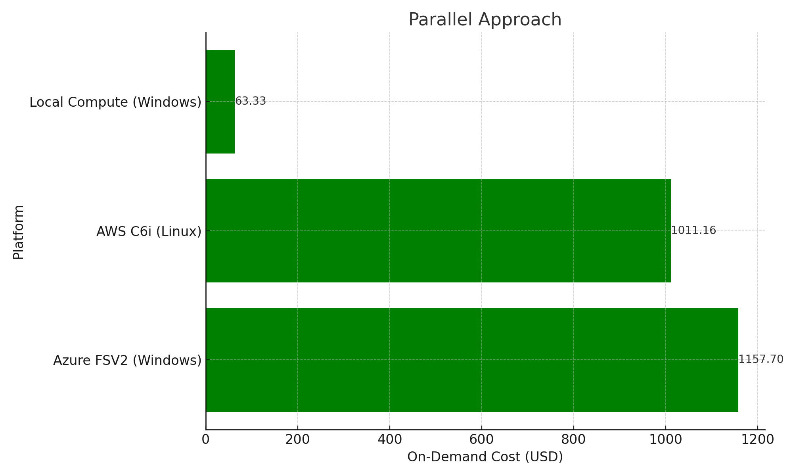
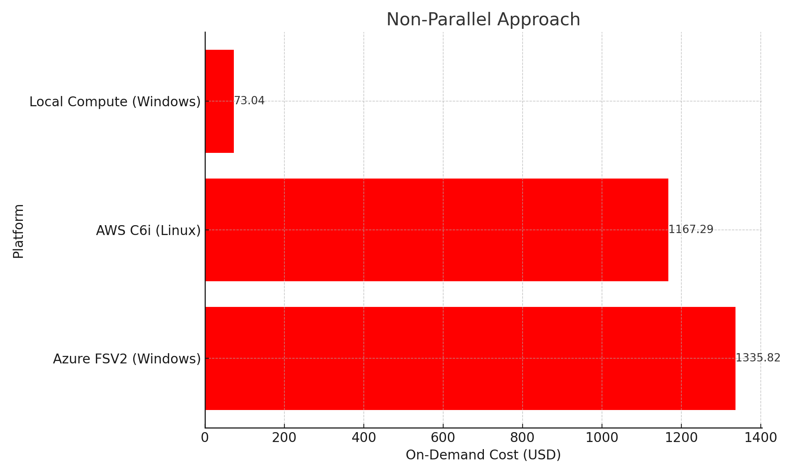

# From 10x to 0.25x Engineering: By The Numbers

10x Engineering with AI: By the Numbers
Introduction
This is a follow-up to my previous post about 10x engineering and water resources. The shrewd reader who looked at the numbers should have come away asking, “You only use 10 machines. How did you get a greater than 10x speed improvement?” It's a valid question that highlights the core of 10x engineering - not just scaling up resources, but also optimizing them with a data-driven approach.  The foundation of this approach was benchmarking large 2D HEC-RAS models to understand how they scale

Fenstermaker's local compute cluster was utilized as a baseline, and runtimes for the benchmark model were converted to unit runtimes.  This allows a direct comparison across platforms with greater unit runtimes denoting slower overall model performance, and lower unit runtimes indicating faster overall model performance.  These findings are summarized on the slide below:

  

# Linear vs Nonlinear Scaling
To optimize for throughput in a parallelized scenario, the number of paralell runs per machine (and core count) should maximize efficiency.  In the slide above, it is apparent that runs at 1 core or 2 cores have very similar efficiency.  This is due to the internal architecture of the chips, L3 cache sharing, etc.  After 2 cores, adding more cores causes a large drop in overall efficiency.  Therefore, where throughput is a priority, a 2 core configuration was used.  This strategy is described in the slide below as giving 70% to gain 70%: 

  

This demonstrates that the power of parallelization is not just in the ability to run multiple plans at once, but to also optimize efficiency. 

  
# Insights on Efficiency Optimization
By optimizing the core count and parallelizing just 3 runs per machine, up to 70% greater throughput per machine was achieved for throughput-dependent worlflows.  This configuration also leaves spare capacity for the user to perform other operations without significant slowdonw.  This scaling and efficiency relationship has been consistently demonstrated across many 2D HEC-RAS models of varying size, complexity and stages of model development, and is fundamentally linked to the types of mathematical operations being performed and how the data is synced across cores. 

* By maximizing single core clock speed, the linear scaling was maximized, lowering unit runtime.  

* By maximizing efficiency with 2-core runs and paralellization, an additional 70% throughput per machine was realized.  

The impact of clock speed on overall performance will be apparent in the sections below, where a typical midrange desktop and cloud options unit runtimes are compared with an optimized local compute cluster.  

  

  

# Local Compute vs Cloud Costs

## Introduction to Benchmarking and Data Driven Analysis

In addition to the previously noted benchmarking model, detailed modeling was conducted on a wide range of publicly available cloud systems.  This included opening, closing and saving 2D HEC-RAS projects, as well as performing common RASMapper geometry and terrain operations.  This real-world testing is a better measure than the synthetic testing or promised specifications/performance from vendors.  

## The Latency Impact of Cloud Systems on GIS Operations

A critical aspect contributing to this downturn is the inherent latency issues in cloud systems, which significantly impede GIS operations. For water resource engineers, GIS tools like ArcGIS, QGIS and RASMapper are essential. However, benchmarking reveals that operations within RASMAPPER – including opening, closing, saving, and editing terrains – are 20-80% slower on cloud systems, averaging around a 60% reduction in performance. This slowdown isn't just a minor inconvenience; it's a substantial barrier for any serious large-scale work on these platforms.  This 60% reduction in performance, compounded by user interface delays, creates a ripple effect. Tasks that were once quick and efficient become drawn-out ordeals, significantly impacting project timelines and productivity on even the fastest available cloud storage systems. The impact is not just felt in the time taken to complete these tasks but also in the quality of work. Engineers, bogged down by sluggish systems, are unable to perform at their best, leading to a cascading effect on overall project outcomes.

## Local vs. Cloud Infrastructure for 2D HEC-RAS

When it comes to HEC-RAS modeling, the choice between local and cloud infrastructure becomes critical. Local setups, even those as simple as a workstation with a USB-C hard drive, generally outperform their cloud counterparts for these specific tasks. 

Public cloud infrastructures, despite their massive scale and resources, consistently fall short in meeting the unique demands of HEC-RAS, RASMapper and 2D models. The scale efficiencies of cloud systems, often touted as their biggest advantage, are achieved through specific approaches that don't match well with HEC-RAS's 2D compute requirements.  This is primarily due to the low clock speeds typically available, and the limited thermal footprint available in cloud facilities at scale.  This drives cloud providers to select hardware platforms and CPU die packages that take advantage of the nonlinear relationship between per-cycle efficiency, core voltage and clock speed, always resulting in lower overall clock speeds per CPU core.  This allows for a greater number of cores to be added per GHZ of base clock frequency that is traded off.  For vendors that sell VCPU's, there is also a great financial incentive built into their hardware platform selection which is reprsented in the customer-facing public cloud options.  

When CPU's are not being placed in an arrangement where thermal density and core count are not being maximized, better performance characteristics are observed for single-thread-dependent applications, which still comprise the majority of water resources workflows.  In addition, other shared infrastructure such as storage, memory, VM overhead and the "noisy neighbor" effect compound these inefficiencies.  This is evident when testing consumer-grade desktops with equivalent cloud instances on the same chipset generation, and observing that the desktop consistently outperforms, even when adjusted for lower clock speeds.  

   

    
  

  

 ## "Elastic" Storage Behavior 
 
For tasks like RASMAPPER operations and HEC-RAS modeling, which involve frequent, small-scale data read/write operations, these performance costs can be particularly burdensome, leading to significant inefficiencies.  

Structural engineering introduces the concept of a materials "elastic" and "inelastic" deformation behavior. Storage systems have a similar elastic behavior between total input/output operations per second (IOPS) and average latency.  The goal of a cloud provider is to balance loading across file systems to achieve an acceptable minimum latency while serving as many IOPS as possible, and never straying into the "inelastic" range where latency increases exponentially with additional demand.  This fundamental tradeoff of shared infrastructure is manageable with applications that are optimized for that environment, but most desktop GIS applications do not fall into that category.  These limitations become even more magnified with larger datasets.  A typlical modelers workflow is dominated by applications that are not optimized for that environment, exacerbating the performance impacts of poor single-threaded performance with potentially jagged and unpredictable file system performance.

## Latency Challenges for GIS Workflows in the Cloud

The inefficiencies of cloud infrastructure become even more pronounced when examining the workflows common in GIS operations. These workflows often involve numerous small, frequent data transactions – a type of operation that cloud systems are not optimized for. HEC-RAS modeling, which lacks GPU acceleration and is heavily reliant on sequential data access, is notably ill-suited for the cloud environment.

This mismatch leads to a marked decrease in efficiency. What might be a routine operation on a local setup becomes a sluggish and frustrating process on cloud platforms.  The implications of these challenges are profound. They not only affect the day-to-day work of engineers but also have broader implications for project timelines, costs, and ultimately the effectiveness of water resource management strategies.  While tools do exist to help ameliorate these limitations and optimize workflows and data types for the cloud, a windows desktop-based virtual machine running QGIS or ArcGIS Pro typically does not benefit from those optimizations.  RASMapper also suffers from the same limitations, with most operations being totally single-threaded.  HDF file access patterns exhibit the same sensitivity to storage latency as geometry, terrain and map layer operations, rendering them difficult to transition to cloud-based platforms without significant performance impacts.  

## Industry Trends vs. Practical Insights

Despite the growing trend towards cloud adoption in various sectors, including water resources engineering, practical experiences paint a different picture. Specifically, for HEC-RAS modeling, the movement towards cloud infrastructure appears to be more of a step backward than forward. This viewpoint is not just based on theoretical assumptions but is rooted in real-world experiences and extensive benchmarking.

As someone deeply embedded in the industry, I offer these insights not just as observations but as a caution to my fellow professionals and LinkedIn followers. The allure of cloud computing, with its promise of scalability and ease of access, can be tempting. However, it's crucial to assess the suitability of these systems for specific applications like HEC-RAS modeling.  Blind adoption of cloud solutions, without considering their impact on productivity and project outcomes, can lead to significant setbacks.

## Local compute vs Best Public Cloud

The combination of a less thermally dense die package, lack of adjacent thermal demands and direct control of the hardware means a significant performance improvement can be observed at low load levels.  This supports qualtiative observations that local compute options are consistently faster in single-threaded applications when no other significant loads are present.  

  

  

  

Please note that the "best" public cloud is likely no longer the AWS C6i (this benchmarking was performed in 2022).  Both the workstation and cloud instance are based on the same architecture, with the similar advertised sustained overclock rates.  The performance difference is most evident when the die is not pushing its thermal envelope. 

Given this comparison, it is clear just from the unit runtimes that even the best public cloud is up to 1.5x slower on a unit runtime basis and other major competitors are up to 2.5x slower.  This is due to slower clock speeds and cloud-infrastructure related overhead and thermal profile, along with the unpredictability adjacent thermal demands on-die.  And if you look closely, you will see that an optimized workstation is still around 2.0-2.5x faster than the AWS C6i instance *at 8 cores*.  This will be important in the cost analysis section.

  

  

  

With all 24 local cores engaged, hyperthreading enabled, and the die reaching thermal saturation, the performance of the two platforms coverges.  This is the typical performance profile for most users defaulting to "All Cores", and without any special CPU optimizations.  With that configuration one may not even notice a difference between platforms from a performance perspective.  

* Running the model at the optimum performance point of 8 yielded the best results for local compute
* Disabling Hyperthreading and Efficiency Cores + Installing Intel XTU Tuning improved performance by ~10%
* With only 8 logical cores being revealed to the operating system, "All Cores" defaults to the best performance for a single run, without the penalty observed when using 10+ cores

While runtimes did converge when the local compute was pushed into its suboptimal performance range, it should be noted that this comparison is between a cloud Linux instance and a local Windows instance, and a consistent 15% advantage was observed across all hardware configurations when the Linux solver was used vs the Windows solver.

Next, let's look at the costs: 

## Cost and Performance Analysis: Cloud vs. Local Servers

The decision between cloud and local server setups isn't just a matter of performance; it also has significant cost implications. Through our previous calculations, we've seen that while cloud instancesmight seem economical at $1.30-$1.45 per hour for a compute instance, over an extended period, the costs add up. More importantly, when you factor in the 1.5x to 2.5x performance hit for CPU-bound tasks like HEC-RAS modeling, the economic equation becomes harder to judge from a surficial review of the hardware statisitcs.

Considering this performance hit, alongside data and storage latency issues inherent in cloud machines, local servers offer not only better performance but also better value for money. They handle operations faster and more efficiently, leading to shorter project timelines and lower overall costs. For resource-intensive tasks typical in water resource engineering, this can mean the difference between meeting project deadlines and budget overruns.

## Compute Cost Case Study using West Fork Calcasieu

In this case study, we'll apply our findings on cloud computing costs to the real-world scenario of the West Fork Calcasieu project, which was covered in Blog Post #1. This analysis will include detailed cost comparisons between cloud-based and local server setups, incorporating all the factors discussed previously, including the performance impacts and practical implications.

From Blog Post #1, the runtimes using Fenstermaker's local compute cluster for West Fork Calcasieu final run set were as follows:

Task Component	Hours with Parallelization	Hours without Parallelization
HMS	10.62	10.62
1D Modeling	5	182
2D Modeling	20	218.4
Total	35.62	411.02

Using these total # of hours, as well as an adjustment to account for the higher unit runtimes  of a typical cloud instance, the following costs were calculated: 

## Calculated Cost to Compute 91-Run Final Calibration Set for West Fork Calcasieu HUC
| Compute Option                | Approach      | On-Demand Cost Per Hour | Compute Time (Hours) | Unit Runtime | On-Demand Cost (USD) 
| ----------------------------- | ------------- | ----------------------- | -------------------- | ------------ | ---------------- 
| Azure FSV2 (Windows)          | Parallel      | $1.30                   | 35.62                | 2.5x         | $115.77               
| Azure FSV2 (Windows)          | Non-Parallel  | $1.30                   | 411.02               | 2.5x         | $1,335.82                
| AWS C6i (Linux)               | Parallel      | $1.42                   | 35.62                | 2.0x         | $101.16               
| AWS C6i (Linux)               | Non-Parallel  | $1.42                   | 411.02               | 2.0x         | $1,167.29
| Local Compute (Windows)       | Parallel      | $0.17                   | 35.62                | 1.0x         | $6.33 (Amortized 5-YR)     
| Local Compute (Windows)       | Non-Parallel  | $0.17  (Amortized)      | 411.02               | 1.0x         | $73.04 (Amortized 5-YR)

  

  

  

  

  

Generally, the poor performance of cloud resources leads to an oversubscription of resources in an attempt to reduce runtimes.  This leads to even higher total costs than the idealized minimum compute cost computed above.  The most inefficient configurations are typically the large instances offering up to 48 to 96 VCPU's and a large pool of memory as a single instance.  Unfortunately, these types of instances are routinely recommended by IT professional who are accustomed to more cloud and web-oriented software demands.  Software as a Service (SaaS) models have become predominant in so many fields of software development, and optimization for cloud environments in increasingly prevalent.  Unfortunately, this industry progression and optimization has actually moved further away from the optimal setup for a GIS user or Flood Modeler using HEC-RAS, and leads to many unfortunate decisions to be made in regards to infrastrucure platforms, hamstringing personnel with performance that can be significantly slower than a midrange deskop, at a price that could have easily accumulate to much greater amounts than the cost of an equivelent optimized solution under even modest project demands.  Thus, cloud systems should only be used for the most demanding and largest workloads (thousands of runs).  In the realm of tens to hundreds, to even a thousand or more runs over the course of a typical project development cycle, local compute is likely to prove to be the most economical option, especially if machines can by dynamically utilized for both model development and as spare compute capacity at the same time.         

**Implications for Water Resources Engineering Projects:**

This case study underscores a crucial consideration for engineering projects: the need to balance cost and performance when choosing between cloud and local infrastructure, as well as truly understanding the problem with a data-driven approach before attempting to architect solutions. While cloud systems offer scalability and accessibility, they may not always be the most cost-effective or efficient choice for specific engineering tasks, particularly those involving intensive GIS operations and HEC-RAS modeling, or routine batched run sets that are commonly prepared during model development, calibration and validation for large 2D models.  

In conclusion, this additional case study using the West Fork Calcasieu HUC provides a clear, quantitative perspective on the economic and performance trade-offs of cloud vs. local computing. It serves as a guide for water resource engineers and decision-makers, emphasizing the importance of a nuanced approach to infrastructure choices, one that aligns with the specific demands and objectives of each project.

# From 10x to 0.25x: By the Numbers 

Now, lets think like a 10x engineer.  In Blog Post #1, we already explored how AI-assisted scripting helped to enable batched-run approaches that proved over 10x throughput increase just by utilizing 10 machines and opimizing our core count for efficiency.  Le'ts look at how we stacked gains to get there:

  

How can I take a 10x engineer and turn them into a 1x engineer?  Discourage the utilization of AI and don't even try to automate your workflows.  But how do you take a 1x engineer and ensure they can never perform better than a 0.25x?  Put them on a typical public cloud backend and ask them to create large 2D HEC-RAS models.  To add insult to injury, if you compare the cost of the local compute vs the non-parallel approaches above, its clear that if you even attempt to throw money at the problem and try to do the same tasks as the 10x engineer, you'll get a 20x higher compute bill, too!

To encapsulate this in an image, I asked ChatGPT (DALL-E 3) to depict Honey I Shrunk the Engineer to 0.25x: 

  

And it also came up with this one, another variation of 90's classics with an image depicting Steve Urkel humorously using a laser to transform a pile of money into a cloud:

  

**A Call to Action:**

This case study and analysis serve as a cautionary tale for the engineering community. Critically assess the tools and technology options in a data-driven way can yeild great benefits, or the lack hereof can serve as a great impediment.  We often think that the difference between a 10x engineer and a 0.25x engineer is something innate to the person, their motivation level or intelligence.  But in fact very fundamental technology/infrastructure decisions and the embrace of AI technologies can easily bridge a gap that wide, and then some.  

Thank you for reading my second installment of this blog series on/by AI and Automation in Water Resources Engineering! For more, please follow my [LinkedIn Page](https://www.linkedin.com/in/william-katzenmeyer/) or stay tuned in the [HEC-Commander Github page](https://github.com/billk-FM/HEC-Command)
