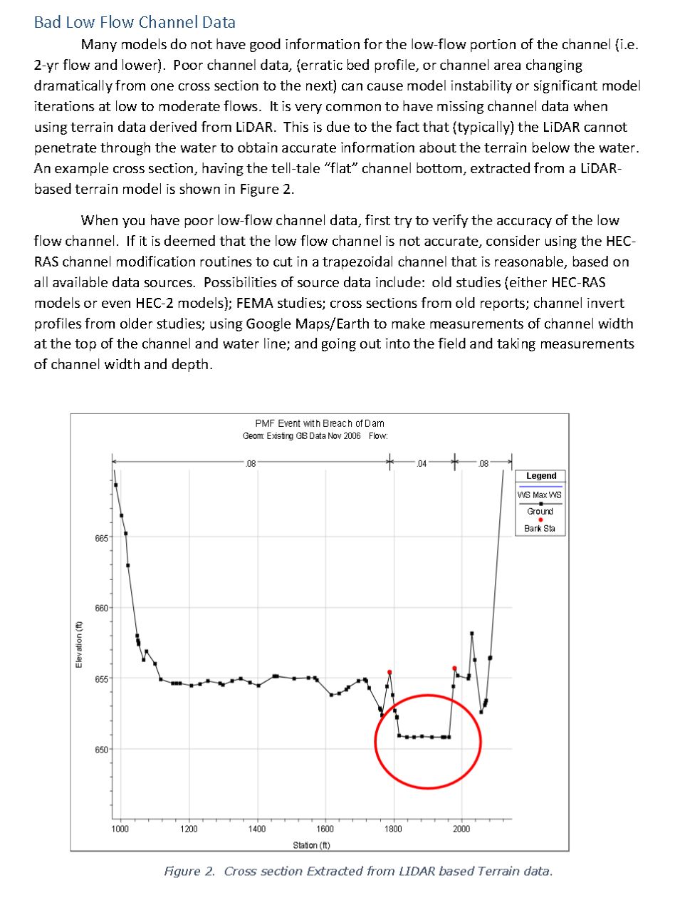

# Using Terrain Mods on Your LIDAR Defined Channels

I came across this tip in a random HEC-RAS tips and tricks document and wanted to share. We have been doing this on our models internally for some time, by using the RASMapper Terrain Modifications layer for low detail channels. By conceptualizing it as a pilot channel, we were able to achieve some very significant performance gains with very minimal computational impact.

Since RAS is actually solving using tables, if the bottom is flat sometimes it can't find an answer between the 0 point and the first interval defined in the table. 1D is especially susceptible to this, and will generally go unstable with a telltale large step-increase in depth at that cross section. The 2D solver is more robust, but that robustness is actually a weakness as this can notoriously hide computational effort during low flows and lead modelers to believe that making modifications on lidar-defined channels is not necessary or prudent.

From the screenshot/document linked below:
"If it is deemed that the low flow channel is not accurate, consider using the HEC-RAS channel modification routines to cut in a trapezoidal channel that is reasonable"

  

With RASMapper's terrain modifications tools, you can just copy your channel centerlines for lidar-defined channels into a RASMapper terrain modifications layer, set a 1ft bottom width (or as appropriate for the channel), and define some bottom points along the lowest points in your profile to filter noise and provide a pilot channel to prevent a flat bottom. The most difficult part of the process is manually defining the STA-ELEV points for the terrain modification profile. And the profile generation could be easily automated with ChatGPT (stay tuned).

Implementing this can easily cut a model's runtime down by 50-75% or more from an unoptimized setup. And because HEC-RAS iterates until *all* nodes are within the WSEL tolerance, it's the least inefficient element in your model that determines the runtime. So you can't just do this to a single channel and expect an improvement, but when you fix the last lidar-defined profile, it usually produces a step-wise improvement in runtime. Because unrealistically flat-bottom and/or tree cover causing noisy profiles in channels presents computational difficulty at low flows (the start/end of your simulations), grinding away iterations needlessly on the least valuable information, in locations where you have the lowest data confidence.

The document I sourced this from is buried in the HEC-RAS documentation. I have the link up from browsing around the confluence site, but now that I am looking for the page I found it on, I'm failing. There are lots of good tips in here, this is just the one we have found great success with, but doesn't seem to be as widely appreciated or regularly implemented.

Source: [Making Your HEC-RAS Model Run Faster](https://www.hec.usace.army.mil/confluence/rasdocs/hgt/files/latest/91881845/105585053/2/1658159468274/Making+HEC-RASModels+Run+Faster.pdf)

More Info: [Optimizing Your Computer for Fast HEC-RAS Modeling](https://www.kleinschmidtgroup.com/ras-post/optimizing-your-computer-for-fast-hec-ras-modeling/)
