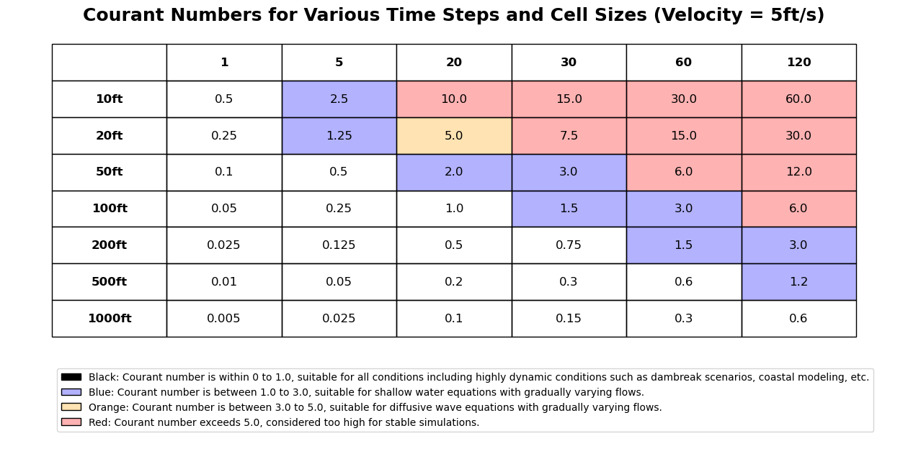

# Courant Rules Everything Around Me 
## Balancing Accuracy, Resolution, and Efficiency in Large-Scale HEC-RAS Modeling 

<p align="center">
  
</p>
 
## I. Introduction

In HEC-RAS modeling, we often find ourselves grappling with complex challenges that demand innovative solutions. Just as the Wu-Tang Clan once declared that "Cash Rules Everything Around Me" in their iconic song "C.R.E.A.M.," we modelers might say that "Courant Rules Everything Around Me" The Courant number, a key factor in model stability and performance, is a critical consideration in our quest to build accurate, efficient, and scalable models.

As we tackle increasingly large-scale modeling projects, we find ourselves at a crossroads. How do we balance the need for high-resolution, accurate results with the practical constraints of computational resources and project timelines? In this blog post, we'll explore this central challenge and discuss strategies for finding the optimal balance between accuracy, resolution, and efficiency in large-scale hydraulic modeling.

## II. HEC-RAS Guidance on Grid Size and Time Step Selection

The developers of HEC-RAS have provided valuable guidance on selecting appropriate grid sizes and time steps for 2D modeling. They emphasize the importance of creating a computational mesh that accurately represents the terrain, flow paths, and hydraulic controls. HEC-RAS employs a unique approach, using detailed elevation-volume/area relationships for cells and cross-sections for faces, which allows for larger cell sizes while still capturing the essential features of the terrain.

When developing a computational mesh in HEC-RAS, modelers should focus on aligning cell faces with barriers to flow, such as levees, roads, and natural high ground. Refinement regions along channel banks can help ensure proper separation of main channel and overbank flows. Additionally, cell sizes should be selected to adequately capture changes in water surface slope and velocity.

Once a suitable mesh is created, modelers must select an appropriate computational time step based on the cell size and flow velocity. HEC-RAS provides guidelines for choosing time steps based on the equation set being used (Shallow Water or Diffusion Wave) and the desired Courant number. The Courant number is a dimensionless value that relates the computational time step, cell size, and flow velocity:
```
C = VΔT / ΔX ≤ 1.0 (with a max C = 3.0 for Shallow Water Equations and max C = 5.0 for Diffusion Wave Equations)
```

Where:
- C = Courant Number
- V = Flood wave velocity (ft/s)
- ΔT = Computational time step (s)
- ΔX = Average cell size (ft)

Importantly, modelers are advised to test the consistency of their mesh and time step by running simulations with varying resolutions and time steps to assess the impact on results and performance. This process of testing and refinement is crucial for finding the sweet spot between accuracy and efficiency, particularly in large-scale modeling projects.

HEC-RAS provides a practical tip for estimating flood wave speed in natural cross-sections. The flood wave speed, which is a critical factor in determining an appropriate computational time step, can be approximated by multiplying the average velocity from HEC-RAS by 1.5. This rule of thumb is derived from the concept that the flood wave speed is typically faster than the average velocity of the water, particularly in the rising limb of the flood wave. 

Source: [HEC-RAS Hydraulic Reference Manual: Performing a Dam Break Study with HEC-RAS: Computational Time Step](https://www.hec.usace.army.mil/confluence/rasdocs/ras1dtechref/6.2/performing-a-dam-break-study-with-hec-ras/computational-time-step)
_"For practical applications of the Courant Condition, the user can take maximum average velocity from HEC-RAS and multiply it by 1.5, to get a rough estimate of flood wave speed in natural cross sections."_

A feature for querying summary statistics within RASMapper was present through version 6.3.1, and is still mentioned within the HEC-RAS documentation (under the [right-click context menu](https://www.hec.usace.army.mil/confluence/rasdocs/r2dum/latest/viewing-2d-or-1d-2d-output-using-hec-ras-mapper/dynamic-mapping) of the results layer in RASMapper). Versions after 6.3.1 are missing this feature. As a workaround, modelers can analyze maps in the older version to extract this average velocity, visually to estimate average velocities, or calculate the summary statistics using external tools or scripts until the feature is hopefully re-enabled in future versions.  

### Example Courant Number and Time Step Estimation
Using an assumed maximum velocity of 5ft/s, the courant numbers were calculated for a range of Computational Time Steps and Average Cell Sizes, as show below, using common thresholds for hydaulic conditions and equation sets:

<p align="center">
  
</p>

Using these tables, a rough estimate of minimum cell size can be estimated.  For smaller models, shorter timesteps may be feasible.  At larger modeling scales, there must be a careful balance between mesh scale and the underlying terrain features.  The code below can be utilized to help estimate your project-specific conditions:

Python Code to generate the Courant Number table above can be found by clicking on details:
<details>
 
```
import matplotlib.pyplot as plt
import numpy as np
import matplotlib.patches as mpatches

# Data for the table, adjusted for headers
data = [
    [0.5, 2.5, 10.0, 15.0, 30.0, 60.0],
    [0.25, 1.25, 5.0, 7.5, 15.0, 30.0],
    [0.1, 0.5, 2.0, 3.0, 6.0, 12.0],
    [0.05, 0.25, 1.0, 1.5, 3.0, 6.0],
    [0.025, 0.125, 0.5, 0.75, 1.5, 3.0],
    [0.01, 0.05, 0.2, 0.3, 0.6, 1.2],
    [0.005, 0.025, 0.1, 0.15, 0.3, 0.6]
]
row_labels = ["10ft", "20ft", "50ft", "100ft", "200ft", "500ft", "1000ft"]
col_labels = ["1", "5", "20", "30", "60", "120"]

# Adjusting data and colors for headers
adjusted_data = [[""] + col_labels] + [[row_labels[i]] + data[i] for i in range(len(data))]
transparent_blue = (0, 0, 1, 0.3)  # Blue with transparency
transparent_orange = (1, 0.64, 0, 0.3)  # Orange with transparency
transparent_red = (1, 0, 0, 0.3)  # Red with transparency
colors = [[(0, 0, 0, 0) if x <= 1 else transparent_blue if x <= 3 else transparent_orange if x <= 5 else transparent_red for x in row] for row in data]
adjusted_colors = [["#FFFFFF"] * (len(col_labels) + 1)] + [["#FFFFFF"] + row for row in colors]

# Create figure and add title with velocity note
fig, ax = plt.subplots(figsize=(16, 8))
ax.set_axis_off()
plt.title('Courant Numbers for Various Time Steps and Cell Sizes (Velocity = 5ft/s)', fontsize=18, weight='bold', y=0.96)

# Create table with adjusted data and colors
table = ax.table(
    cellText=adjusted_data,
    cellLoc='center',
    cellColours=adjusted_colors,
    loc='center',
    bbox=[0.05, 0.26, 0.9, 0.66]  # Adjust bounding box to fit the table and leave space for the legend
)

# Customize table
table.auto_set_font_size(False)
table.set_fontsize(12)
# Bold headers
for (i, j), cell in table.get_celld().items():
    if i == 0 or j == 0:
        cell.set_text_props(weight='bold')
        cell.set_fontsize(12)
table.scale(1.2, 1.2)


# Define legend
legend_elements = [
    mpatches.Patch(facecolor='black', edgecolor='black', label='Black: Courant number is within 0 to 1.0, suitable for all conditions including highly dynamic conditions such as dambreak scenarios, coastal modeling, etc.'),
    mpatches.Patch(facecolor=transparent_blue, edgecolor='black', label='Blue: Courant number is between 1.0 to 3.0, suitable for shallow water equations with gradually varying flows.'),
    mpatches.Patch(facecolor=transparent_orange, edgecolor='black', label='Orange: Courant number is between 3.0 to 5.0, suitable for diffusive wave equations with gradually varying flows.'),
    mpatches.Patch(facecolor=transparent_red, edgecolor='black', label='Red: Courant number exceeds 5.0, considered too high for stable simulations.'),

]

# Add legend to the plot
ax.legend(handles=legend_elements, loc='upper left', bbox_to_anchor=(0.05, 0.2))

plt.show()

```
 
</details>


## III. Scaling Approaches and Challenges in Efficient Large-Scale Modeling

While the HEC-RAS guidance on mesh design and time step selection provides valuable insights, it's important to recognize that it presents a highly deterministic view of terrain representation that may not always be achievable at every scale. The guidance emphasizes the inclusion of all significant terrain features, which can be challenging when working with large watersheds and complex urban environments.

In addition to the HEC-RAS guidance, there are numerous prescriptive regulatory documents and other guidance materials that specify minimum resolution requirements for hydraulic models. These standards often fail to consider the scalability issues that arise when applying them to very large watersheds. For example, modeling small structures or capturing intricate urban drainage patterns may be crucial for local-scale studies but can quickly become computationally infeasible when extended to a regional or watershed scale.

Modelers are often faced with conflicting priorities when attempting to adhere to these prescriptive standards while also striving for acceptable model performance. In urban areas, there may be seemingly critical ridgelines or terrain details that a modeler would insist on including at a local scale. However, when working with large watersheds, the significance of these features must be carefully evaluated in the context of the overall modeling objectives and computational constraints.

The reality is that, due to the inherent limitations of current modeling tools, it is not always possible to achieve the level of detail specified in prescriptive standards while maintaining a highly performant model at large scale. This can put modelers in a difficult position, particularly when the standards conflict with the practical realities of the project.  The outcome of this conflict often depends on the judgment and priorities of the individual engineer in charge of the project. Some may choose to avoid the issue altogether and deliver a model that meets the letter of the standards but fails to perform adequately. While this approach may feel like a conservative approach (prioritizing detailed analysis), it ultimately does a disservice to the project's objectives and the needs of the end-users.  

Furthermore, as we'll discuss in our next blog post, the rapid evolution of computing hardware can introduce additional variability and uncertainty into the modeling process. By providing transparency around performance requirements, including reference hardware specifications and benchmarking results, modelers can help ensure that their work remains relevant and valuable even as technology continues to advance.  Performance benchmarks can be difficult to enforce when large variations in hardware performance mean a large variance in actual runtimes for a given modeled event duration.

Ultimately, the key to success in large-scale hydraulic modeling lies in finding the right balance between adherence to standards, practical feasibility, and the delivery of reliable, actionable results. By approaching these challenges with flexibility, transparency, and a commitment to open communication, modelers can navigate the limitations of prescriptive guidance and deliver models that meet the needs of their clients and the communities they serve. 

## IV. Proposed Approach: Tiered Resolution with Constrained Cell Size Stratification

To address the challenges of large-scale hydraulic modeling, we propose a tiered resolution approach that balances the need for accuracy and efficiency. This strategy involves enforcing a minimum cell size throughout the model domain to manage computational demands, as well as constraining the range of cell sizes to the extent practicable by enforcing a maximum cell size.  This allows for strategic application of finer meshes in critical areas such as channels, key hydraulic controls, and regions of complex flow patterns.  The extent to which the stratification of cell size is constrained should be determined by the performance requirements.  A typical HUC-8 model may have cell sizes varying from 1000ft to 100ft(or smaller), while highly performant models such as in the case study below, where the cell sizes were constrained to 800ft maximum and 500ft minimum.  

To navigate these challenges effectively, it's crucial for modelers to have open and honest conversations with their clients about the tradeoffs between detail, accuracy, and performance. Establishing clear benchmarks for acceptable model performance, based on the project's specific goals and the available computational resources can help guide decision-making and set realistic expectations.  Where feasible, standards for large 2D models should be less prescriptive on cell size and instead emphasize the required differences of scale between large-scale and project-scale models.  Tiered resolution approaches are common in 2D modeling guidance, and implementations that result in a large stratification of cell sizes may be less optimal than a tiered resolution approach that enforces a more conservative minimum/maximum cell size, constraining the stratification of cell sizes to the extent practicable for a given model scale.  However, it's essential to recognize that this approach may require accepting some approximations in smaller features that cannot be fully resolved at the chosen cell size.  In many cases, there is very little difference in results when this method is conservatively applied and any major features are still prioritized and represented in the mesh.


## V. Pitfalls of Over-Reliance on Adaptive Timesteps

Adaptive timesteps can be a valuable tool for improving model stability and performance, particularly in situations where flow conditions vary significantly across the model domain. By automatically adjusting the time step based on local Courant number calculations, adaptive timesteps can help maintain numerical stability while minimizing computational demands.

However, it's crucial to recognize that adaptive timesteps are not a panacea for fundamental issues with model design and mesh resolution. Over-reliance on adaptive timesteps can sometimes lead to increased model instability and usability issues, particularly if the underlying mesh is not well-suited to the flow conditions being simulated.  Often the model development objective is to create a wide variance in cell sizes, then "solve" the resulting performance issue with adaptive timesteps.  Instead, preventing too large of a stratification in cell sizes early in model development is a better strategy, with adaptive time steps and increased resolution applied only if necessary.  This avoids the accumulation of computational inefficiency in the form of unnecessary mesh and operational complexity.   

In addition to courant difficulties, small mesh cells can exacerbate the effect of terrain noise and/or inherently unstable small-scale physical conditions (instabilites near structures, lidar-defined channels with tree cover, etc) which are averaged out over larger distances when larger cells are used.  Even with adaptive timestep, smaller distances combined with noise in the terrain layer can often create instablilities that are not solved with a halving of the timestep.  This is a function of the cell size in relation to the raster resolution and noise in the source LIDAR dataset, and often cannot be effectively mitigated at a small cell size.  While "pilot channel"-type terrain mods can be helpful (as discussed in previous blogs), it should be recognized that fewer cell faces and longer distances means that adverse slopes between cell faces are less steep, and fewer cell faces means fewer opportunities for a cell face to fall on a location of significant error.  For a 1-meter raster, a 100-ft mesh cell only spans 30 raster pixels, so as cell sizes become smaller and smaller, the amount of noise being actively used for computation increases.

Using profile lines to understand the channel bottom profiles can help with investigating areas of instability and assessing whether to implement adaptive timestep, editing the mesh or breaklines, or implementation larger cell sizes and/or terrain modifications should be performed to address the stability.  Ultimately, representation of any obeserved input dataset noise should be minimized for computational efficiency.  Reduction of timestep is most effective in addressing courant-based instabilities that emerge from the input of rainfall.  It is not as effective at addressing instabilities from low flow conditions in areas of dense tree cover, or addressing instabilities at structures, or instabilities arising from how the mesh overlays unique terrain elements.  However, it is not uncommon to simply let the adaptive timestep algorithm do its work, resulting in higher runtimes than what could be achieved with a more balanced approach.  

## VIII. Case Study: Optimization of the Amite Transition Zone HEC-RAS Model

To illustrate the effectiveness of the optimization strategies discussed in this post, let's examine a case study involving the Amite Transition Zone HEC-RAS Model, a full 2-dimensional model with various inputs and boundary conditions (Partida, 2022, private communication).

The original model had extensive simulation times exceeding 30 hours in most cases, severely limiting the number of simulations that could be executed, even on high-performance computers. To address this issue, the optimization process focused on re-evaluating mesh resolution, computational time step, and Courant conditions.

In the original model, cell sizes ranged from 1,000 ft x 1,000 ft to as low as 100 ft x 100 ft along breaklines. The optimized model adjusted the cell spacing along streams to 500 ft x 500 ft and lowered the overall mesh spacing to 800 ft x 800 ft. This change limited cell size variances and Courant conditions globally, contributing to a higher computational time step and more efficient simulations.

The original model also contained 10 independent 2D meshes connected via SA/2D Connectors, which sometimes acted as elevated weirs, disrupting the transfer of runoff between meshes. The optimized model merged these into a single mesh, eliminating the need for SA/2D Connectors and improving flow continuity and boundrary iterations.

The computational time step was another key factor in optimization. The original model used a base time step of 12 seconds with divisors, resulting in time steps as low as 1.5 seconds. The optimized model adjusted the time step to 2 minutes with no divisors, still maintaining low Courant numbers and satisfactory results when compared to USGS gauge data.

The optimization process resulted in significant improvements in simulation times:

- For Hurricane Isaac, the runtime decreased from 34 hours 42 minutes to just 1 hour 8 minutes.
- For Hurricane Gustav, the runtime decreased from 44 hours 8 minutes to only 39 minutes 57 seconds.
- For the August 2016 storm event, the runtime decreased from 30 hours 26 minutes to 35 minutes 9 seconds.
- For Hurricane Katrina, the runtime decreased from 36 hours 34 minutes to 32 minutes 32 seconds.

Statistical comparisons between the original and optimized model results showed strong performance metrics, with very good ratings for RSR, NSE, and R2, and satisfactory to very good ratings for PBIAS.

This case study demonstrates the substantial benefits of applying optimization strategies to large-scale hydraulic models. By carefully adjusting mesh resolution, computational time steps, and model structure, modelers can achieve significant improvements in runtime efficiency while maintaining acceptable levels of accuracy. These optimizations enable more extensive model runs and facilitate the use of these models in real-time forecasting systems and other applications where computational efficiency is critical.

Case Study Reference:
_Partida, L. (2022). Optimization of the Amite Transition Zone HEC-RAS Model. Private communication, The Water Institute._


## VII. Subgrid Sampling, Breaklines and Optimization

HEC-RAS employs a unique approach to representing terrain within 2D flow areas, known as the "high-resolution subgrid model" (Casulli, 2008). This method allows for larger computational cell sizes while still capturing the essential details of the underlying terrain. The subgrid approach in HEC-RAS creates detailed elevation-volume relationships for each cell and hydraulic property tables for each cell face based on the high-resolution terrain data.  The subgrid approach enables modelers to use larger computational cells without sacrificing too much detail in the underlying terrain that controls flow movement. Strategic placement of cell faces along key terrain features like roads, high ground, and walls can further improve hydraulic calculations while using fewer cells overall. The use of larger cells leads to fewer computations and significantly faster run times.

For example, consider a model built from a terrain model with a 1-meter grid resolution and a computational cell size of 200x200 feet.  Each face is being defined by 200/3.28 = 61 points.  At a spacing of 25ft, each cell face is only representing 7.6 data points of the underlying terrain dataset at each face.  The 2D flow area pre-processor computes the elevation-volume relationship for the interior of each cell using the detailed 1-meter (3.28 feet) terrain data, which is accurate regardless of cell size. This allows cells to be partially wet with the correct water volume for a given water surface elevation. Similarly, cell faces are treated like cross-sections, with detailed hydraulic property tables (elevation vs. wetted perimeter, area, roughness, etc.).  This allows more robust scaling of cell sizes while maintaining accuracy to the extent practicable.  Future meshing and solver improvements from HEC are anticipated, but the realities of the progression of Moore's law for x86 CPU's are likely to continue to be a limiting factor for what defines practicable in this context.

### Comparisons of Input Datasets to Minimum Cell Sizes

To provide a comparison of common cell sizes to the underlying datasets they represent, the following assumptions were made:
- In-Channel bathymetric data collected every 2,500ft
- LIDAR base terrain at 1 meter 
- 2019 NLCD Land Cover at 30 meter resolution
- GSSURGO data imported at 10 meter resolution
- Gridded Rainfall imported at 1km2 resolution

| Cell Size (ft)      | Bathymetric Cross Sections per Cell Face | Terrain Raster Points per Cell Face | NLCD Points per Cell Face | GSSURGO Points per Cell Face | Gridded Rainfall Points per Cell |
|---------------------|------------------------------------------|-------------------------------------|---------------------------|------------------------------|----------------------------------|
| Dataset Resolution  | Every 2,500ft                            | 1 meter                             | 30 meters                 | 10 meters                    | 1km^2                            |
| 10                  | 0.004                                    | 3.048                               | 0.102                     | 0.305                        | 0.000009                         |
| 20                  | 0.008                                    | 6.096                               | 0.203                     | 0.610                        | 0.000037                         |
| 50                  | 0.020                                    | 15.24                               | 0.508                     | 1.524                        | 0.000232                         |
| 100                 | 0.040                                    | 30.48                               | 1.016                     | 3.048                        | 0.000929                         |
| 200                 | 0.080                                    | 60.96                               | 2.032                     | 6.096                        | 0.003716                         |
| 500                 | 0.200                                    | 152.4                               | 5.080                     | 15.24                        | 0.023226                         |

Given the subgrid representation and typical resolutions of large-scale datasets, there are many cases where smaller cell sizes may not be advisable unless there are significant features at the model's intended scale that require cell faces to accurately represent the hydraulics. When uncertain, modelers can compare results from a model with smaller cell sizes to one with increased cell sizes to assess changes in model results and computational performance. 

As cell sizes become smaller, the number of terrain points being actively used to define cell faces, conveyance, slope between cell faces, etc increases. If there is noise in this dataset, it can increase the representation of underlying dataset noise in the cell face tables.  For a given magnitude of noise impacting the slope or conveyance between cells, there can be nonlinear effects on model performance when the changes in slope from cell face to cell face become hydraulically significant (particularly at low flows for lidar-defined channels).  In contrast, larger cell sizes tend to smooth out small-scale variations and noise in the underlying terrain data, and it's less likely that any particular cell face falls across terrain points that could cause instability when reprented within the cell faces.  This can provide a nonlinear improvement for a given cell size increase in areas with relatively high slope and limited terrain detail.  


### To Breakline or Not to Breakline

Aligning the grid with small channels can be advantageous for ensuring smooth transitions between cell sizes, volumes, and conveyance.  However, following channel centerlines can also lead to smaller cell spacings and potential issues if the channel data is not high-quality. In many cases, a larger square grid may be more successful than smaller, channel-aligned cells, particularly for lean modeling scopes and areas where the resulting cell sizes still adequately represent the hydraulics and underlying data. Understanding the scale of the feature in relation to the underlying data, as well as the level of detail of the underlying data, is essential to make this determination.


1. Increasing cell sizes along the centerline breakline (if this does not produce odd cells with small volume that create errors).
2. Creating a more generalized offset breakline along a bank line or spoil bank (which requires fewer vertices to define), that still follows the general flow direction at full stage.
3. In some cases, a larger square grid instead of smaller cells that are aligned with the channels can prove successful. 


<p align="center">
   
  <br></br> <i>Example from <a href="https://www.hec.usace.army.mil/confluence/rasdocs/r2dum/6.2/introduction/hec-ras-2d-modeling-advantages-capabilities">HEC-RAS 2D Modeling Advantages/Capabilities</a></i>
</p>


This may be the best solution for a leaner modeling scope, and in areas where the resulting cell sizes are still adequate to represent the hydraulics and underlying data at a reasonable accuracy.  Understanding the scale of the feature in relation to the underlying data, as well as the level of detail of the underlying data are essential to make this determination.  

Reducing cell resolution can impact:

- The density of computation points for velocity vectors, potentially reducing 2D velocity representation within channels. This may not be necessary for small channels and can be parameterized as increased roughness if required by mesh size and performance constraints. Multiple cells across the main channel may not be achievable for the same size channel within different models due to the overall model size and scale. This makes it difficult to create prescriptive standards or a totally deterministic approach.
- The volume of cells and the corresponding elevation-volume relationships.
- The Courant calculations for the cells, as larger cells generally allow for larger time steps.
- The representation of noise from underlying datasets, as larger cells tend to smooth out small-scale variations. In some cases, structure density and stability may require further approximation of critical model elements to promote convergence and performance.

Every model presents unique challenges, and deterministic approaches can prove difficult. Iteration is necessary to identify computational bottlenecks, and perspective on the representation of underlying data is crucial. While the desire for precision is understandable, it's important to remember that models often spend more time running than being developed. Excessive runtimes compound technical debt, consuming budgets, personal time, and mental well-being. In many cases, conservative approximations can address computationally inefficient elements with minimal accuracy tradeoffs. The key is finding the right balance for each project's goals and constraints.

## VIII. Balancing Tradeoffs in Large-Scale Modeling

Ultimately, successful large-scale hydraulic modeling requires a delicate balance between accuracy, resolution, and computational efficiency. Modelers must work within the constraints of their available software and hardware while striving to allocate limited computational resources in a way that maximizes the value and reliability of their simulations.

This balance will look different for every project, depending on the specific objectives, data availability, and computational constraints. Modelers must think critically about these tradeoffs and make informed decisions based on a deep understanding of the problem at hand and the strengths and limitations of their modeling tools.

By embracing innovative approaches like tiered resolution meshes, strategic terrain modification, and judicious use of adaptive timesteps, modelers can navigate these tradeoffs more effectively. However, it's important to recognize that there is no one-size-fits-all solution, and the optimal approach will vary from model to model, but is still constrained by the courant conditions of the underlying numerical model solution.  

## Additional Links and References
1. [Selecting an Appropriate Grid Size and Time Step](https://www.hec.usace.army.mil/confluence/rasdocs/r2dum/6.2/running-a-model-with-2d-flow-areas/selecting-an-appropriate-grid-size-and-time-step)

2. [Compound Flood Transition Zone Pilot Study for the Amite River Basin](https://thewaterinstitute.org/assets/docs/reports/Compound-Flood-Transition-Zone-Pilot-Study-for-the-Amite-River-Basin.pdf)
   
3. [An Adaptive Time-Step Optimization Method for 2D HEC-RAS Simulations](https://www.kleinschmidtgroup.com/ras-post/an-adaptive-time-step-optimization-method-for-2d-hec-ras-simulations/)

4. [Subgrid Concept](https://www.hec.usace.army.mil/confluence/rasdocs/d2sd/ras2dsedtr/latest/numerical-methods/subgrid-concept)
5. [https://www.hec.usace.army.mil/confluence/rasdocs/r2dum/6.2/introduction/hec-ras-2d-modeling-advantages-capabilities](https://www.hec.usace.army.mil/confluence/rasdocs/r2dum/6.2/introduction/hec-ras-2d-modeling-advantages-capabilities)
6. [https://www.hec.usace.army.mil/confluence/rasdocs/ras1dtechref/6.2/performing-a-dam-break-study-with-hec-ras/computational-time-step](https://www.hec.usace.army.mil/confluence/rasdocs/ras1dtechref/6.2/performing-a-dam-break-study-with-hec-ras/computational-time-step)
7. [https://www.hec.usace.army.mil/confluence/rasdocs/r2dum/latest/viewing-2d-or-1d-2d-output-using-hec-ras-mapper/dynamic-mapping](https://www.hec.usace.army.mil/confluence/rasdocs/r2dum/latest/viewing-2d-or-1d-2d-output-using-hec-ras-mapper/dynamic-mapping)
