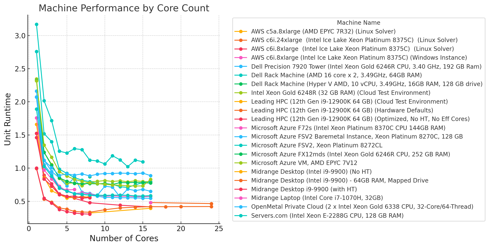
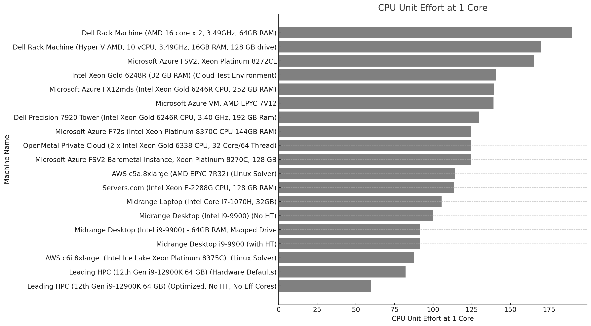
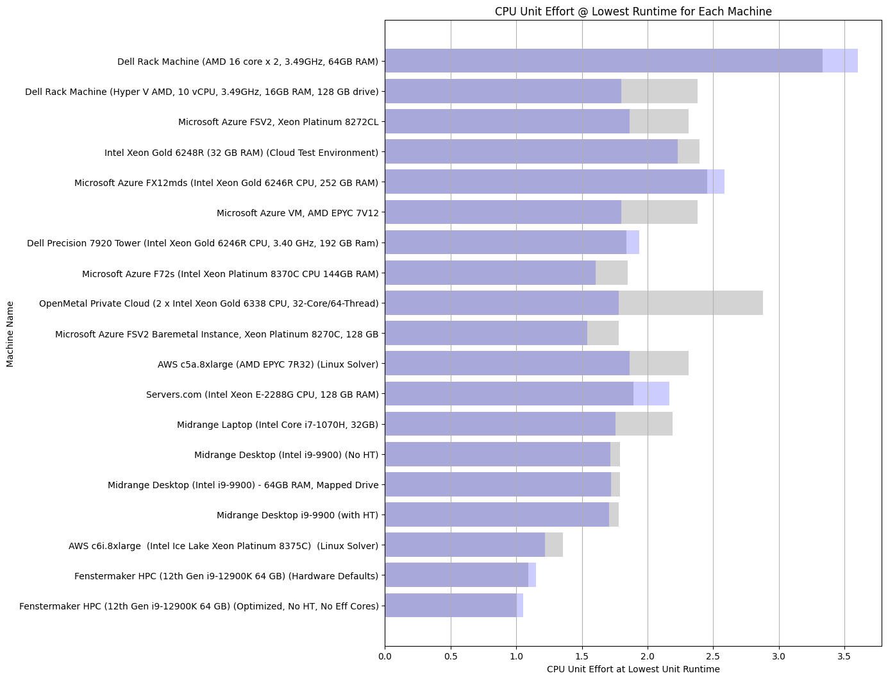
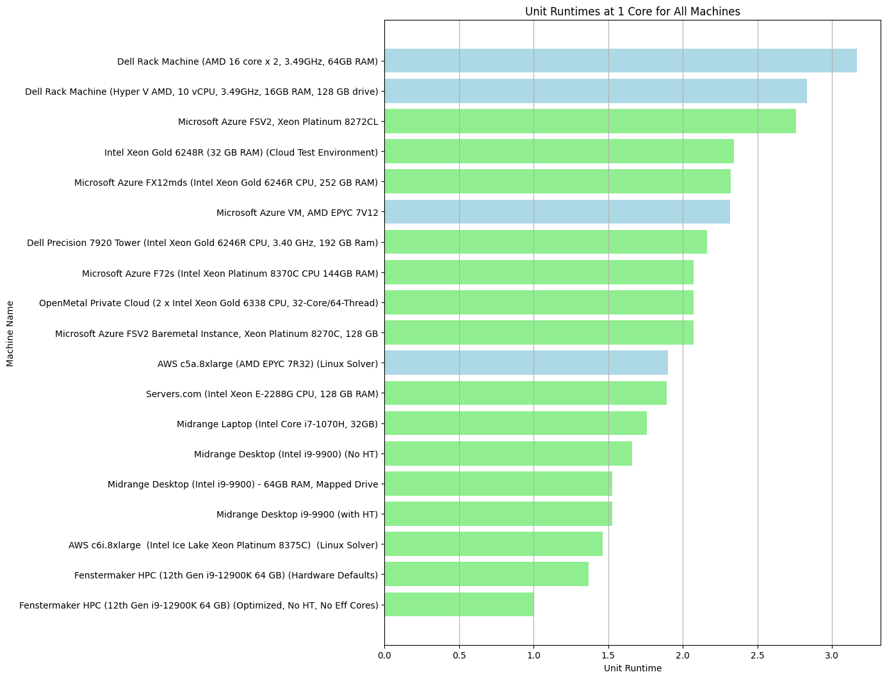
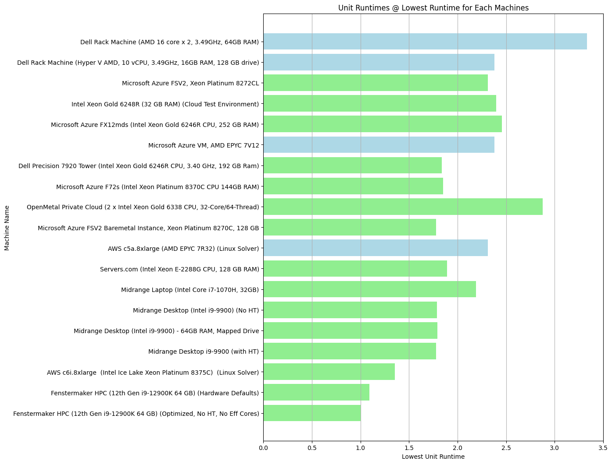

# Benchmarking Is All You Need
### A Data-Driven Approach to Optimizing HEC-RAS Performance 
 
<p align="center">
 <br></br>
 <i>You Wanna Run this Bayou Hot Rod for Pink Slips?</i>

 
</p>


## I. Introduction

The performance of our computational platforms can make or break a project. Among these tools, the Hydrologic Engineering Center's River Analysis System (HEC-RAS) stands out as a critical resource for modeling river hydraulics. However, as models grow in size and complexity, the computational demands can quickly outpace the capabilities of generic hardware setups. This is where benchmarking comes in.

At Fenstermaker, we've made it a priority to take a data-driven approach to optimizing our HEC-RAS workflows. By systematically benchmarking HEC-RAS performance across a range of hardware and software configurations, we've gained invaluable insights into the factors that truly drive performance. This blog post will dive into our methodology, results, and the implications for water resources engineering projects.

## II. Methodology

The foundation of any good benchmarking study is a representative test case. For our purposes, we selected a large, complex 2D HEC-RAS model that typifies the sort of computational challenges we regularly encounter. This benchmark model was then tested across a variety of platforms, including our in-house local compute clusters and popular public cloud systems like Microsoft Azure and Amazon Web Services (AWS).

To ensure a fair and direct comparison between these diverse platforms, we converted all of our benchmark results into a standardized "unit runtime" metric. This normalization process allowed us to cut through the noise of different hardware specifications and focus on the relative performance of each setup.

## Benchmarking Results: A Visual Exploration

To really drive home the insights from our benchmarking process, we've prepared a series of visualizations that highlight key trends and takeaways. Let's dive in.

### Image 1: Machine Performance by Core Count

<p align="center">
 
</p>

This chart shows the runtime performance of various machines across a range of core counts. A few key observations:

- Performance improves (i.e., runtime decreases) as core count increases, but with diminishing returns.
- The performance curves are not linear, with most machines showing a significant change in slope around the 2-4 core mark.
- The relative ranking of machines remains fairly consistent across core counts, with the Fenstermaker HPC clusters and the Dell Precision workstation leading the pack.

### Image 2: CPU Unit Effort at 1 Core

<p align="center">
 
</p>

Switching gears, this chart looks at the CPU unit effort expended by each machine when running on a single core. This metric provides a way to compare the inherent single-threaded performance of each CPU, independent of core count.

- The Fenstermaker HPC cluster, with its optimized 12th Gen Intel CPUs, demonstrates the lowest unit effort (i.e., highest performance).
- The Dell rack server and Hyper-V VM, both running older AMD CPUs, show significantly higher unit efforts.
- Interestingly, the AWS and Azure cloud instances, despite running on newer Intel and AMD hardware, fail to match the performance of the optimized Fenstermaker cluster.

### Image 3: CPU Unit Effort at Lowest Runtime

<p align="center">
 
</p>

Building on the previous chart, this visual shows the CPU unit effort at each machine's lowest observed runtime, regardless of core count.

- The broad trends remain similar, with the Fenstermaker cluster and Dell workstation in the lead.
- However, the gaps between machines are smaller than in the single-core scenario, reflecting the performance benefits of higher core counts.
- Notably, even at their respective optimal core counts, the cloud instances still lag behind the top on-premises performers.

### Image 4: Unit Runtimes at 1 Core

<p align="center">
 
</p>

Circling back to unit runtimes, this chart ranks each machine based on its performance at a single core.

- The Fenstermaker HPC cluster, in both its "Hardware Defaults" and "Optimized" configurations, claim the top spots.
- The Dell servers and the majority of cloud instances cluster around the middle of the pack.
- The Midrange Laptop, despite its portability advantage, brings up the rear in terms of raw single-core performance.

### Image 5: Unit Runtimes at Lowest Runtime

<p align="center">
 
</p>

Finally, we have the unit runtime ranking at each machine's optimal core count.

- The Fenstermaker HPC cluster maintains its lead, with the optimized configuration stretching its advantage.
- The Dell Precision workstation makes a strong showing, nearly matching the base Fenstermaker cluster.
- The cloud instances, while improving on their single-core showing, still struggle to keep pace with the leaders.

Taken together, these visualizations reinforce the key findings of our benchmarking analysis. They highlight the performance advantages of optimized, on-premises hardware, particularly for the sort of single-threaded, I/O-bound workloads that are common in HEC-RAS modeling. At the same time, they underscore the importance of configuration and tuning in extracting maximum performance from any given hardware platform.


## III. Results and Analysis

### A. Core scaling and efficiency

One of the most striking findings from our benchmarking was the importance of core count and parallel processing strategy. We found that for most HEC-RAS workloads, optimal performance was achieved by running 3 parallel simulations, each utilizing 2 cores. This "3x2" setup consistently delivered the best balance of throughput and efficiency.

Interestingly, we noticed a significant drop-off in efficiency when moving beyond 2 cores per simulation. This highlights the importance of understanding the specific computational characteristics of HEC-RAS and tailoring our hardware setups accordingly.

### B. Local compute vs. public cloud performance

Another key area of investigation was the relative performance of local compute clusters versus public cloud instances. Across the board, we found that optimized local workstations outperformed cloud-based setups for the sort of single-threaded, I/O-bound operations that are common in HEC-RAS.

Even the best-performing cloud instances, such as the AWS C6i, were around 1.5 times slower than an equivalent local workstation on a per-core basis. Other major cloud providers fared even worse, with instances up to 2.5 times slower than our local cluster.

Interestingly, we did observe a convergence in performance when our local cluster was intentionally hobbled to mimic suboptimal configurations (e.g., with hyperthreading enabled). This suggests that the performance advantages of local compute are contingent on proper hardware and software tuning.

### C. Hardware and software optimization

Building on the above findings, we delved into the specific hardware and software optimizations that yield the best HEC-RAS performance. On the hardware front, we found that disabling hyperthreading and Intel's "efficiency" cores provided a consistent boost. On top of this, the use of Intel's Extreme Tuning Utility (XTU) yielded an additional 10% improvement.

In terms of core count, our benchmarks showed that 8 cores tend to be the sweet spot for HEC-RAS performance on local workstations. This 8-core setup, when paired with the above optimizations, regularly outperformed even the heftiest cloud instances.

## IV. Implications for Water Resources Engineering Projects

So, what does all of this mean for real-world water resources engineering projects? At the most basic level, it underscores the importance of treating computational performance as a first-class engineering concern. The speed and efficiency of our HEC-RAS simulations directly impact our ability to deliver timely, high-quality results.

More specifically, our benchmarking results suggest that a properly optimized local compute cluster can offer significant performance advantages over default hardware setups or cloud-based instances. By understanding the specific performance characteristics of HEC-RAS and tailoring our hardware and software stacks accordingly, we can unlock new levels of productivity and capability.

## V. Cost Analysis

Of course, performance is only one side of the equation. For any engineering organization, cost is an equally important consideration. To assess the financial implications of our benchmarking results, we conducted a thorough cost analysis.

On the local compute side, we amortized the upfront cost of our optimized workstations over a 5-year expected lifespan. This worked out to an effective hourly rate of around $0.17 per core.

In contrast, the hourly costs for equivalent cloud instances were significantly higher. Even with reserved instance pricing, the best-performing cloud setups came in at around $1.30 to $1.45 per core-hour. When adjusted for the performance differential we observed in our benchmarks, the effective cost of cloud computing for HEC-RAS workloads was even higher.

This cost analysis paints a compelling picture. For the vast majority of HEC-RAS use cases, a well-optimized local compute cluster offers not just the best performance, but also the most cost-effective solution.

## VI. Conclusion

As we've seen throughout this post, benchmarking is all you need when it comes to optimizing HEC-RAS performance. By taking a systematic, data-driven approach to evaluating hardware and software setups, we can identify the configurations that truly maximize our computational capabilities.

For Fenstermaker, this benchmarking process has resoundingly affirmed the value of optimized local compute clusters. By tailoring our workstations to the specific needs of HEC-RAS, we've been able to achieve levels of performance and efficiency that simply aren't possible with stock hardware or cloud-based instances.

**It should be noted, all of the benchmarking in this blog post was prepared in 2021 and 2022**.  The Fenstermaker HPC Benchmark system is a 12th Gen intel Core i9-12900KS processor, with overclocking to approximately 5GHZ which is able to be sustained with all 8 performance cores fully utilized.  This serves as our benchmark system until we benchmark something even faster!  There have been additional hardware releases since this benchmarking have been completed that undoubtely surpass the performance of the benchmark machine, and any engineer reading this analysis should know it is already outdated.  Although these results do not show any systems outperforming our benchmark system, they undoubtedly exist.  If you have one and are open to it, we would love to send you a model to benchmark and we can add it to this dataset.  The code and datasets are included below, although the benchmark model itself is proprietary (It is an early model development checkpoint, not a particularly good model on it's own which makes it a solid benchmarking candidate, as most models are not well-optimized through much of their development cycle).  

Benchmarking should be a standard part of any water resources engineering workflow and capital outlay plan. As our models continue to grow in size and complexity, the ability to efficiently leverage computational resources will only become more critical.  While the information provided below does not represent a fully rigorous benchmarking effort, it has been sufficient to provide many useful insights and the successful identification of high performance workstations, and is being released here to benefit the LWI program to the extent that it is useful at this stage for evaluating relative model performance across the program.   

## VII. Appendices

For those interested in diving deeper into our benchmarking process and results, we've included several appendices to this post:

- Appendix A provides a detailed breakdown of our benchmark results across all tested platforms and configurations.
- Appendix B offers a closer look at the specific hardware and software specs we used in our testing.
- Appendix C includes a collection of additional resources and guides for optimizing HEC-RAS performance.

**General Note about Data Collection:** Some of the machine names are generalized, as detailed technical information was not always consistently communicated, especially when results were not satisfactory.  All CPU/technical data was recorded from information provided by relevant parties and is provided here as-is.  

As always, if you have any questions, comments, or insights to share, please don't hesitate to reach out. At Fenstermaker, we're committed to advancing the state of the art in water resources engineering, and we believe that collaboration and knowledge-sharing are essential to that mission.


###  Reproducing Unit Calculations and Plots

<details>
<summary>Full Python Code for Reproducing Dataframes and Plots (Click to Expand)</summary>

```
import pandas as pd
import matplotlib.pyplot as plt

def load_data(performance_file, machine_names_file):
    """
    Load performance data and machine names from CSV files.
    
    Parameters:
    - performance_file: Path to the CSV file containing performance data.
    - machine_names_file: Path to the CSV file containing machine names.
    
    Returns:
    - A DataFrame merging both the performance data and machine names.
    """
    performance_data = pd.read_csv(performance_file)
    machine_names = pd.read_csv(machine_names_file)
    merged_data = pd.merge(performance_data, machine_names, on='Machine Index')
    display(merged_data)
    return merged_data

def plot_performance_data(merged_data):
    """
    Plot the performance data showing runtime against number of cores for each machine.
    
    Parameters:
    - merged_data: DataFrame containing the merged performance data and machine names.
    """
    fig, ax = plt.subplots(figsize=(17, 6))

    for machine_name, group in merged_data.groupby('Machine Name'):
        ax.plot(group['Cores'], group['Runtime (min)'], marker='o', linestyle='-', label=machine_name)

    ax.set_xlabel('Number of Cores', fontsize=14)
    ax.set_ylabel('Runtime (minutes)', fontsize=14)
    ax.set_title('Machine Performance by Core Count', fontsize=16)
    ax.legend(bbox_to_anchor=(1.05, 1), loc='upper left', title='Machine Name')
    plt.tight_layout()
    plt.show()

def plot_unit_performance_data(merged_data):
    """
    Plot the performance data showing unit runtime against number of cores for each machine.
    
    Parameters:
    - merged_data: DataFrame containing the merged performance data and machine names.
    """
    fig, ax = plt.subplots(figsize=(17, 6))

    for machine_name, group in merged_data.groupby('Machine Name'):
        ax.plot(group['Cores'], group['Unit Runtime'], marker='o', linestyle='-', label=machine_name)

    ax.set_xlabel('Number of Cores', fontsize=14)
    ax.set_ylabel('Unit Runtime', fontsize=14)
    ax.set_title('Machine Performance by Core Count', fontsize=16)
    ax.legend(bbox_to_anchor=(1.05, 1), loc='upper left', title='Machine Name')
    plt.tight_layout()
    plt.show()    

def main():
    performance_file = 'performance_data.csv'
    machine_names_file = 'machine_names.csv'
    merged_data = load_data(performance_file, machine_names_file)
    plot_performance_data(merged_data)

if __name__ == '__main__':
    main()

    performance_file = 'performance_data.csv'
    machine_names_file = 'machine_names.csv'
    merged_data = load_data(performance_file, machine_names_file)

    # Now, provide the same plot, but only include up to 24 cores.
    merged_data_24 = merged_data[merged_data['Cores'] <= 20]
    if not merged_data_24.empty:
        plot_performance_data(merged_data_24)
    else:
        print("No data available for machines with 24 or fewer cores.")
    
#  Using 10.98 minutes as the baseline, we can calculate a unit runtime for each machine.
# Create a new column in the DataFrame that contains the unit runtime for each machine.
merged_data['Unit Runtime'] = merged_data['Runtime (min)'] / 35.82
display(merged_data)

# Plot unit runtimes less than 20 cores
merged_data_20 = merged_data[merged_data['Cores'] <= 20]
if not merged_data_20.empty:
    plot_unit_performance_data(merged_data_20)
else:
    print("No data available for machines with 20 or fewer cores.")


# Print a list of Machine Names and Unit Runtimes at 1 Core. Sort by unit runtime

display(merged_data[merged_data['Cores'] == 1][['Machine Name', 'Unit Runtime']].sort_values(by='Unit Runtime'))

# Make a bar chart with Unit Runtime.  Omit line 123
display(merged_data[merged_data['Cores'] == 1][['Machine Name', 'Unit Runtime']].sort_values(by='Unit Runtime').plot(kind='bar', x='Machine Name', y='Unit Runtime'))


# Create a new column "Manufacturer".  If "AMD" is in the name, label AMD, if not, Intel
merged_data['Manufacturer'] = merged_data['Machine Name'].apply(lambda x: 'AMD' if 'AMD' in x or 'EPYC' in x or 'Ryzen' in x or '7V12' in x else 'Intel')
display(merged_data)
# save to CSV
merged_data.to_csv('merged_data.csv')


# Make bar chart color if manufacturer is AMD
merged_data[merged_data['Cores'] == 1][['Machine Name', 'Unit Runtime', 'Manufacturer']].sort_values(by='Unit Runtime').plot(kind='bar', x='Machine Name', y='Unit Runtime', color=merged_data['Manufacturer'].map({'AMD': 'red', 'Intel': 'blue'}))
plt.show()

# save to new dataframe UnitRuntimes
UnitRuntimes = merged_data[merged_data['Cores'] == 1][['Machine Name', 'Unit Runtime', 'Manufacturer']].sort_values(by='Unit Runtime')

# Now, for any machines index 8 and 17, they only have data at 16 and 8 cores respectively.  
# We can divide the runtime by 10.98 to get the unit runtime, and add that line to UnitRuntimes
# Since UnitRuntimes doesn't have these entries because there are no entries for 1 core, we can add them to UnitRuntimes from merged_data

# Lookup the runtime in minutes for index 8 and 17
display(merged_data[(merged_data['Machine Index'] == 8) | (merged_data['Machine Index'] == 17)][['Machine Name', 'Cores', 'Runtime (min)']])

# use that data to calculate the unit runtime and add it to UnitRuntimes
UnitRuntimes.at[8, 'Unit Runtime'] = 1.90
UnitRuntimes.at[17, 'Unit Runtime'] = 2.83
UnitRuntimes.at[123, 'Unit Runtime'] = 1.37


# Populate the manufacturer column for these two entries
UnitRuntimes.at[8, 'Manufacturer'] = 'AMD'
UnitRuntimes.at[17, 'Manufacturer'] = 'AMD'

# Populate Machine Name and Machine Index for these two entries
UnitRuntimes.at[8, 'Machine Name'] = 'AWS c5a.8xlarge (AMD EPYC 7R32) (Linux Solver)'
UnitRuntimes.at[17, 'Machine Name'] = 'Dell Rack Machine (Hyper V AMD, 10 vCPU, 3.49GHz, 16GB RAM, 128 GB drive)'
UnitRuntimes.at[8, 'Machine Index'] = 8
UnitRuntimes.at[17, 'Machine Index'] = 17

# Sort data by Unit Runtime
UnitRuntimes = UnitRuntimes.sort_values(by='Unit Runtime')

#save to UnitRuntimes.csv
UnitRuntimes.to_csv('UnitRuntimes.csv')


import matplotlib.pyplot as plt

# Assuming merged_data is your DataFrame with the same structure as the UnitRuntimes.csv
# First, sort the data by 'Unit Runtime' to make the chart organized
sorted_merged_data = UnitRuntimes.sort_values('Unit Runtime')
display(sorted_merged_data)

# Now, plotting all machines with a horizontal bar chart
plt.figure(figsize=(10, len(sorted_merged_data) / 1.5))  # Adjusting figure size based on number of entries
plt.barh(sorted_merged_data['Machine Name'], sorted_merged_data['Unit Runtime'], color=sorted_merged_data['Manufacturer'].map({'AMD': 'lightblue', 'Intel': 'lightgreen'}))
plt.xlabel('Unit Runtime')
plt.ylabel('Machine Name')
plt.title('Unit Runtimes at 1 Core for All Machines')
plt.grid(axis='x')

# Show the plot
plt.show()


# Now, create another plot with the unit runtime based on the lowest runtime in each machine's dataset, and dividing it by 10.98 (use intermediate dataframe to calculate)
# Then, add that data back to sorted_merged_data and plot it in a horizontal bar chart (so it stays in the same sort order as the previous plot)

# build intermediate dataframe with only the lowest runtime for each machine
lowest_runtime = merged_data.groupby('Machine Index')['Runtime (min)'].min().reset_index()
lowest_runtime['Unit Runtime'] = lowest_runtime['Runtime (min)'] / 10.98
# Get the base clock from merged_data and use it to calculate the columns
lowest_runtime = lowest_runtime.merge(merged_data[['Machine Index', 'Machine Name', 'CPU Base Clock Speed (GHz)']], on='Machine Index', how='left')
lowest_runtime['CPU Clock Cycles (Effort)'] = lowest_runtime['Unit Runtime'] * lowest_runtime['CPU Base Clock Speed (GHz)'] * 60
lowest_runtime['Used (GHZ-Hr)'] = lowest_runtime['CPU Clock Cycles (Effort)'] / 3600
lowest_runtime['CPU Efficiency Coefficient'] = lowest_runtime['Runtime (min)'] / lowest_runtime['Used (GHZ-Hr)']
display(lowest_runtime)
# Add lowest runtime data to sorted_merged_data
sorted_merged_data['Lowest Runtime'] = lowest_runtime['Runtime (min)']
sorted_merged_data['Lowest Unit Runtime'] = lowest_runtime['Unit Runtime']
sorted_merged_data['CPU Clock Cycles (Effort)'] = lowest_runtime['CPU Clock Cycles (Effort)']
sorted_merged_data['Used (GHZ-Hr)'] = lowest_runtime['Used (GHZ-Hr)']
sorted_merged_data['CPU Efficiency Coefficient'] = lowest_runtime['CPU Efficiency Coefficient']
sorted_merged_data['CPU Base Clock Speed (GHz)'] = lowest_runtime['CPU Base Clock Speed (GHz)']
display(sorted_merged_data)


# Plot lowest unit runtime in bar chart identical to above
plt.figure(figsize=(10, len(sorted_merged_data) / 1.5))  # Adjusting figure size based on number of entries
plt.barh(sorted_merged_data['Machine Name'], sorted_merged_data['Lowest Unit Runtime'], color=sorted_merged_data['Manufacturer'].map({'AMD': 'lightblue', 'Intel': 'lightgreen'}))
plt.xlabel('Lowest Unit Runtime')
plt.ylabel('Machine Name')
plt.title('Unit Runtimes @ Lowest Runtime for Each Machines')
plt.grid(axis='x')

# Show the plot
plt.show()

# Check if 'CPU Base Clock Speed (GHz)' is in the dataframe
if 'CPU Base Clock Speed (GHz)' in sorted_merged_data.columns:
    # Calculate CPU Unit Effort @ 1 Core using Unit Runtime and Base Clock Speed
    sorted_merged_data['CPU Unit Effort @ 1 Core'] = sorted_merged_data['Lowest Unit Runtime'] * sorted_merged_data['CPU Base Clock Speed (GHz)'] * 60 / 3600 /0.056667
    display(sorted_merged_data)
else:
    print("'CPU Base Clock Speed (GHz)' is not in the dataframe. Please check the column name.")


# Plot CPU Unit Effort @ 1 Core in bar chart identical to above
plt.figure(figsize=(10, len(sorted_merged_data) / 1.5))  # Adjusting figure size based on number of entries
if 'CPU Unit Effort @ 1 Core' in sorted_merged_data.columns:
    plt.barh(sorted_merged_data['Machine Name'], sorted_merged_data['CPU Unit Effort @ 1 Core'], color='lightgrey')  # Neutral color scheme
    plt.xlabel('CPU Unit Effort @ 1 Core')
    plt.ylabel('Machine Name')
    plt.title('CPU Unit Effort @ 1 Core for Each Machine')
    plt.grid(axis='x')
else:
    print("'CPU Unit Effort @ 1 Core' is not in the dataframe. Please check the column name.")

# Show the plot
plt.show()


# Plot CPU Unit Effort @ Lowest Runtime for Each Machines
plt.figure(figsize=(10, len(sorted_merged_data) / 1.5))  # Adjusting figure size based on number of entries
plt.barh(sorted_merged_data['Machine Name'], sorted_merged_data['Lowest Unit Runtime'], color='lightgrey')  # Neutral color scheme
plt.xlabel('CPU Unit Effort at Lowest Unit Runtime')
plt.ylabel('Machine Name')
plt.title('CPU Unit Effort @ Lowest Runtime vs Unit Effort at 1 Core for Each Machine')
plt.grid(axis='x')

# Add CPU Effort in Unit Terms to the chart
sorted_merged_data['CPU Effort (Unit Terms)'] = sorted_merged_data['CPU Clock Cycles (Effort)'] / 193.764706
plt.barh(sorted_merged_data['Machine Name'], sorted_merged_data['CPU Effort (Unit Terms)'], color='blue', alpha=0.2)  # Less prominent


# Show the plot
plt.show()

```

</details>

### Raw Data and Dataframes
Benchmarking data and generated dataframes are provided as CSV files: 
[Zip File with Benchmarking Dataframes](https://github.com/billk-FM/HEC-Commander/blob/68230415dc59e8e6ccd8f5747e48830d9d3d5277/Blog/img/benchmarking_dataframes.zip)


#### Platforms Tested:  machine_names.csv
<details>
<summary> Platforms Tested:  machine_names.csv (Click to Expand)</summary>


| Machine Index | Machine Name                                                          | CPU Base Clock Speed (GHz) |
|---------------|-----------------------------------------------------------------------|----------------------------|
| 0             | Microsoft Azure FSV2, Xeon Platinum 8272CL                            | 2.6                        |
| 1             | Microsoft Azure VM, AMD EPYC 7V12                                     | 2.44                       |
| 2             | Microsoft Azure FSV2 Baremetal Instance, Xeon Platinum 8270C, 128 GB  | 2.8                        |
| 3             | OpenMetal Private Cloud (2 x Intel Xeon Gold 6338 CPU, 32-Core/64-Thread)| 2                          |
| 4             | Servers.com (Intel Xeon E-2288G CPU, 128 GB RAM)                      | 3.7                        |
| 5             | AWS c6i.8xlarge (Intel Ice Lake Xeon Platinum 8375C) (Linux Solver)   | 2.9                        |
| 6             | AWS c6i.24xlarge (Intel Ice Lake Xeon Platinum 8375C) (Linux Solver)  | 2.9                        |
| 7             | AWS c6i.8xlarge (Intel Ice Lake Xeon Platinum 8375C) (Windows Instance)| 2.9                       |
| 8             | AWS c5a.8xlarge (AMD EPYC 7R32) (Linux Solver)                        | 3.3                        |
| 9             | Midrange Laptop (Intel Core i7-1070H, 32GB)                           | 2.59                       |
| 10            | Midrange Desktop (Intel i9-9900) (No HT)                              | 3.1                        |
| 11            | Midrange Desktop (Intel i9-9900) - 64GB RAM, Mapped Drive             | 3.1                        |
| 12            | Midrange Desktop i9-9900 (with HT)                                    | 3.1                        |
| 13            | Fenstermaker HPC (12th Gen i9-12900K 64 GB) (Cloud Test Environment)  | 3.19                       |
| 14            | Fenstermaker HPC (12th Gen i9-12900K 64 GB) (Hardware Defaults)       | 3.4                        |
| 15            | Dell Rack Machine (AMD 16 core x 2, 3.49GHz, 64GB RAM)                | 3.49                       |
| 16            | Dell Precision 7920 Tower (Intel Xeon Gold 6246R CPU, 3.40 GHz, 192 GB Ram)| 3.4                    |
| 17            | Dell Rack Machine (Hyper V AMD, 10 vCPU, 3.49GHz, 16GB RAM, 128 GB drive)| 3.49                   |
| 18            | Microsoft Azure FX12mds (Intel Xeon Gold 6246R CPU, 252 GB RAM)       | 3.4                        |
| 19            | Microsoft Azure F72s (Intel Xeon Platinum 8370C CPU 144GB RAM)        | 2.8                        |
| 20            | Intel Xeon Gold 6248R (32 GB RAM) (Cloud Test Environment)            | 3                          |
| 21            | Fenstermaker HPC (12th Gen i9-12900K 64 GB) (Optimized, No HT, No Eff Cores)| 3.4                 |


</details>


#### Raw Runtime Results:  performance_data.csv

<details>
<summary>Raw Runtime Results:  performance_data.csv (Click to Expand)</summary>

| Machine Index | Cores | Runtime (min) |
|---------------|-------|---------------|
| 0             | 1     | 98.78333333   |
| 0             | 2     | 54.43333333   |
| 0             | 3     | 50.1          |
| 0             | 4     | 35.23333333   |
| 0             | 5     | 32.96666667   |
| 0             | 6     | 30.68333333   |
| 0             | 7     | 29.33333333   |
| 0             | 8     | 28.53333333   |
| 0             | 9     | 27.55         |
| 0             | 10    | 27.03333333   |
| 0             | 11    | 27.03333333   |
| 0             | 12    | 25.76666667   |
| 0             | 13    | 25.38333333   |
| 0             | 14    | 26.76666667   |
| 0             | 15    | 28.03333333   |
| 0             | 16    | 28.53333333   |
| 1             | 1     | 83.00916667   |
| 1             | 2     | 48.3          |
| 1             | 3     | 41.68333333   |
| 1             | 4     | 33.93333333   |
| 1             | 5     | 31.56666667   |
| 1             | 6     | 29.71666667   |
| 1             | 7     | 28.7          |
| 1             | 8     | 27.88333333   |
| 1             | 9     | 27.46666667   |
| 1             | 10    | 27.1          |
| 1             | 11    | 26.7          |
| 1             | 12    | 26.6          |
| 1             | 13    | 26.26666667   |
| 1             | 14    | 26.15         |
| 1             | 15    | 26.21666667   |
| 1             | 16    | 29.73333333   |
| 2             | 1     | 74.16666667   |
| 2             | 2     | 37.61666667   |
| 2             | 3     | 32.38333333   |
| 2             | 4     | 25.41666667   |
| 2             | 5     | 23.71666667   |
| 2             | 6     | 22.08333333   |
| 2             | 7     | 21.76666667   |
| 2             | 8     | 21.23333333   |
| 2             | 9     | 20.63333333   |
| 2             | 10    | 20             |
| 2             | 11    | 20.03333333   |
| 2             | 12    | 19.8           |
| 2             | 13    | 19.83333333   |
| 2             | 14    | 19.76666667   |
| 2             | 15    | 19.55          |
| 2             | 16    | 19.53333333   |
| 3             | 1     | 74.25          |
| 3             | 2     | 40.01666667   |
| 3             | 3     | 36.11666667   |
| 3             | 4     | 31.88333333   |
| 3             | 5     | 32.71666667   |
| 3             | 6     | 32.03333333   |
| 3             | 7     | 32.7           |
| 3             | 8     | 31.6           |
| 3             | 9     | 32.53333333   |
| 3             | 10    | 32.88333333   |
| 3             | 11    | 32.95          |
| 3             | 12    | 33.1           |
| 3             | 13    | 33.01666667   |
| 3             | 14    | 32.83333333   |
| 3             | 15    | 33.13333333   |
| 3             | 16    | 31.76666667   |
| 4             | 1     | 67.73333333   |
| 4             | 2     | 36.71666667   |
| 4             | 3     | 31.43333333   |
| 4             | 4     | 25.03333333   |
| 4             | 5     | 23.35          |
| 4             | 6     | 21.96666667   |
| 4             | 7     | 21.53333333   |
| 4             | 8     | 21.21666667   |
| 4             | 9     | 21.21666667   |
| 4             | 10    | 21.08333333   |
| 4             | 11    | 21.2           |
| 4             | 12    | 21.2           |
| 4             | 13    | 21.18333333   |
| 4             | 14    | 20.78333333   |
| 4             | 15    | 20.76666667   |
| 4             | 16    | 20.93333333   |
| 5             | 1     | 52.33          |
| 5             | 2     | 32.03          |
| 5             | 3     | 27.4           |
| 5             | 4     | 21.88          |
| 5             | 8     | 17.13          |
| 5             | 12    | 15.78          |
| 5             | 16    | 14.88          |
| 6             | 16    | 17.22          |
| 6             | 24    | 16.67          |
| 6             | 48    | 16.12          |
| 7             | 16    | 17.23          |
| 8             | 16    | 20.95          |
| 9             | 1     | 62.95          |
| 9             | 2     | 34.83          |
| 9             | 3     | 29.97          |
| 9             | 4     | 25.02          |
| 9             | 5     | 24.05          |
| 9             | 6     | 24.25          |
| 10            | 1     | 59.48          |
| 10            | 2     | 30.88          |
| 10            | 3     | 23.57          |
| 10            | 5     | 19.65          |
| 10            | 6     | 20.15          |
| 10            | 7     | 19.77          |
| 10            | 8     | 20.55          |
| 11            | 1     | 54.65          |
| 11            | 2     | 29.98          |
| 11            | 3     | 26.05          |
| 11            | 4     | 21.58          |
| 11            | 5     | 20.57          |
| 11            | 6     | 19.68          |
| 11            | 7     | 20.6           |
| 11            | 8     | 19.78          |
| 12            | 1     | 54.63          |
| 12            | 2     | 30              |
| 12            | 3     | 26.2           |
| 12            | 4     | 21.52          |
| 12            | 5     | 20.5           |
| 12            | 6     | 20.73          |
| 12            | 7     | 19.55          |
| 12            | 8     | 19.87          |
| 13            | 8     | 11.55          |
| 13            | 16    | 14.12          |
| 14            | 1     | 35.65          |
| 14            | 2     | 19.08          |
| 14            | 3     | 17.45          |
| 14            | 4     | 14.32          |
| 14            | 5     | 13.65          |
| 14            | 6     | 12.42          |
| 14            | 7     | 12.1           |
| 14            | 8     | 11.98          |
| 14            | 10    | 13.35          |
| 14            | 12    | 14.33          |
| 14            | 14    | 14.73          |
| 14            | 16    | 15              |
| 14            | 18    | 14.97          |
| 14            | 20    | 15.03          |
| 14            | 24    | 15.07          |
| 15            | 1     | 113.52         |
| 15            | 2     | 72.22          |
| 15            | 3     | 61.5           |
| 15            | 4     | 44.97          |
| 15            | 5     | 44.03          |
| 15            | 6     | 46.32          |
| 15            | 7     | 45.8           |
| 15            | 8     | 40.17          |
| 15            | 9     | 39.68          |
| 15            | 10    | 38.07          |
| 15            | 11    | 42.52          |
| 15            | 12    | 40.28          |
| 15            | 13    | 36.62          |
| 15            | 14    | 40.15          |
| 15            | 15    | 39.25          |
| 16            | 1     | 77.4           |
| 16            | 2     | 40.12          |
| 16            | 3     | 34.03          |
| 16            | 4     | 30.52          |
| 16            | 5     | 26.28          |
| 16            | 6     | 30.9           |
| 16            | 7     | 22.8           |
| 16            | 8     | 22.2           |
| 16            | 9     | 21.1           |
| 16            | 10    | 26.07          |
| 16            | 11    | 25.52          |
| 16            | 12    | 20.18          |
| 16            | 13    | 24.52          |
| 16            | 14    | 23.68          |
| 16            | 15    | 24.35          |
| 16            | 16    | 23.3           |
| 17            | 8     | 31.15          |
| 18            | 1     | 83.18          |
| 18            | 2     | 44.37          |
| 18            | 3     | 37.33          |
| 18            | 4     | 30.55          |
| 18            | 5     | 28.73          |
| 18            | 6     | 27.58          |
| 18            | 7     | 27.47          |
| 18            | 8     | 27.42          |
| 18            | 9     | 27.32          |
| 18            | 10    | 27.55          |
| 18            | 11    | 26.95          |
| 18            | 12    | 28.02          |
| 18            | 13    | 27.92          |
| 18            | 14    | 28.15          |
| 18            | 15    | 27.87          |
| 18            | 16    | 27.77          |
| 19            | 1     | 74.27          |
| 19            | 2     | 37.7           |
| 19            | 3     | 32.32          |
| 19            | 4     | 26.03          |
| 19            | 5     | 23.33          |
| 19            | 6     | 22.07          |
| 19            | 7     | 22.53          |
| 19            | 8     | 21.78          |
| 19            | 9     | 21.22          |
| 19            | 10    | 20.62          |
| 19            | 11    | 20.85          |
| 19            | 12    | 20.58          |
| 19            | 13    | 20.6           |
| 19            | 14    | 20.45          |
| 19            | 15    | 20.3           |
| 19            | 16    | 20.57          |
| 20            | 1     | 83.97          |
| 20            | 2     | 44.4           |
| 20            | 3     | 37.72          |
| 20            | 4     | 30.32          |
| 20            | 5     | 27.62          |
| 20            | 6     | 27.83          |
| 20            | 7     | 26.33          |
| 20            | 8     | 28.47          |
| 20            | 9     | 28.67          |
| 20            | 10    | 29.1           |
| 20            | 11    | 28.6           |
| 20            | 12    | 28.98          |
| 20            | 13    | 28.42          |
| 20            | 14    | 29             |
| 20            | 15    | 28.55          |
| 20            | 16    | 28.45          |
| 21            | 1     | 35.82          |
| 21            | 2     | 19.55          |
| 21            | 3     | 16.92          |
| 21            | 4     | 13.48          |
| 21            | 5     | 12.32          |
| 21            | 6     | 11.55          |
| 21            | 7     | 11.12          |
| 21            | 8     | 10.98          |


</details>


#### Machine Name and Runtime (Merged):  merged_data.csv
This dataframe is the merged dataframe with machine names and raw performance results and unit runtimes based on 10.98, the best observed runtime. 
<details>
| Machine Index | Cores | Runtime (min) | Machine Name | CPU | Base Clock Speed (GHz) | Unit Runtime | Manufacturer |
|---------------|----|---------------|-------------------------------------------------|-------------------------------------------------|---------|---------|---------------|
| 0 | 0 | 1 | 98.78333 | Microsoft Azure FSV2, Xeon Platinum 8272CL | 2.6 | 2.75777 | Intel |
| 1 | 0 | 2 | 54.43333 | Microsoft Azure FSV2, Xeon Platinum 8272CL | 2.6 | 1.519635 | Intel |
| 2 | 0 | 3 | 50.1 | Microsoft Azure FSV2, Xeon Platinum 8272CL | 2.6 | 1.39866 | Intel |
| 3 | 0 | 4 | 35.23333 | Microsoft Azure FSV2, Xeon Platinum 8272CL | 2.6 | 0.983622 | Intel |
| 4 | 0 | 5 | 32.96667 | Microsoft Azure FSV2, Xeon Platinum 8272CL | 2.6 | 0.920342 | Intel |
| 5 | 0 | 6 | 30.68333 | Microsoft Azure FSV2, Xeon Platinum 8272CL | 2.6 | 0.856598 | Intel |
| 6 | 0 | 7 | 29.33333 | Microsoft Azure FSV2, Xeon Platinum 8272CL | 2.6 | 0.818909 | Intel |
| 7 | 0 | 8 | 28.53333 | Microsoft Azure FSV2, Xeon Platinum 8272CL | 2.6 | 0.796575 | Intel |
| 8 | 0 | 9 | 27.55 | Microsoft Azure FSV2, Xeon Platinum 8272CL | 2.6 | 0.769123 | Intel |
| 9 | 0 | 10 | 27.03333 | Microsoft Azure FSV2, Xeon Platinum 8272CL | 2.6 | 0.754699 | Intel |
| 10 | 0 | 11 | 27.03333 | Microsoft Azure FSV2, Xeon Platinum 8272CL | 2.6 | 0.754699 | Intel |
| 11 | 0 | 12 | 25.76667 | Microsoft Azure FSV2, Xeon Platinum 8272CL | 2.6 | 0.719337 | Intel |
| 12 | 0 | 13 | 25.38333 | Microsoft Azure FSV2, Xeon Platinum 8272CL | 2.6 | 0.708636 | Intel |
| 13 | 0 | 14 | 26.76667 | Microsoft Azure FSV2, Xeon Platinum 8272CL | 2.6 | 0.747255 | Intel |
| 14 | 0 | 15 | 28.03333 | Microsoft Azure FSV2, Xeon Platinum 8272CL | 2.6 | 0.782617 | Intel |
| 15 | 0 | 16 | 28.53333 | Microsoft Azure FSV2, Xeon Platinum 8272CL | 2.6 | 0.796575 | Intel |
| 16 | 1 | 1 | 83.00917 | Microsoft Azure VM, AMD EPYC 7V12 | 2.44 | 2.317397 | AMD |
| 17 | 1 | 2 | 48.3 | Microsoft Azure VM, AMD EPYC 7V12 | 2.44 | 1.348409 | AMD |
| 18 | 1 | 3 | 41.68333 | Microsoft Azure VM, AMD EPYC 7V12 | 2.44 | 1.163689 | AMD |
| 19 | 1 | 4 | 33.93333 | Microsoft Azure VM, AMD EPYC 7V12 | 2.44 | 0.947329 | AMD |
| 20 | 1 | 5 | 31.56667 | Microsoft Azure VM, AMD EPYC 7V12 | 2.44 | 0.881258 | AMD |
| 21 | 1 | 6 | 29.71667 | Microsoft Azure VM, AMD EPYC 7V12 | 2.44 | 0.829611 | AMD |
| 22 | 1 | 7 | 28.7 | Microsoft Azure VM, AMD EPYC 7V12 | 2.44 | 0.801228 | AMD |
| 23 | 1 | 8 | 27.88333 | Microsoft Azure VM, AMD EPYC 7V12 | 2.44 | 0.778429 | AMD |
| 24 | 1 | 9 | 27.46667 | Microsoft Azure VM, AMD EPYC 7V12 | 2.44 | 0.766797 | AMD |
| 25 | 1 | 10 | 27.1 | Microsoft Azure VM, AMD EPYC 7V12 | 2.44 | 0.756561 | AMD |
| 26 | 1 | 11 | 26.7 | Microsoft Azure VM, AMD EPYC 7V12 | 2.44 | 0.745394 | AMD |
| 27 | 1 | 12 | 26.6 | Microsoft Azure VM, AMD EPYC 7V12 | 2.44 | 0.742602 | AMD |
| 28 | 1 | 13 | 26.26667 | Microsoft Azure VM, AMD EPYC 7V12 | 2.44 | 0.733296 | AMD |
| 29 | 1 | 14 | 26.15 | Microsoft Azure VM, AMD EPYC 7V12 | 2.44 | 0.730039 | AMD |
| 30 | 1 | 15 | 26.21667 | Microsoft Azure VM, AMD EPYC 7V12 | 2.44 | 0.7319 | AMD |
| 31 | 1 | 16 | 29.73333 | Microsoft Azure VM, AMD EPYC 7V12 | 2.44 | 0.830076 | AMD |
| 32 | 2 | 1 | 74.16667 | Microsoft Azure FSV2 Baremetal Instance, Xeon Platinum 8270C, 128 GB | 2.8 | 2.070538 | Intel |
| 33 | 2 | 2 | 37.61667 | Microsoft Azure FSV2 Baremetal Instance, Xeon Platinum 8270C, 128 GB | 2.8 | 1.050158 | Intel |
| 34 | 2 | 3 | 32.38333 | Microsoft Azure FSV2 Baremetal Instance, Xeon Platinum 8270C, 128 GB | 2.8 | 0.904057 | Intel |
| 35 | 2 | 4 | 25.41667 | Microsoft Azure FSV2 Baremetal Instance, Xeon Platinum 8270C, 128 GB | 2.8 | 0.709566 | Intel |
| 36 | 2 | 5 | 23.71667 | Microsoft Azure FSV2 Baremetal Instance, Xeon Platinum 8270C, 128 GB | 2.8 | 0.662107 | Intel |
| 37 | 2 | 6 | 22.08333 | Microsoft Azure FSV2 Baremetal Instance, Xeon Platinum 8270C, 128 GB | 2.8 | 0.616508 | Intel |
| 38 | 2 | 7 | 21.76667 | Microsoft Azure FSV2 Baremetal Instance, Xeon Platinum 8270C, 128 GB | 2.8 | 0.607668 | Intel |
| 39 | 2 | 8 | 21.23333 | Microsoft Azure FSV2 Baremetal Instance, Xeon Platinum 8270C, 128 GB | 2.8 | 0.592779 | Intel |
| 40 | 2 | 9 | 20.63333 | Microsoft Azure FSV2 Baremetal Instance, Xeon Platinum 8270C, 128 GB | 2.8 | 0.576028 | Intel |
| 41 | 2 | 10 | 20 | Microsoft Azure FSV2 Baremetal Instance, Xeon Platinum 8270C, 128 GB | 2.8 | 0.558347 | Intel |
| 42 | 2 | 11 | 20.03333 | Microsoft Azure FSV2 Baremetal Instance, Xeon Platinum 8270C, 128 GB | 2.8 | 0.559278 | Intel |
| 43 | 2 | 12 | 19.8 | Microsoft Azure FSV2 Baremetal Instance, Xeon Platinum 8270C, 128 GB | 2.8 | 0.552764 | Intel |
| 44 | 2 | 13 | 19.83333 | Microsoft Azure FSV2 Baremetal Instance, Xeon Platinum 8270C, 128 GB | 2.8 | 0.553694 | Intel |
| 45 | 2 | 14 | 19.76667 | Microsoft Azure FSV2 Baremetal Instance, Xeon Platinum 8270C, 128 GB | 2.8 | 0.551833 | Intel |
| 46 | 2 | 15 | 19.55 | Microsoft Azure FSV2 Baremetal Instance, Xeon Platinum 8270C, 128 GB | 2.8 | 0.545784 | Intel |
| 47 | 2 | 16 | 19.53333 | Microsoft Azure FSV2 Baremetal Instance, Xeon Platinum 8270C, 128 GB | 2.8 | 0.545319 | Intel |
| 48 | 3 | 1 | 74.25 | OpenMetal Private Cloud (2 x Intel Xeon Gold 6338 CPU, 32-Core/64-Thread) | 2 | 2.072864 | Intel |
| 49 | 3 | 2 | 40.01667 | OpenMetal Private Cloud (2 x Intel Xeon Gold 6338 CPU, 32-Core/64-Thread) | 2 | 1.11716 | Intel |
| 50 | 3 | 3 | 36.11667 | OpenMetal Private Cloud (2 x Intel Xeon Gold 6338 CPU, 32-Core/64-Thread) | 2 | 1.008282 | Intel |
| 51 | 3 | 4 | 31.88333 | OpenMetal Private Cloud (2 x Intel Xeon Gold 6338 CPU, 32-Core/64-Thread) | 2 | 0.890099 | Intel |
| 52 | 3 | 5 | 32.71667 | OpenMetal Private Cloud (2 x Intel Xeon Gold 6338 CPU, 32-Core/64-Thread) | 2 | 0.913363 | Intel |
| 53 | 3 | 6 | 32.03333 | OpenMetal Private Cloud (2 x Intel Xeon Gold 6338 CPU, 32-Core/64-Thread) | 2 | 0.894286 | Intel |
| 54 | 3 | 7 | 32.7 | OpenMetal Private Cloud (2 x Intel Xeon Gold 6338 CPU, 32-Core/64-Thread) | 2 | 0.912898 | Intel |
| 55 | 3 | 8 | 31.6 | OpenMetal Private Cloud (2 x Intel Xeon Gold 6338 CPU, 32-Core/64-Thread) | 2 | 0.882189 | Intel |
| 56 | 3 | 9 | 32.53333 | OpenMetal Private Cloud (2 x Intel Xeon Gold 6338 CPU, 32-Core/64-Thread) | 2 | 0.908245 | Intel |
| 57 | 3 | 10 | 32.88333 | OpenMetal Private Cloud (2 x Intel Xeon Gold 6338 CPU, 32-Core/64-Thread) | 2 | 0.918016 | Intel |
| 58 | 3 | 11 | 32.95 | OpenMetal Private Cloud (2 x Intel Xeon Gold 6338 CPU, 32-Core/64-Thread) | 2 | 0.919877 | Intel |
| 59 | 3 | 12 | 33.1 | OpenMetal Private Cloud (2 x Intel Xeon Gold 6338 CPU, 32-Core/64-Thread) | 2 | 0.924065 | Intel |
| 60 | 3 | 13 | 33.01667 | OpenMetal Private Cloud (2 x Intel Xeon Gold 6338 CPU, 32-Core/64-Thread) | 2 | 0.921738 | Intel |
| 61 | 3 | 14 | 32.83333 | OpenMetal Private Cloud (2 x Intel Xeon Gold 6338 CPU, 32-Core/64-Thread) | 2 | 0.91662 | Intel |
| 62 | 3 | 15 | 33.13333 | OpenMetal Private Cloud (2 x Intel Xeon Gold 6338 CPU, 32-Core/64-Thread) | 2 | 0.924995 | Intel |
| 63 | 3 | 16 | 31.76667 | OpenMetal Private Cloud (2 x Intel Xeon Gold 6338 CPU, 32-Core/64-Thread) | 2 | 0.886842 | Intel |
| 64 | 4 | 1 | 67.73333 | Servers.com (Intel Xeon E-2288G CPU, 128 GB RAM) | 3.7 | 1.890936 | Intel |
| 65 | 4 | 2 | 36.71667 | Servers.com (Intel Xeon E-2288G CPU, 128 GB RAM) | 3.7 | 1.025033 | Intel |
| 66 | 4 | 3 | 31.43333 | Servers.com (Intel Xeon E-2288G CPU, 128 GB RAM) | 3.7 | 0.877536 | Intel |
| 67 | 4 | 4 | 25.03333 | Servers.com (Intel Xeon E-2288G CPU, 128 GB RAM) | 3.7 | 0.698865 | Intel |
| 68 | 4 | 5 | 23.35 | Servers.com (Intel Xeon E-2288G CPU, 128 GB RAM) | 3.7 | 0.65187 | Intel |
| 69 | 4 | 6 | 21.96667 | Servers.com (Intel Xeon E-2288G CPU, 128 GB RAM) | 3.7 | 0.613251 | Intel |
| 70 | 4 | 7 | 21.53333 | Servers.com (Intel Xeon E-2288G CPU, 128 GB RAM) | 3.7 | 0.601154 | Intel |
| 71 | 4 | 8 | 21.21667 | Servers.com (Intel Xeon E-2288G CPU, 128 GB RAM) | 3.7 | 0.592313 | Intel |
| 72 | 4 | 9 | 21.21667 | Servers.com (Intel Xeon E-2288G CPU, 128 GB RAM) | 3.7 | 0.592313 | Intel |
| 73 | 4 | 10 | 21.08333 | Servers.com (Intel Xeon E-2288G CPU, 128 GB RAM) | 3.7 | 0.588591 | Intel |
| 74 | 4 | 11 | 21.2 | Servers.com (Intel Xeon E-2288G CPU, 128 GB RAM) | 3.7 | 0.591848 | Intel |
| 75 | 4 | 12 | 21.2 | Servers.com (Intel Xeon E-2288G CPU, 128 GB RAM) | 3.7 | 0.591848 | Intel |
| 76 | 4 | 13 | 21.18333 | Servers.com (Intel Xeon E-2288G CPU, 128 GB RAM) | 3.7 | 0.591383 | Intel |
| 77 | 4 | 14 | 20.78333 | Servers.com (Intel Xeon E-2288G CPU, 128 GB RAM) | 3.7 | 0.580216 | Intel |
| 78 | 4 | 15 | 20.76667 | Servers.com (Intel Xeon E-2288G CPU, 128 GB RAM) | 3.7 | 0.579751 | Intel |
| 79 | 4 | 16 | 20.93333 | Servers.com (Intel Xeon E-2288G CPU, 128 GB RAM) | 3.7 | 0.584403 | Intel |
| 80 | 5 | 1 | 52.33 | AWS c6i.8xlarge  (Intel Ice Lake Xeon Platinum 8375C)  (Linux Solver) | 2.9 | 1.460916 | Intel |
| 81 | 5 | 2 | 32.03 | AWS c6i.8xlarge  (Intel Ice Lake Xeon Platinum 8375C)  (Linux Solver) | 2.9 | 0.894193 | Intel |
| 82 | 5 | 3 | 27.4 | AWS c6i.8xlarge  (Intel Ice Lake Xeon Platinum 8375C)  (Linux Solver) | 2.9 | 0.764936 | Intel |
| 83 | 5 | 4 | 21.88 | AWS c6i.8xlarge  (Intel Ice Lake Xeon Platinum 8375C)  (Linux Solver) | 2.9 | 0.610832 | Intel |
| 84 | 5 | 8 | 17.13 | AWS c6i.8xlarge  (Intel Ice Lake Xeon Platinum 8375C)  (Linux Solver) | 2.9 | 0.478224 | Intel |
| 85 | 5 | 12 | 15.78 | AWS c6i.8xlarge  (Intel Ice Lake Xeon Platinum 8375C)  (Linux Solver) | 2.9 | 0.440536 | Intel |
| 86 | 5 | 16 | 14.88 | AWS c6i.8xlarge  (Intel Ice Lake Xeon Platinum 8375C)  (Linux Solver) | 2.9 | 0.41541 | Intel |
| 87 | 6 | 16 | 17.22 | AWS c6i.24xlarge  (Intel Ice Lake Xeon Platinum 8375C)  (Linux Solver) | 2.9 | 0.480737 | Intel |
| 88 | 6 | 24 | 16.67 | AWS c6i.24xlarge  (Intel Ice Lake Xeon Platinum 8375C)  (Linux Solver) | 2.9 | 0.465382 | Intel |
| 89 | 6 | 48 | 16.12 | AWS c6i.24xlarge  (Intel Ice Lake Xeon Platinum 8375C)  (Linux Solver) | 2.9 | 0.450028 | Intel |
| 90 | 7 | 16 | 17.23 | AWS c6i.8xlarge (Intel Ice Lake Xeon Platinum 8375C) (Windows Instance) | 2.9 | 0.481016 | Intel |
| 91 | 8 | 16 | 20.95 | AWS c5a.8xlarge (AMD EPYC 7R32) (Linux Solver) | 3.3 | 0.584869 | AMD |
| 92 | 9 | 1 | 62.95 | Midrange Laptop (Intel Core i7-1070H, 32GB) | 2.59 | 1.757398 | Intel |
| 93 | 9 | 2 | 34.83 | Midrange Laptop (Intel Core i7-1070H, 32GB) | 2.59 | 0.972362 | Intel |
| 94 | 9 | 3 | 29.97 | Midrange Laptop (Intel Core i7-1070H, 32GB) | 2.59 | 0.836683 | Intel |
| 95 | 9 | 4 | 25.02 | Midrange Laptop (Intel Core i7-1070H, 32GB) | 2.59 | 0.698492 | Intel |
| 96 | 9 | 5 | 24.05 | Midrange Laptop (Intel Core i7-1070H, 32GB) | 2.59 | 0.671413 | Intel |
| 97 | 9 | 6 | 24.25 | Midrange Laptop (Intel Core i7-1070H, 32GB) | 2.59 | 0.676996 | Intel |
| 98 | 10 | 1 | 59.48 | Midrange Desktop (Intel i9-9900) (No HT) | 3.1 | 1.660525 | Intel |
| 99 | 10 | 2 | 30.88 | Midrange Desktop (Intel i9-9900) (No HT) | 3.1 | 0.862088 | Intel |
| 100 | 10 | 3 | 23.57 | Midrange Desktop (Intel i9-9900) (No HT) | 3.1 | 0.658012 | Intel |
| 101 | 10 | 5 | 19.65 | Midrange Desktop (Intel i9-9900) (No HT) | 3.1 | 0.548576 | Intel |
| 102 | 10 | 6 | 20.15 | Midrange Desktop (Intel i9-9900) (No HT) | 3.1 | 0.562535 | Intel |
| 103 | 10 | 7 | 19.77 | Midrange Desktop (Intel i9-9900) (No HT) | 3.1 | 0.551926 | Intel |
| 104 | 10 | 8 | 20.55 | Midrange Desktop (Intel i9-9900) (No HT) | 3.1 | 0.573702 | Intel |
| 105 | 11 | 1 | 54.65 | Midrange Desktop (Intel i9-9900) - 64GB RAM, Mapped Drive | 3.1 | 1.525684 | Intel |
| 106 | 11 | 2 | 29.98 | Midrange Desktop (Intel i9-9900) - 64GB RAM, Mapped Drive | 3.1 | 0.836963 | Intel |
| 107 | 11 | 3 | 26.05 | Midrange Desktop (Intel i9-9900) - 64GB RAM, Mapped Drive | 3.1 | 0.727247 | Intel |
| 108 | 11 | 4 | 21.58 | Midrange Desktop (Intel i9-9900) - 64GB RAM, Mapped Drive | 3.1 | 0.602457 | Intel |
| 109 | 11 | 5 | 20.57 | Midrange Desktop (Intel i9-9900) - 64GB RAM, Mapped Drive | 3.1 | 0.57426 | Intel |
| 110 | 11 | 6 | 19.68 | Midrange Desktop (Intel i9-9900) - 64GB RAM, Mapped Drive | 3.1 | 0.549414 | Intel |
| 111 | 11 | 7 | 20.6 | Midrange Desktop (Intel i9-9900) - 64GB RAM, Mapped Drive | 3.1 | 0.575098 | Intel |
| 112 | 11 | 8 | 19.78 | Midrange Desktop (Intel i9-9900) - 64GB RAM, Mapped Drive | 3.1 | 0.552205 | Intel |
| 113 | 12 | 1 | 54.63 | Midrange Desktop i9-9900 (with HT) | 3.1 | 1.525126 | Intel |
| 114 | 12 | 2 | 30 | Midrange Desktop i9-9900 (with HT) | 3.1 | 0.837521 | Intel |
| 115 | 12 | 3 | 26.2 | Midrange Desktop i9-9900 (with HT) | 3.1 | 0.731435 | Intel |
| 116 | 12 | 4 | 21.52 | Midrange Desktop i9-9900 (with HT) | 3.1 | 0.600782 | Intel |
| 117 | 12 | 5 | 20.5 | Midrange Desktop i9-9900 (with HT) | 3.1 | 0.572306 | Intel |
| 118 | 12 | 6 | 20.73 | Midrange Desktop i9-9900 (with HT) | 3.1 | 0.578727 | Intel |
| 119 | 12 | 7 | 19.55 | Midrange Desktop i9-9900 (with HT) | 3.1 | 0.545784 | Intel |
| 120 | 12 | 8 | 19.87 | Midrange Desktop i9-9900 (with HT) | 3.1 | 0.554718 | Intel |
| 121 | 13 | 8 | 11.55 | Fenstermaker HPC (12th Gen i9-12900K 64 GB) (Cloud Test Environment) | 3.19 | 0.322446 | Intel |
| 122 | 13 | 16 | 14.12 | Fenstermaker HPC (12th Gen i9-12900K 64 GB) (Cloud Test Environment) | 3.19 | 0.394193 | Intel |
| 123 | 14 | 1 | 35.65 | Fenstermaker HPC (12th Gen i9-12900K 64 GB) (Hardware Defaults) | 3.4 | 0.995254 | Intel |
| 124 | 14 | 2 | 19.08 | Fenstermaker HPC (12th Gen i9-12900K 64 GB) (Hardware Defaults) | 3.4 | 0.532663 | Intel |
| 125 | 14 | 3 | 17.45 | Fenstermaker HPC (12th Gen i9-12900K 64 GB) (Hardware Defaults) | 3.4 | 0.487158 | Intel |
| 126 | 14 | 4 | 14.32 | Fenstermaker HPC (12th Gen i9-12900K 64 GB) (Hardware Defaults) | 3.4 | 0.399777 | Intel |
| 127 | 14 | 5 | 13.65 | Fenstermaker HPC (12th Gen i9-12900K 64 GB) (Hardware Defaults) | 3.4 | 0.381072 | Intel |
| 128 | 14 | 6 | 12.42 | Fenstermaker HPC (12th Gen i9-12900K 64 GB) (Hardware Defaults) | 3.4 | 0.346734 | Intel |
| 129 | 14 | 7 | 12.1 | Fenstermaker HPC (12th Gen i9-12900K 64 GB) (Hardware Defaults) | 3.4 | 0.3378 | Intel |
| 130 | 14 | 8 | 11.98 | Fenstermaker HPC (12th Gen i9-12900K 64 GB) (Hardware Defaults) | 3.4 | 0.33445 | Intel |
| 131 | 14 | 10 | 13.35 | Fenstermaker HPC (12th Gen i9-12900K 64 GB) (Hardware Defaults) | 3.4 | 0.372697 | Intel |
| 132 | 14 | 12 | 14.33 | Fenstermaker HPC (12th Gen i9-12900K 64 GB) (Hardware Defaults) | 3.4 | 0.400056 | Intel |
| 133 | 14 | 14 | 14.73 | Fenstermaker HPC (12th Gen i9-12900K 64 GB) (Hardware Defaults) | 3.4 | 0.411223 | Intel |
| 134 | 14 | 16 | 15 | Fenstermaker HPC (12th Gen i9-12900K 64 GB) (Hardware Defaults) | 3.4 | 0.41876 | Intel |
| 135 | 14 | 18 | 14.97 | Fenstermaker HPC (12th Gen i9-12900K 64 GB) (Hardware Defaults) | 3.4 | 0.417923 | Intel |
| 136 | 14 | 20 | 15.03 | Fenstermaker HPC (12th Gen i9-12900K 64 GB) (Hardware Defaults) | 3.4 | 0.419598 | Intel |
| 137 | 14 | 24 | 15.07 | Fenstermaker HPC (12th Gen i9-12900K 64 GB) (Hardware Defaults) | 3.4 | 0.420715 | Intel |
| 138 | 15 | 1 | 113.52 | Dell Rack Machine (AMD 16 core x 2, 3.49GHz, 64GB RAM) | 3.49 | 3.169179 | AMD |
| 139 | 15 | 2 | 72.22 | Dell Rack Machine (AMD 16 core x 2, 3.49GHz, 64GB RAM) | 3.49 | 2.016192 | AMD |
| 140 | 15 | 3 | 61.5 | Dell Rack Machine (AMD 16 core x 2, 3.49GHz, 64GB RAM) | 3.49 | 1.716918 | AMD |
| 141 | 15 | 4 | 44.97 | Dell Rack Machine (AMD 16 core x 2, 3.49GHz, 64GB RAM) | 3.49 | 1.255444 | AMD |
| 142 | 15 | 5 | 44.03 | Dell Rack Machine (AMD 16 core x 2, 3.49GHz, 64GB RAM) | 3.49 | 1.229202 | AMD |
| 143 | 15 | 6 | 46.32 | Dell Rack Machine (AMD 16 core x 2, 3.49GHz, 64GB RAM) | 3.49 | 1.293132 | AMD |
| 144 | 15 | 7 | 45.8 | Dell Rack Machine (AMD 16 core x 2, 3.49GHz, 64GB RAM) | 3.49 | 1.278615 | AMD |
| 145 | 15 | 8 | 40.17 | Dell Rack Machine (AMD 16 core x 2, 3.49GHz, 64GB RAM) | 3.49 | 1.121441 | AMD |
| 146 | 15 | 9 | 39.68 | Dell Rack Machine (AMD 16 core x 2, 3.49GHz, 64GB RAM) | 3.49 | 1.107761 | AMD |
| 147 | 15 | 10 | 38.07 | Dell Rack Machine (AMD 16 core x 2, 3.49GHz, 64GB RAM) | 3.49 | 1.062814 | AMD |
| 148 | 15 | 11 | 42.52 | Dell Rack Machine (AMD 16 core x 2, 3.49GHz, 64GB RAM) | 3.49 | 1.187046 | AMD |
| 149 | 15 | 12 | 40.28 | Dell Rack Machine (AMD 16 core x 2, 3.49GHz, 64GB RAM) | 3.49 | 1.124511 | AMD |
| 150 | 15 | 13 | 36.62 | Dell Rack Machine (AMD 16 core x 2, 3.49GHz, 64GB RAM) | 3.49 | 1.022334 | AMD |
| 151 | 15 | 14 | 40.15 | Dell Rack Machine (AMD 16 core x 2, 3.49GHz, 64GB RAM) | 3.49 | 1.120882 | AMD |
| 152 | 15 | 15 | 39.25 | Dell Rack Machine (AMD 16 core x 2, 3.49GHz, 64GB RAM) | 3.49 | 1.095757 | AMD |
| 153 | 16 | 1 | 77.4 | Dell Precision 7920 Tower (Intel Xeon Gold 6246R CPU, 3.40 GHz, 192 GB Ram) | 3.4 | 2.160804 | Intel |
| 154 | 16 | 2 | 40.12 | Dell Precision 7920 Tower (Intel Xeon Gold 6246R CPU, 3.40 GHz, 192 GB Ram) | 3.4 | 1.120045 | Intel |
| 155 | 16 | 3 | 34.03 | Dell Precision 7920 Tower (Intel Xeon Gold 6246R CPU, 3.40 GHz, 192 GB Ram) | 3.4 | 0.950028 | Intel |
| 156 | 16 | 4 | 30.52 | Dell Precision 7920 Tower (Intel Xeon Gold 6246R CPU, 3.40 GHz, 192 GB Ram) | 3.4 | 0.852038 | Intel |
| 157 | 16 | 5 | 26.28 | Dell Precision 7920 Tower (Intel Xeon Gold 6246R CPU, 3.40 GHz, 192 GB Ram) | 3.4 | 0.733668 | Intel |
| 158 | 16 | 6 | 30.9 | Dell Precision 7920 Tower (Intel Xeon Gold 6246R CPU, 3.40 GHz, 192 GB Ram) | 3.4 | 0.862647 | Intel |
| 159 | 16 | 7 | 22.8 | Dell Precision 7920 Tower (Intel Xeon Gold 6246R CPU, 3.40 GHz, 192 GB Ram) | 3.4 | 0.636516 | Intel |
| 160 | 16 | 8 | 22.2 | Dell Precision 7920 Tower (Intel Xeon Gold 6246R CPU, 3.40 GHz, 192 GB Ram) | 3.4 | 0.619765 | Intel |
| 161 | 16 | 9 | 21.1 | Dell Precision 7920 Tower (Intel Xeon Gold 6246R CPU, 3.40 GHz, 192 GB Ram) | 3.4 | 0.589056 | Intel |
| 162 | 16 | 10 | 26.07 | Dell Precision 7920 Tower (Intel Xeon Gold 6246R CPU, 3.40 GHz, 192 GB Ram) | 3.4 | 0.727806 | Intel |
| 163 | 16 | 11 | 25.52 | Dell Precision 7920 Tower (Intel Xeon Gold 6246R CPU, 3.40 GHz, 192 GB Ram) | 3.4 | 0.712451 | Intel |
| 164 | 16 | 12 | 20.18 | Dell Precision 7920 Tower (Intel Xeon Gold 6246R CPU, 3.40 GHz, 192 GB Ram) | 3.4 | 0.563372 | Intel |
| 165 | 16 | 13 | 24.52 | Dell Precision 7920 Tower (Intel Xeon Gold 6246R CPU, 3.40 GHz, 192 GB Ram) | 3.4 | 0.684534 | Intel |
| 166 | 16 | 14 | 23.68 | Dell Precision 7920 Tower (Intel Xeon Gold 6246R CPU, 3.40 GHz, 192 GB Ram) | 3.4 | 0.661083 | Intel |
| 167 | 16 | 15 | 24.35 | Dell Precision 7920 Tower (Intel Xeon Gold 6246R CPU, 3.40 GHz, 192 GB Ram) | 3.4 | 0.679788 | Intel |
| 168 | 16 | 16 | 23.3 | Dell Precision 7920 Tower (Intel Xeon Gold 6246R CPU, 3.40 GHz, 192 GB Ram) | 3.4 | 0.650475 | Intel |
| 169 | 17 | 8 | 31.15 | Dell Rack Machine (Hyper V AMD, 10 vCPU, 3.49GHz, 16GB RAM, 128 GB drive) | 3.49 | 0.869626 | AMD |
| 170 | 18 | 1 | 83.18 | Microsoft Azure FX12mds (Intel Xeon Gold 6246R CPU, 252 GB RAM) | 3.4 | 2.322166 | Intel |
| 171 | 18 | 2 | 44.37 | Microsoft Azure FX12mds (Intel Xeon Gold 6246R CPU, 252 GB RAM) | 3.4 | 1.238693 | Intel |
| 172 | 18 | 3 | 37.33 | Microsoft Azure FX12mds (Intel Xeon Gold 6246R CPU, 252 GB RAM) | 3.4 | 1.042155 | Intel |
| 173 | 18 | 4 | 30.55 | Microsoft Azure FX12mds (Intel Xeon Gold 6246R CPU, 252 GB RAM) | 3.4 | 0.852875 | Intel |
| 174 | 18 | 5 | 28.73 | Microsoft Azure FX12mds (Intel Xeon Gold 6246R CPU, 252 GB RAM) | 3.4 | 0.802066 | Intel |
| 175 | 18 | 6 | 27.58 | Microsoft Azure FX12mds (Intel Xeon Gold 6246R CPU, 252 GB RAM) | 3.4 | 0.769961 | Intel |
| 176 | 18 | 7 | 27.47 | Microsoft Azure FX12mds (Intel Xeon Gold 6246R CPU, 252 GB RAM) | 3.4 | 0.76689 | Intel |
| 177 | 18 | 8 | 27.42 | Microsoft Azure FX12mds (Intel Xeon Gold 6246R CPU, 252 GB RAM) | 3.4 | 0.765494 | Intel |
| 178 | 18 | 9 | 27.32 | Microsoft Azure FX12mds (Intel Xeon Gold 6246R CPU, 252 GB RAM) | 3.4 | 0.762702 | Intel |
| 179 | 18 | 10 | 27.55 | Microsoft Azure FX12mds (Intel Xeon Gold 6246R CPU, 252 GB RAM) | 3.4 | 0.769123 | Intel |
| 180 | 18 | 11 | 26.95 | Microsoft Azure FX12mds (Intel Xeon Gold 6246R CPU, 252 GB RAM) | 3.4 | 0.752373 | Intel |
| 181 | 18 | 12 | 28.02 | Microsoft Azure FX12mds (Intel Xeon Gold 6246R CPU, 252 GB RAM) | 3.4 | 0.782245 | Intel |
| 182 | 18 | 13 | 27.92 | Microsoft Azure FX12mds (Intel Xeon Gold 6246R CPU, 252 GB RAM) | 3.4 | 0.779453 | Intel |
| 183 | 18 | 14 | 28.15 | Microsoft Azure FX12mds (Intel Xeon Gold 6246R CPU, 252 GB RAM) | 3.4 | 0.785874 | Intel |
| 184 | 18 | 15 | 27.87 | Microsoft Azure FX12mds (Intel Xeon Gold 6246R CPU, 252 GB RAM) | 3.4 | 0.778057 | Intel |
| 185 | 18 | 16 | 27.77 | Microsoft Azure FX12mds (Intel Xeon Gold 6246R CPU, 252 GB RAM) | 3.4 | 0.775265 | Intel |
| 186 | 19 | 1 | 74.27 | Microsoft Azure F72s (Intel Xeon Platinum 8370C CPU 144GB RAM) | 2.8 | 2.073423 | Intel |
| 187 | 19 | 2 | 37.7 | Microsoft Azure F72s (Intel Xeon Platinum 8370C CPU 144GB RAM) | 2.8 | 1.052485 | Intel |
| 188 | 19 | 3 | 32.32 | Microsoft Azure F72s (Intel Xeon Platinum 8370C CPU 144GB RAM) | 2.8 | 0.902289 | Intel |
| 189 | 19 | 4 | 26.03 | Microsoft Azure F72s (Intel Xeon Platinum 8370C CPU 144GB RAM) | 2.8 | 0.726689 | Intel |
| 190 | 19 | 5 | 23.33 | Microsoft Azure F72s (Intel Xeon Platinum 8370C CPU 144GB RAM) | 2.8 | 0.651312 | Intel |
| 191 | 19 | 6 | 22.07 | Microsoft Azure F72s (Intel Xeon Platinum 8370C CPU 144GB RAM) | 2.8 | 0.616136 | Intel |
| 192 | 19 | 7 | 22.53 | Microsoft Azure F72s (Intel Xeon Platinum 8370C CPU 144GB RAM) | 2.8 | 0.628978 | Intel |
| 193 | 19 | 8 | 21.78 | Microsoft Azure F72s (Intel Xeon Platinum 8370C CPU 144GB RAM) | 2.8 | 0.60804 | Intel |
| 194 | 19 | 9 | 21.22 | Microsoft Azure F72s (Intel Xeon Platinum 8370C CPU 144GB RAM) | 2.8 | 0.592406 | Intel |
| 195 | 19 | 10 | 20.62 | Microsoft Azure F72s (Intel Xeon Platinum 8370C CPU 144GB RAM) | 2.8 | 0.575656 | Intel |
| 196 | 19 | 11 | 20.85 | Microsoft Azure F72s (Intel Xeon Platinum 8370C CPU 144GB RAM) | 2.8 | 0.582077 | Intel |
| 197 | 19 | 12 | 20.58 | Microsoft Azure F72s (Intel Xeon Platinum 8370C CPU 144GB RAM) | 2.8 | 0.574539 | Intel |
| 198 | 19 | 13 | 20.6 | Microsoft Azure F72s (Intel Xeon Platinum 8370C CPU 144GB RAM) | 2.8 | 0.575098 | Intel |
| 199 | 19 | 14 | 20.45 | Microsoft Azure F72s (Intel Xeon Platinum 8370C CPU 144GB RAM) | 2.8 | 0.57091 | Intel |
| 200 | 19 | 15 | 20.3 | Microsoft Azure F72s (Intel Xeon Platinum 8370C CPU 144GB RAM) | 2.8 | 0.566723 | Intel |
| 201 | 19 | 16 | 20.57 | Microsoft Azure F72s (Intel Xeon Platinum 8370C CPU 144GB RAM) | 2.8 | 0.57426 | Intel |
| 202 | 20 | 1 | 83.97 | Intel Xeon Gold 6248R (32 GB RAM) (Cloud Test Environment) | 3 | 2.344221 | Intel |
| 203 | 20 | 2 | 44.4 | Intel Xeon Gold 6248R (32 GB RAM) (Cloud Test Environment) | 3 | 1.239531 | Intel |
| 204 | 20 | 3 | 37.72 | Intel Xeon Gold 6248R (32 GB RAM) (Cloud Test Environment) | 3 | 1.053043 | Intel |
| 205 | 20 | 4 | 30.32 | Intel Xeon Gold 6248R (32 GB RAM) (Cloud Test Environment) | 3 | 0.846454 | Intel |
| 206 | 20 | 5 | 27.62 | Intel Xeon Gold 6248R (32 GB RAM) (Cloud Test Environment) | 3 | 0.771078 | Intel |
| 207 | 20 | 6 | 27.83 | Intel Xeon Gold 6248R (32 GB RAM) (Cloud Test Environment) | 3 | 0.77694 | Intel |
| 208 | 20 | 7 | 26.33 | Intel Xeon Gold 6248R (32 GB RAM) (Cloud Test Environment) | 3 | 0.735064 | Intel |
| 209 | 20 | 8 | 28.47 | Intel Xeon Gold 6248R (32 GB RAM) (Cloud Test Environment) | 3 | 0.794807 | Intel |
| 210 | 20 | 9 | 28.67 | Intel Xeon Gold 6248R (32 GB RAM) (Cloud Test Environment) | 3 | 0.800391 | Intel |
| 211 | 20 | 10 | 29.1 | Intel Xeon Gold 6248R (32 GB RAM) (Cloud Test Environment) | 3 | 0.812395 | Intel |
| 212 | 20 | 11 | 28.6 | Intel Xeon Gold 6248R (32 GB RAM) (Cloud Test Environment) | 3 | 0.798437 | Intel |
| 213 | 20 | 12 | 28.98 | Intel Xeon Gold 6248R (32 GB RAM) (Cloud Test Environment) | 3 | 0.809045 | Intel |
| 214 | 20 | 13 | 28.42 | Intel Xeon Gold 6248R (32 GB RAM) (Cloud Test Environment) | 3 | 0.793412 | Intel |
| 215 | 20 | 14 | 29 | Intel Xeon Gold 6248R (32 GB RAM) (Cloud Test Environment) | 3 | 0.809604 | Intel |
| 216 | 20 | 15 | 28.55 | Intel Xeon Gold 6248R (32 GB RAM) (Cloud Test Environment) | 3 | 0.797041 | Intel |
| 217 | 20 | 16 | 28.45 | Intel Xeon Gold 6248R (32 GB RAM) (Cloud Test Environment) | 3 | 0.794249 | Intel |
| 218 | 21 | 1 | 35.82 | Fenstermaker HPC (12th Gen i9-12900K 64 GB) (Optimized, No HT, No Eff Cores) | 3.4 | 1 | Intel |
| 219 | 21 | 2 | 19.55 | Fenstermaker HPC (12th Gen i9-12900K 64 GB) (Optimized, No HT, No Eff Cores) | 3.4 | 0.545784 | Intel |
| 220 | 21 | 3 | 16.92 | Fenstermaker HPC (12th Gen i9-12900K 64 GB) (Optimized, No HT, No Eff Cores) | 3.4 | 0.472362 | Intel |
| 221 | 21 | 4 | 13.48 | Fenstermaker HPC (12th Gen i9-12900K 64 GB) (Optimized, No HT, No Eff Cores) | 3.4 | 0.376326 | Intel |
| 222 | 21 | 5 | 12.32 | Fenstermaker HPC (12th Gen i9-12900K 64 GB) (Optimized, No HT, No Eff Cores) | 3.4 | 0.343942 | Intel |
| 223 | 21 | 6 | 11.55 | Fenstermaker HPC (12th Gen i9-12900K 64 GB) (Optimized, No HT, No Eff Cores) | 3.4 | 0.322446 | Intel |
| 224 | 21 | 7 | 11.12 | Fenstermaker HPC (12th Gen i9-12900K 64 GB) (Optimized, No HT, No Eff Cores) | 3.4 | 0.310441 | Intel |
| 225 | 21 | 8 | 10.98 | Fenstermaker HPC (12th Gen i9-12900K 64 GB) (Optimized, No HT, No Eff Cores) | 3.4 | 0.306533 | Intel |


 
</details>

#### Unit_Runtimes:  UnitRuntimes.csv
This dataframe contains the Unit Runtimes at 1 core

<details>
<summary>Unit Runtimes at 1 Core (Click to Expand)</summary>

| #   | Machine Name                                                           | Unit Runtime            | Manufacturer | Machine Index |
|-----|------------------------------------------------------------------------|-------------------------|--------------|---------------|
| 218 | Fenstermaker HPC (12th Gen i9-12900K 64 GB) (Optimized, No HT, No Eff Cores) | 1.0                   | Intel        |               |
| 123 | Fenstermaker HPC (12th Gen i9-12900K 64 GB) (Hardware Defaults)        | 1.37                    | Intel        |               |
| 80  | AWS c6i.8xlarge (Intel Ice Lake Xeon Platinum 8375C) (Linux Solver)   | 1.4609156895589055      | Intel        |               |
| 113 | Midrange Desktop i9-9900 (with HT)                                     | 1.5251256281407035      | Intel        |               |
| 105 | Midrange Desktop (Intel i9-9900) - 64GB RAM, Mapped Drive              | 1.5256839754327192      | Intel        |               |
| 98  | Midrange Desktop (Intel i9-9900) (No HT)                               | 1.6605248464544946      | Intel        |               |
| 92  | Midrange Laptop (Intel Core i7-1070H, 32GB)                            | 1.7573981016192073      | Intel        |               |
| 64  | Servers.com (Intel Xeon E-2288G CPU, 128 GB RAM)                       | 1.8909361621998881      | Intel        |               |
| 8   | AWS c5a.8xlarge (AMD EPYC 7R32) (Linux Solver)                         | 1.9                     | AMD          | 8.0           |
| 32  | Microsoft Azure FSV2 Baremetal Instance, Xeon Platinum 8270C, 128 GB   | 2.070537874651033       | Intel        |               |
| 48  | OpenMetal Private Cloud (2 x Intel Xeon Gold 6338 CPU, 32-Core/64-Thread) | 2.0728643216080402    | Intel        |               |
| 186 | Microsoft Azure F72s (Intel Xeon Platinum 8370C CPU 144GB RAM)         | 2.0734226689000557      | Intel        |               |
| 153 | Dell Precision 7920 Tower (Intel Xeon Gold 6246R CPU, 3.40 GHz, 192 GB Ram) | 2.1608040201005028  | Intel        |               |
| 16  | Microsoft Azure VM, AMD EPYC 7V12                                      | 2.317397171133445       | AMD          |               |
| 170 | Microsoft Azure FX12mds (Intel Xeon Gold 6246R CPU, 252 GB RAM)        | 2.322166387493021       | Intel        |               |
| 202 | Intel Xeon Gold 6248R (32 GB RAM) (Cloud Test Environment)             | 2.3442211055276383      | Intel        |               |
| 0   | Microsoft Azure FSV2, Xeon Platinum 8272CL                             | 2.7577703330541596      | Intel        |               |
| 17  | Dell Rack Machine (Hyper V AMD, 10 vCPU, 3.49GHz, 16GB RAM, 128 GB drive) | 2.83                  | AMD          | 17.0          |
| 138 | Dell Rack Machine (AMD 16 core x 2, 3.49GHz, 64GB RAM)                 | 3.169179229480737       | AMD          |               |


</details>


##


