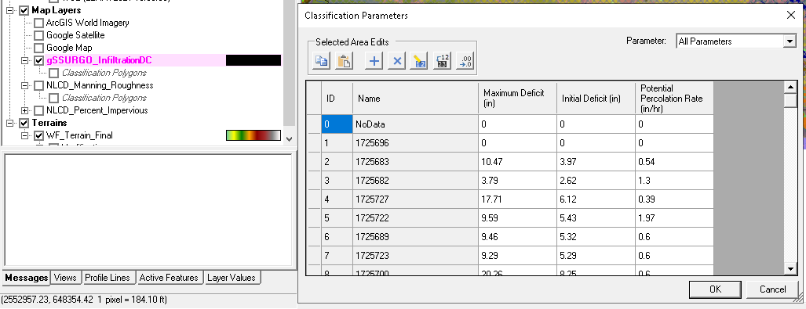
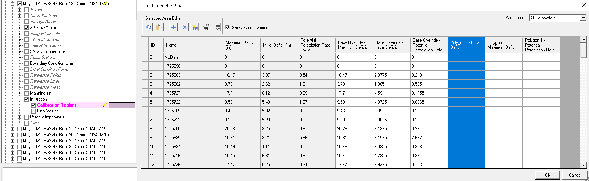

# Modification of HEC-RAS 2D Geometry Infiltration Base Overrides using H5py

<p align="center">
  <br>
  <i>Friendly Llama at Percolation Station</i>
</p>


## Introduction
HEC-RAS (Hydrologic Engineering Center's River Analysis System) is a widely used software for hydrological modeling and river analysis. One of the critical components in these models is the accurate representation of infiltration parameters. However, manually updating these parameters can be time-consuming and error-prone, especially when dealing with multiple scenarios or large datasets. Manual workflows also have natural limitations that prevent more rigorous parallel batch evaluation of parameter values.  This is where programmatic modification using Python and the H5py library show their strengths, enabling efficient and automated updates to infiltration base overrides in HEC-RAS 2D geometries.

RAS-Commander introduced the ability to set 2D infiltration overrides for deficit and constant methods using a python notebook-based workflow.  This blog is a deep dive into the core functionality that enables RAS-Commander's Code Cell 9 to modify infiltration parameters by directly modifying the base overrides in the HEC-RAS geometry HDF file.  As additional geometry elements and new features get integrated into the HEC-RAS HDF format, the examples and workflows shown in this blog post can be adapted for use with additional future features.  

## Background
As of HEC-RAS version 6.0, HDF5 files (.hdf) are used to store and organize geometry, results, terrain, land cover and infiltration data layer information.  The geometry HDF files follow a specific structure are built dynamically from the ASCII geometry file each time the geometry is saved, creating a binary digital twin using the legacy plain text geometry file as input. 

To achieve programmatic modification of HDF files, we use the H5py library in Python which provides a convenient way to interact with and modify these HDF5 files. By leveraging the power of H5py and AI-assisted coding, we can automate the process of updating infiltration parameters to assist in HEC-RAS calibration and validation workflows.

This blog is based on the python code/logic provided in the most recent version of [RAS-Commander Notebook - Code Cell #9.](https://github.com/billk-FM/HEC-Commander/blob/main/RAS-Commander/RAS-Commander%20_1.0.ipynb)

Please note: RAS-Commander provides additional logic to create new prj file entries, plan files, unsteady flow files, and copies of geometries to create a new run-ready plan for multiple parameter combinations.  The functions provided here are a deep dive on the portion of the code that modifies each geometry file.  


## Why Modify the Geometry HDF instead of the Infiltration Layer HDF?
There are multiple way to achieve infiltration scaling using HEC-RAS and RASMapper.  The manual method involves simply editing the infiltration tables, and keeping notes within the geometry description to note which scale factors were utilized.  While this is feasible for a limited number of variations, the labor and potential for human error makes it less than optimal when performing large run sets.  The next logical step is to programmatically vary the infiltration layer HDF, where the infiltration value tables are stored.  However, this is not compatible with parallelization, as only one combination of infiltration parameters can be run at a time, or on-the-fly programmatic modifications would be needed that could potentially introduce difficult-to-diagnose errors in the results.  

<p align="center">
  <br>
   <i>Defining Infiltration by Map Layer Override</i>
</p>

When writing the infiltration values to the geometry HDF File, the base override values are modified, and not the calibration region itself.  This makes the actual calibration region irrelevant (one must be present, but its shape and position does not affect the script operation), and allows uniform scaling across the entire model domain without relying on the user to correctly draw or import a calibration region. Modification of the geometry HDF file allow multiple variations to persist and be verifiable, as the full geometry including base overrides are copied into the results. This enables mass parallelization without the need for explicit recordkeeping within the geometry description and/or additional analysis needed to verify which infiltration values and scale factors were used.  

For our purposes an arbitrary calibration region within the geometry file + utilizing the base override field was the most optimal approach, as it provided the most transparent and flexible workflow. The only required step is the creation of an infiltration calibration region within the geometry prior to running the python function (Otherwise, the necessary tables are not included in the HDF file).  This is manageable, although in the future it would be nice to create another function that creates an arbitrary calibration region and modifies tables, to remove that requirement for the user.  


<p align="center">
  <br>
  <i>Defining Infiltration by Geometry Base Override via Calibration Region</i>
</p>

_Note: While the function provided here only supports uniform infiltration paramater scaling across the model domain (due to it's use of base overrides), the function could be readily modified to support multiple calibration regions within the model domain, if needed for more demanding workflows._ 

One last thing!  You may have noticed that I mentioned that the geometry HDF is dynamically generated.  So doesn't that mean that any information that is written there, will be overwritten on the next save?  Well, infiltration layers are actually one of the only bits of data that *are not* stored anywhere in the ASCII geometry file.  Because the ASCII geometry file is a legacy file type that will eventually no longer be supported, new features are being incorporated in HDF format directly without backporting to the ASCII format.  Infiltration layers in RASMapper just so happen to be one of those features.  Go ahead, search the .gxx file for infiltration table values, you won't find them! Therefore the tables in the geometry HDF file are the primary storage location for that data, and it does not get dynamically overwritten when the geometry is subsequently saved. 

This might not seem like a big deal right now - it's only the infiltration parameters, right?  But HEC-RAS is moving towards HDF for all new features, and eventually will drop support for the ASCII geometry file.  I predict that this blog will only become more useful over time as more features and options become programmatically modifiable through HDF file manipulation.  

## Python Code Deep Dive: Using H5py to Modify .gxx.hdf Files with `scale_infiltration_data` function
Let's dive into the technical details of the H5py python function I used to modify the .gxx.hdf files in HEC-RAS. These files follow a specific structure, and understanding this structure is crucial for making accurate modifications. The key function that enables the programmatic update of infiltration base overrides is `scale_infiltration_data`. Here's a breakdown of how this function works:

```python
def scale_infiltration_data(hdf_file_path, infiltration_df, scale_md, scale_id, scale_pr):
    hdf_path_to_overwrite = '/Geometry/Infiltration/Base Overrides'
    
    with h5py.File(hdf_file_path, 'a') as hdf_file:
        if hdf_path_to_overwrite in hdf_file:
            del hdf_file[hdf_path_to_overwrite]

        dt = np.dtype([
            ('Land Cover Name', 'S7'),
            ('Maximum Deficit', 'f4'),
            ('Initial Deficit', 'f4'),
            ('Potential Percolation Rate', 'f4')
        ])

        structured_array = np.zeros(infiltration_df.shape[0], dtype=dt)
        structured_array['Land Cover Name'] = np.array(infiltration_df['Name'].astype(str).values.astype('|S7'))
        structured_array['Maximum Deficit'] = infiltration_df['Maximum Deficit'].values.astype(np.float32)
        structured_array['Initial Deficit'] = infiltration_df['Initial Deficit'].values.astype(np.float32)
        structured_array['Potential Percolation Rate'] = infiltration_df['Potential Percolation Rate'].values.astype(np.float32)

        hdf_file.create_dataset(
            hdf_path_to_overwrite,
            data=structured_array,  
            dtype=dt,
            compression='gzip',
            compression_opts=1,
            chunks=(100,),
            maxshape=(None,)
        )
        
    return infiltration_df
```

The function takes the following arguments:
- `hdf_file_path`: The path to the .gxx.hdf file to be modified.
- `infiltration_df`: A pandas DataFrame containing the infiltration data to be scaled and written to the HDF5 file.
- `scale_md`, `scale_id`, `scale_pr`: Scale factors for Maximum Deficit, Initial Deficit, and Potential Percolation Rate, respectively.

*FROM RAS-COMMANDER README:*
## Example Infiltration Parameters from RASMapper
This CSV should be a direct copy/paste from RASMapper's Infiltration Layer:
```
ID,Name,Maximum Deficit,Initial Deficit,Potential Percolation Rate
0,NoData,0,0,0
1,1725696,0,0,0
10,1725684,10.49,4.11,0.57
11,1725716,15.45,6.31,0.6
12,1725726,17.47,5.25,0.34
```
Note, only MD, ID, and PR are scaled in the 1.0 version of this script. 


Please note that the infiltration data in RAS-Commander is a user-created CSV file: 

The infiltration data is then called using the following code: 

  ```python
# Read Infiltration Grid CSV
Infiltration_From_RAS2D_df = pd.read_csv(Infiltration_From_RASMapper_csv)
print("\nInfiltration Data from CSV (This should be unscaled data values) as Infiltration_From_RAS2D_df:")
display(Infiltration_From_RAS2D_df)
```

## Step by Step Explanation of scale_infiltration_data

The function performs the following steps:
- Opens the HDF5 file in append mode using `h5py.File()`.
- Checks if the dataset to be overwritten exists and deletes it if necessary.
- Defines a structured data type (dt) that matches the expected structure in the HDF5 file.
- Creates a structured array using the infiltration DataFrame and the defined data type.
- Writes the structured array to the HDF5 file using `create_dataset()`, specifying compression options and chunk size.
- Returns the scaled infiltration DataFrame for verification purposes.

It's important to note that the function uses specific data types and compression options that are compatible with HEC-RAS. Modifying these options may lead to issues with the HEC-RAS solver.

## Implementing the scale_infiltration_data Function in Your Workflow
To integrate the `scale_infiltration_data` function into your existing Python workflow, follow these steps:
- Ensure that you have the h5py and pandas libraries installed in your Python environment.
- Prepare your infiltration data as a pandas DataFrame with the required columns:
  - 'Name': Land cover names
  - 'Maximum Deficit'
  - 'Initial Deficit'
  - 'Potential Percolation Rate'

Here's an example of creating a sample DataFrame:

```python
data = {
    'Name': ['Grass', 'Concrete', 'Soil'],
    'Maximum Deficit': [7, 1, 5],
    'Initial Deficit': [2, 0.1, 1.75],
    'Potential Percolation Rate': [1, 0.25, 0.8]
}
infiltration_df = pd.DataFrame(data)
```

- Specify the path to your .gxx.hdf file and the desired scale factors:

```python
hdf_file_path = 'path_to_your_hdf5_file.hdf5'
scale_md = 1.2
scale_id = 1.1
scale_pr = 0.9
```

- Call the `scale_infiltration_data` function with the appropriate arguments:
  
```python
scaled_df = scale_infiltration_data(hdf_file_path, infiltration_df, scale_md, scale_id, scale_pr)
```

- Verify the changes by inspecting the scaled DataFrame returned by the function:
```python
print("Scaled Infiltration Data:")
print(scaled_df)
```

## Challenges and Solutions
When implementing the `scale_infiltration_data` function, I encountered some challenges related to the specific HDF5 options required by the HEC-RAS unsteady solver. Here are a few common issues and the solutions I found: 

- **Incorrect HDF5 Options in H5py**: The most common challenge when editing geometry files is using the correct HDF5 options in H5py that exactly match the existing geometry HDF file. The RAS unsteady solver requires strict adherence to the original structured array, chunking, shape, and compression options when making edits to the .gxx.hdf file. Failure to use the exact same options can result in solver errors.
  - **Solution**: Use HDFView, a visual tool for browsing and editing HDF5 files, to inspect the existing HDF5 file and ensure that the options used in the `scale_infiltration_data` function match precisely.  Use the "General Object Info" tab for a quick reference to all of the required info:

<p align="center">
  <br>
  <i>HDFView General Object Info Tab</i>
</p> 
 
  - **HDFView Download**: [https://www.hdfgroup.org/downloads/hdfview/](https://www.hdfgroup.org/downloads/hdfview/)  Navigating to the table of interest and going to the "General Object Info" tab will expose all of the HD options needed to succesfully recreate the dataset with H5py.
- **Complex HDF5 Options**: Setting the correct HDF5 options programmatically can be challenging, especially when dealing with structured arrays, compression, and chunking.
  - **Solution**: Leverage AI-assisted coding techniques, such as using the h5py documentation and examples, to create the required structured arrays and set the HDF parameters correctly.  Vision models were used to ingest screenshots of HDFView directly, and iterate until results were produced that were successfully ingested by the unsteady solver.
  - **H5py Documentation - Datasets**: [https://docs.h5py.org/en/stable/high/dataset.html](https://docs.h5py.org/en/stable/high/dataset.html)
- **Lack of Examples**: Finding specific examples of editing HEC-RAS geometry files using Python is difficult, as the infiltration layers are currently the only major option stored in the geometry HDF that isn't dynamically overwritten from the ASCII geometry.  Combined with the need for an exact, in-kind replacement of the entire data structure each time a value is updated, there were simply are no examples available online for editing the HEC-RAS geometry HDF (which this blog seeks to ameliorate). 
  - **Solution**: Refer to the RAS-Commander Notebook, specifically Code Cell #9, which demonstrates how to update geometry HDF files with new infiltration grid base overrides. This code cell provides a practical example of using the `scale_infiltration_data` function and can serve as a starting point for your own implementation.
  - **RAS-Commander Notebook - Code Cell #9**: [https://github.com/billk-FM/HEC-Commander/blob/main/RAS-Commander/RAS-Commander%20_1.0.ipynb](https://github.com/billk-FM/HEC-Commander/blob/main/RAS-Commander/RAS-Commander%20_1.0.ipynb)

## Conclusion
Programmatic modification of HEC-RAS 2D geometries using the `scale_infiltration_data` function (leveraging H5py) provides a powerful and efficient way to update infiltration base overrides. By automating the process, you can save time, reduce errors, and easily handle multiple scenarios. The `scale_infiltration_data` function demonstrated in this blog post is meant to help others with integrating this functionality into their own python-based automation frameworks, especially since I have not seen these specific options or programmatic modification of geometry HDF files mentioned in any existing guidance.  This functionality is already integrated into RAS-Commander, however I felt it was worth a deep dive to explore the specific options and data structures needed as well as explain the logic behind the approach.  As HEC-RAS versions advance and more features are implemented exclusively in the geometry HDF files, the need to adhere to the stricter data structuring and HDF options will become more important.  The ability to programmatically modify infiltration base overrides opens up new possibilities for automated sensitivity analysis, calibration, and scenario testing in HEC-RAS 2D models.  By breaking out and doing a deep dive on this specific functionality, hopefully it extends the reach of this approach to those who already have proprietary python-based automation solutions.  

Finally, this should serve as yet another example of the power of AI-assisted coding for water resources engineers!  To adapt this code for your own use, just drop this entire .md file (copy/paste or drag and drop) into your favorite LLM provider (ChatGPT, Claude, Gemini or Llama3) and ask for a variation that suits your needs!  Or ask it to help you write a technical deep dive post to make your code more accessible to others.  Happy coding and happy modeling!

## References and Further Reading

- **HDFView Download**: [https://www.hdfgroup.org/downloads/hdfview/](https://www.hdfgroup.org/downloads/hdfview/)
- **H5py Documentation - Datasets**: [https://docs.h5py.org/en/stable/high/dataset.html](https://docs.h5py.org/en/stable/high/dataset.html)
- **RAS-Commander Notebook - Code Cell #9**: [https://github.com/billk-FM/HEC-Commander/blob/main/RAS-Commander/RAS-Commander%20_1.0.ipynb](https://github.com/billk-FM/HEC-Commander/blob/main/RAS-Commander/RAS-Commander%20_1.0.ipynb)
- **HEC-RAS Documentation**: [https://www.hec.usace.army.mil/software/hec-ras/documentation.aspx](https://www.hec.usace.army.mil/software/hec-ras/documentation.aspx)
- **RAS Commander Blog**: [https://rascommander.com/blog/](https://rascommander.com/blog/)

For more detailed information and additional examples, refer to the RAS Commander blog and the HEC-RAS documentation.
