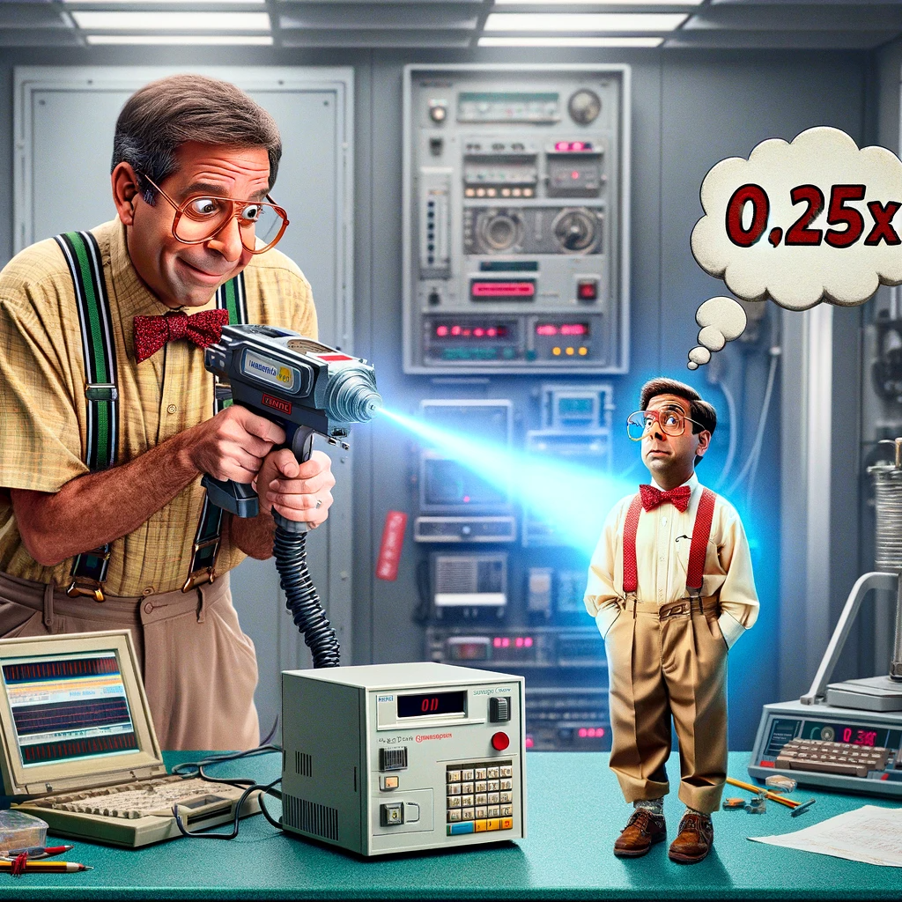

# Welcome to the HEC-Commander Blog!

Here are the latest blog posts with brief summaries:

<h1 align="center" style="font-weight:bold; font-size: 36px;"> 10x Engineering in Water Resources with AI</h1>

  

### [10x Engineering in Water Resources with AI](https://github.com/billk-FM/HEC-Commander/tree/main/Blog/1.%2010x%20Engineering%20in%20Water%20Resources%20with%20AI.md)
This post discusses the role of AI in revolutionizing water resource management and engineering. It explores how AI can bring about a tenfold improvement in efficiency and effectiveness in this field.

  

<h1 align="center" style="font-weight:bold; font-size: 36px;"> From 10x to 0.25x Engineering: By The Numbers</h1>

  

### [From 10x to 0.25x Engineering: By The Numbers](https://github.com/billk-FM/HEC-Commander/tree/main/Blog/2.%2010XEngineering_By_The_Numbers.md)
In this article, we delve into the quantitative aspects of 10x engineering. It provides a detailed analysis of how metrics and data-driven approaches are shaping the future of engineering, as well as a breakdown of cloud computing costs for various platforms and approaches.

<h1 align="center" style="font-weight:bold; font-size: 36px;"> Coming Soon: Moore's Law, AI Speedrunning the Golden Age of Computing</h1>

<h1 align="center" style="font-weight:bold; font-size: 36px;"> Coming Soon: Automating Parallel HEC-RAS Execution: Command Line is All You Need</h1>

<h1 align="center" style="font-weight:bold; font-size: 36px;"> Coming Soon: Simplifyihg Python Notebooks Environment Setup with a Custom GPT</h1>

<h1 align="center" style="font-weight:bold; font-size: 36px;"> Coming Soon: CoPilots: Novel Methods for Water Resource Engineers</h1>

<h1 align="center" style="font-weight:bold; font-size: 36px;"> Coming Soon: Prompting Basics for Water Resource Engineers using HEC-RAS ans HEC-HMS</h1>

<h1 align="center" style="font-weight:bold; font-size: 36px;"> Coming Soon: Back to Basics: Optimizing 2D HEC-RAS Model Runtimes</h1>

