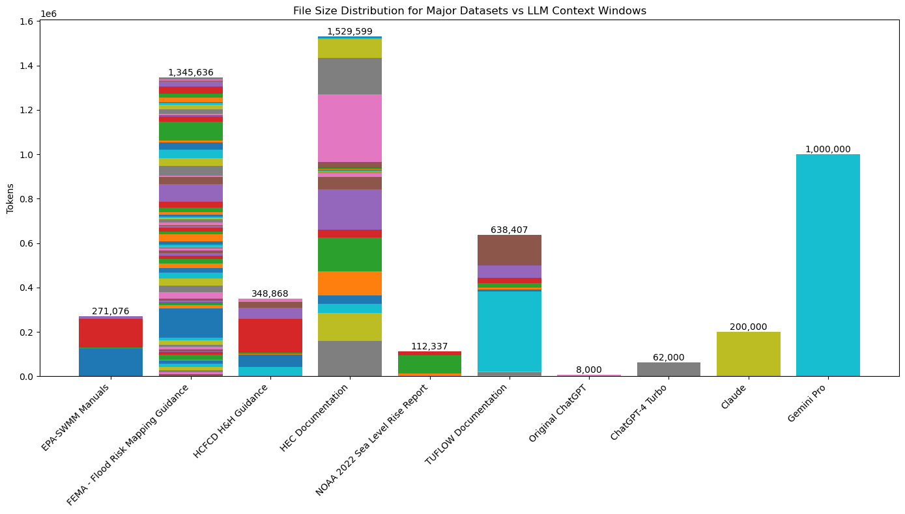

# Example 17: Converting PDF to Text and Counting Tokens

In this example, we are converting PDF to text for easier ingestion by LLM interfaces such as ChatGPT.  Then we are counting the tokens in each file and providing subtotals that we can use to build a stacked bar graph.

To provide a useful comparision, several document collections were gathered: 
- EPA-SWMM Documentation
- FEMA FLood Risk Mapping Guidance
- Harris County Flood Control District H&H Guidance
- HEC-RAS Documentation 
- NOAA 2022 Sea Level Rise Report + Appendices
- TUFLOW Documentation
- QGIS Documentation 

These were compared agaist common LLM context window sizes:
- Original ChatGPT: 8k
- ChatGPT4-Turbo: 62k (inside the GPT+ interface 128k through API)
- Claude: 200k
- Gemini Pro: 1M

To re-create this example, copy the code cells below to your own notebook, and place the notebook in the same folder as your PDF files.  The script will search subfolders and convert PDF to text and count the number of tokens in each file using the GPT2 tokenizer (which is still applicable to GPT-4)

If your files aren't too large, you can try running this script directly in ChatGPT using this custom GPT: [Convert PDF to Text for Knowledge Base](https://chat.openai.com/g/g-tYD47i22J-convert-pdf-to-text-for-knowledge-base)


### Install PDFMiner and Huggingface Transformers
```
!pip install pdfminer.six
!pip install transformers
```


### Convert Every PDF in Folders and Subfolders to .TXT, then count tokens

```
import os
import re
from collections import defaultdict
from pdfminer.high_level import extract_text_to_fp
from io import StringIO
from transformers import GPT2TokenizerFast

def extract_text_from_pdf(pdf_path):
    output_string = StringIO()
    with open(pdf_path, 'rb') as in_pdf:
        extract_text_to_fp(in_pdf, output_string, codec='utf-8')
    return output_string.getvalue()

from transformers import GPT2TokenizerFast

def count_tokens_in_text(text, chunk_size=1024):
    # Initialize the tokenizer
    tokenizer = GPT2TokenizerFast.from_pretrained("gpt2")
    
    # Split the text into chunks of up to chunk_size characters
    chunks = [text[i:i+chunk_size] for i in range(0, len(text), chunk_size)]
    
    # Initialize a variable to keep track of the total number of tokens
    total_tokens = 0
    
    # Tokenize each chunk and update the total token count
    for chunk in chunks:
        tokens = tokenizer.encode(chunk)
        total_tokens += len(tokens)
    
    return total_tokens


def convert_pdf_to_text_and_count_tokens(directory):
    results = defaultdict(list)
    print("Starting PDF conversion and token counting...")
    for root, _, files in os.walk(directory):
        print(f"Processing directory: {root}")
        for file in files:
            if file.lower().endswith('.pdf'):
                pdf_path = os.path.join(root, file)
                rel_path = os.path.relpath(pdf_path, start=directory)
                txt_path = pdf_path.rsplit('.', 1)[0] + '.txt'
                print(f"Processing file: {file}")
                try:
                    if not os.path.exists(txt_path) or os.path.getsize(txt_path) < 5 * 1024:
                        text = extract_text_from_pdf(pdf_path)
                        with open(txt_path, 'w', encoding='utf-8') as txt_file:
                            txt_file.write(text)
                        token_count = count_tokens_in_text(text)
                        results[root].append((rel_path, token_count))
                        print(f"Successfully processed {file}: {token_count} tokens")
                    else:
                        with open(txt_path, 'r', encoding='utf-8') as txt_file:
                            text = txt_file.read()
                        token_count = count_tokens_in_text(text)
                        results[root].append((rel_path, token_count))
                        print(f"Skipped processing {file}, using existing .txt file: {token_count} tokens")
                except Exception as e:
                    results[root].append((rel_path, f"Failed: {e}"))
                    print(f"Failed to process {file}: {e}")
    print("PDF conversion and token counting completed.")
    return results

import matplotlib.pyplot as plt
import pandas as pd

import ipywidgets as widgets
from IPython.display import display

def save_results_as_table(results):
    for directory, files in results.items():
        data = []
        subtotal_tokens = 0
        for file, token_count in files:
            if isinstance(token_count, int):
                subtotal_tokens += token_count
            data.append([file, token_count])
        data.append(["Subtotal tokens in directory", subtotal_tokens])
        df = pd.DataFrame(data, columns=['File', 'Token Count'])
        
        # Display in Jupyter Notebook using ipywidgets
        out = widgets.Output(layout={'border': '1px solid black'})
        with out:
            display(df)
        display(out)
        
        # Save figure as image
        fig, ax = plt.subplots(figsize=(8, len(data) * 0.5))  # Adjust figure size as needed
        ax.axis('tight')
        ax.axis('off')
        ax.table(cellText=df.values, colLabels=df.columns, loc='center')
        plt.savefig(f"{directory.replace('/', '_').replace(':', '')}_tokens_table.png")

# Path to the directory you want to process
directory_path = '.'

# Convert all PDF files to text and count tokens
results = convert_pdf_to_text_and_count_tokens(directory_path)

# Print the results with subtotals
print_results_with_subtotals(results)


```

### Example Outputs
```
Directory: .\ARBM
  ARBM\ARBNM_Project_Report_03252019.pdf	181797
  ARBM\ARBNM_Project_Report_BoundaryConditionPortion_03252019.pdf	5274
  ARBM\ARBNM_QuickGuide_Final_March2019.pdf	36459
Subtotal tokens in '.\ARBM': 223530

Directory: .\EPA-SWMM
  EPA-SWMM\epaswmm5_1_manual_master_8-2-15.pdf	123174
  EPA-SWMM\SWMM Reference Manual Errata.pdf	843
  EPA-SWMM\SWMM-CAT User's Guide (Version 1.1).pdf	6079
  EPA-SWMM\swmm-users-manual-version-5.2.pdf	129471
  EPA-SWMM\swmm5-reference-manual-ii-addendum-20220210mas2wr-1.pdf	11509
Subtotal tokens in '.\EPA-SWMM': 271076

Directory: .\FEMA -  Flood Risk Mapping Guidance
  FEMA -  Flood Risk Mapping Guidance\Appeal_And_Comment_Processing_Nov_2023.pdf	10260
  FEMA -  Flood Risk Mapping Guidance\Base_Map_FIRM_Panel_Layout_Guidance_Nov_2023.pdf	9684
  FEMA -  Flood Risk Mapping Guidance\BFE_Mapping_Guidance_Nov_2023.pdf	7382
  FEMA -  Flood Risk Mapping Guidance\Coastal_Floodplain_Mapping_Guidance_Nov_2023.pdf	16494
  FEMA -  Flood Risk Mapping Guidance\Coastal_Flood_Frequency_and_Extreme_Value_Analysis_Guidance_Nov_2023.pdf	12163
  FEMA -  Flood Risk Mapping Guidance\Coastal_Overland_Wave_Propagation_Nov_2023.pdf	16144
  FEMA -  Flood Risk Mapping Guidance\Coastal_Riverine_Guidance_Nov_2023.pdf	3126
  FEMA -  Flood Risk Mapping Guidance\Coastal_Statistical_Simulation_Methods_Nov_2023.pdf	23163
  FEMA -  Flood Risk Mapping Guidance\Elevation_Guidance_Nov_2023.pdf	10859
  FEMA -  Flood Risk Mapping Guidance\FEDD_TSDN_Guidance_Nov_2023.pdf	3370
  FEMA -  Flood Risk Mapping Guidance\Federal_Register_Guidance_Nov_2023.pdf	8843
  FEMA -  Flood Risk Mapping Guidance\FEMA General Hydraulics Considerations.pdf	12681
  FEMA -  Flood Risk Mapping Guidance\fema_archived-bfe-mapping-guidance.pdf	6581
  FEMA -  Flood Risk Mapping Guidance\fema_archived-firm-panel-technical-reference_112021.pdf	20766
  FEMA -  Flood Risk Mapping Guidance\fema_base-level-engineering-analysis-mapping_112022.pdf	14057
  FEMA -  Flood Risk Mapping Guidance\fema_CNMS-technical-reference_112021.pdf	131684
  FEMA -  Flood Risk Mapping Guidance\fema_coastal-general-study-considerations_112022.pdf	14877
  FEMA -  Flood Risk Mapping Guidance\fema_coastal-specific-non-regulatory-datasets_112022.pdf	6196
  FEMA -  Flood Risk Mapping Guidance\fema_coastal-zone-management-act-guidance.pdf	4304
  FEMA -  Flood Risk Mapping Guidance\fema_cpastal-structures-guidance_112022.pdf	9172
  FEMA -  Flood Risk Mapping Guidance\fema_dam-specific-non-regulatory-frd-guidance.pdf	8787
  FEMA -  Flood Risk Mapping Guidance\fema_dams-reservoirs-non-dam-features-guidance_112022.pdf	27664
  FEMA -  Flood Risk Mapping Guidance\fema_data-capture-guidance-workflow-details.pdf	30510
  FEMA -  Flood Risk Mapping Guidance\fema_data-capture-guidance-workflow-details_112021.pdf	32708
  FEMA -  Flood Risk Mapping Guidance\fema_data-capture-technical-reference-nov-2023.pdf	27240
  FEMA -  Flood Risk Mapping Guidance\fema_determination-wave-characteristics-guidance_112021.pdf	19097
  FEMA -  Flood Risk Mapping Guidance\fema_firm-panel-technical-reference.pdf	20018
  FEMA -  Flood Risk Mapping Guidance\fema_firm-panel-technical-reference_112022.pdf	20292
  FEMA -  Flood Risk Mapping Guidance\fema_general-hydraulics-guidance_112022.pdf	14845
  FEMA -  Flood Risk Mapping Guidance\fema_general-hydrologic-considerations_112022.pdf	12858
  FEMA -  Flood Risk Mapping Guidance\fema_guidance-flood-risk-analysis-mapping-key-decision-points_112022.pdf	11562
  FEMA -  Flood Risk Mapping Guidance\fema_hydraulics-2d-analyses-guidance_112022.pdf	7380
  FEMA -  Flood Risk Mapping Guidance\fema_letter-final-determination_112022.pdf	5694
  FEMA -  Flood Risk Mapping Guidance\fema_lomr-incorporation-guidance_112022.pdf	5222
  FEMA -  Flood Risk Mapping Guidance\fema_metadata-guidance_112021.pdf	7397
  FEMA -  Flood Risk Mapping Guidance\fema_metadata-profiles-technical-reference_112021.pdf	15906
  FEMA -  Flood Risk Mapping Guidance\fema_mt-1-technical-guidance_112022.pdf	31101
  FEMA -  Flood Risk Mapping Guidance\fema_pmr-guidance_112022.pdf	11612
  FEMA -  Flood Risk Mapping Guidance\fema_post-flood-hazard-verificaton-recovery-tools_112022.pdf	18298
  FEMA -  Flood Risk Mapping Guidance\fema_post-preliminary-deliverables_112022.pdf	7457
  FEMA -  Flood Risk Mapping Guidance\fema_profile-baseline-guidance.pdf	4976
  FEMA -  Flood Risk Mapping Guidance\fema_project-planning-guidance_112022.pdf	9552
  FEMA -  Flood Risk Mapping Guidance\fema_quality-management-guidance_112021.pdf	15940
  FEMA -  Flood Risk Mapping Guidance\fema_riverine-mapping-floodplain-boundaries-guidance_112022.pdf	5865
  FEMA -  Flood Risk Mapping Guidance\fema_rm-6510_tab_submission_template_nov_2023.pdf	5200
  FEMA -  Flood Risk Mapping Guidance\fema_rm-accepting-numerical-models-guidance-nov-2023.pdf	9652
  FEMA -  Flood Risk Mapping Guidance\fema_rm-base_level_engineering_guidance_nov_2023.pdf	12552
  FEMA -  Flood Risk Mapping Guidance\fema_rm-coastal-wave-runup-and-overtopping-nov-2023.pdf	19566
  FEMA -  Flood Risk Mapping Guidance\fema_rm-domain-tables-technical-reference-nov-2023.pdf	25606
  FEMA -  Flood Risk Mapping Guidance\fema_rm-firm-database-technical-reference-nov-2023.pdf	78738
  FEMA -  Flood Risk Mapping Guidance\fema_rm-firm_database_guidance_nov_2023.pdf	31538
  FEMA -  Flood Risk Mapping Guidance\fema_rm-firm_index_guidance_nov_2023.pdf	8625
  FEMA -  Flood Risk Mapping Guidance\fema_rm-fis-report-technical-reference-nov-2023.pdf	42223
  FEMA -  Flood Risk Mapping Guidance\fema_rm-flood-risk-analysis-mapping-policy-rev14.pdf	34484
  FEMA -  Flood Risk Mapping Guidance\fema_rm-flood-risk-database-technical-reference-nov-2023.pdf	40525
  FEMA -  Flood Risk Mapping Guidance\fema_rm-floodway-analysis-and-mapping-nov-2023.pdf	31965
  FEMA -  Flood Risk Mapping Guidance\fema_rm-hydraulics_2d_analyses_guidance_nov_2023.pdf	7421
  FEMA -  Flood Risk Mapping Guidance\fema_rm-incorporating_mitigation_planning_technical_assistance_into_rm_projects_nov_2023.pdf	Failed: [Errno 2] No such file or directory: '.\\FEMA -  Flood Risk Mapping Guidance\\fema_rm-incorporating_mitigation_planning_technical_assistance_into_rm_projects_nov_2023.pdf'
  FEMA -  Flood Risk Mapping Guidance\fema_rm-levee_guidance_nov_2023.pdf	85033
  FEMA -  Flood Risk Mapping Guidance\fema_rm-mt-2_requests_guidance_nov_2023.pdf	23489
  FEMA -  Flood Risk Mapping Guidance\fema_rm-pal-progress-report_template_nov_2023.pdf	1756
  FEMA -  Flood Risk Mapping Guidance\fema_rm-stakeholder_engagement_preliminary_production_process_guidance_nov_2023.pdf	Failed: [Errno 2] No such file or directory: '.\\FEMA -  Flood Risk Mapping Guidance\\fema_rm-stakeholder_engagement_preliminary_production_process_guidance_nov_2023.pdf'
  FEMA -  Flood Risk Mapping Guidance\fema_shallow-flooding-guidance.pdf	4255
  FEMA -  Flood Risk Mapping Guidance\fema_stakeholder-engagement-introduction-guidance_112021.pdf	6612
  FEMA -  Flood Risk Mapping Guidance\fema_stakeholder-engagement-prelim-production-process-guidance_112021.pdf	18874
  FEMA -  Flood Risk Mapping Guidance\fema_stakeholder-engagement-project-planning-discovery-guidance_112021.pdf	19877
  FEMA -  Flood Risk Mapping Guidance\fema_zone-ar-zone-a99-determinations-guidance_112022.pdf	9426
  FEMA -  Flood Risk Mapping Guidance\GDC_Guidance_Nov_2023.pdf	3824
  FEMA -  Flood Risk Mapping Guidance\Ice_Jam_Guidance_Nov_2023.pdf	20355
  FEMA -  Flood Risk Mapping Guidance\Metadata_Profiles_Technical_Reference_Feb_2018.pdf	18050
  FEMA -  Flood Risk Mapping Guidance\MIP_Guidance_Nov_2023.pdf	32075
  FEMA -  Flood Risk Mapping Guidance\National_Flood_Hazard_Layer_Guidance_Nov_2023.pdf	22559
  FEMA -  Flood Risk Mapping Guidance\Notice_to_User_Corrections_Nov_2023.pdf	3655
  FEMA -  Flood Risk Mapping Guidance\PPP-Due_Process_Guidance_Guidance_Nov_2023.pdf	6632
  FEMA -  Flood Risk Mapping Guidance\Vertical_Datum_Conversion_Guidance_Nov_2023.pdf	7282
Subtotal tokens in '.\FEMA -  Flood Risk Mapping Guidance': 1345636

Directory: .\HCFCD
  HCFCD\14-M6-24fcd Regional Curve Data Final Memo amd Data (SQD).pdf	234
  HCFCD\Design-Guidelines-WetBottom-Basins-FINAL.pdf	41904
  HCFCD\Final-HCFCD_Geo_Guidelines-2021_12_31.pdf	55441
  HCFCD\gis_for_fema_submittals.pdf	2358
  HCFCD\HC-Channels.pdf	8233
  HCFCD\hcfcd-hydrology-hydraulics-manual_06272019.pdf	150891
  HCFCD\hcfcd_2005_specifications.pdf	51271
  HCFCD\Hydrology  Hydraulics Modeling and Management Standards.pdf	24048
  HCFCD\Pay_Items_October_2022.pdf	14488
Subtotal tokens in '.\HCFCD': 348868

Directory: .\HEC Documentation
  HEC Documentation\HEC-FIA_31_Users_Manual_2019-Dec.pdf	159008
  HEC Documentation\HEC-RAS 1D Sediment Transport-v4-20240414_122004.pdf	127080
  HEC Documentation\HEC-RAS 2D Sediment Technical Reference Manual-v6-20240414_122125.pdf	39239
  HEC Documentation\HEC-RAS 2D Sediment User Manual-v2-20240414_122036.pdf	38014
  HEC Documentation\HEC-RAS 2D User's Manual-v3-20240414_120630.pdf	111211
  HEC Documentation\HEC-RAS Applications Guide-v1-20240414_122441.pdf	150838
  HEC Documentation\HEC-RAS Guides and Tutorials-v9-20240414_121737.pdf	36517
  HEC Documentation\HEC-RAS Hydraulic Reference Manual-20240414_121657.pdf	181428
  HEC Documentation\HEC-RAS Mapper User's Manual-v6-20240414_121014.pdf	54071
  HEC Documentation\HEC-RAS Mud and Debris Flow-v13-20240414_122556.pdf	16756
  HEC Documentation\HEC-RAS Release Notes-v2-20240414_121557.pdf	4014
  HEC Documentation\HEC-RAS Release Notes-v3-20240414_121159.pdf	4119
  HEC Documentation\HEC-RAS Release Notes-v3-20240414_121221.pdf	4119
  HEC Documentation\HEC-RAS Release Notes-v3-20240414_121403.pdf	5010
  HEC Documentation\HEC-RAS Release Notes-v5-20240414_121432.pdf	1421
  HEC Documentation\HEC-RAS Release Notes-v5-20240414_121457.pdf	4885
  HEC Documentation\HEC-RAS Release Notes-v6-20240414_121536.pdf	4699
  HEC Documentation\HEC-RAS Release Notes-v7-20240414_121342.pdf	908
  HEC Documentation\HEC-RAS Training-v1-20240414_122147.pdf	21748
  HEC Documentation\HEC-RAS User's Manual-20240414_120942.pdf	304908
  HEC Documentation\HEC-SSP_22_Users_Manual.pdf	165367
  HEC Documentation\HEC-SSP_v2.3_Examples_20231026.pdf	83183
  HEC Documentation\HEC-SSP_v2.3_Release_Notes_20231026.pdf	6984
  HEC Documentation\HEC-SSP_v2.3_Validation_Guide_20231026.pdf	4072
Subtotal tokens in '.\HEC Documentation': 1529599

Directory: .\NOAA
  NOAA\Appendices.pdf	13153
  NOAA\noaa-nos-techrpt01-global-regional-SLR-scenarios-US.pdf	81157
  NOAA\noaa-nos-techrpt02-global-regional-SLR-scenarios-US-application-guide.pdf	18027
Subtotal tokens in '.\NOAA': 112337

Directory: .\QGIS-Combined-Documentation\docs\training_manual\database_concepts\img
  QGIS-Combined-Documentation\docs\training_manual\database_concepts\img\psql_cheatsheet.pdf	1738
Subtotal tokens in '.\QGIS-Combined-Documentation\docs\training_manual\database_concepts\img': 1738

Directory: .\QGIS-Combined-Documentation\docs\training_manual\spatial_databases\img
  QGIS-Combined-Documentation\docs\training_manual\spatial_databases\img\postgis_cheatsheet.pdf	2322
Subtotal tokens in '.\QGIS-Combined-Documentation\docs\training_manual\spatial_databases\img': 2322

Directory: .\QGIS-Documentation-master\docs\training_manual\database_concepts\img
  QGIS-Documentation-master\docs\training_manual\database_concepts\img\psql_cheatsheet.pdf	1738
Subtotal tokens in '.\QGIS-Documentation-master\docs\training_manual\database_concepts\img': 1738

Directory: .\QGIS-Documentation-master\docs\training_manual\spatial_databases\img
  QGIS-Documentation-master\docs\training_manual\spatial_databases\img\postgis_cheatsheet.pdf	2322
Subtotal tokens in '.\QGIS-Documentation-master\docs\training_manual\spatial_databases\img': 2322

Directory: .\TUFLOW\TUFLOW-PDF
  TUFLOW\TUFLOW-PDF\FLIKE_Installation_Instructions.pdf	786
  TUFLOW\TUFLOW-PDF\MiTools Release Notes.2020-01-AA.pdf	1102
  TUFLOW\TUFLOW-PDF\miTools_2016-05_ReleaseNotes.pdf	1119
  TUFLOW\TUFLOW-PDF\TUFLOW AD Manual.pdf	15991
  TUFLOW\TUFLOW-PDF\TUFLOW Flike License Agreement - 20211011 - BMT Commercial.pdf	3100
  TUFLOW\TUFLOW-PDF\TUFLOW Manual.pdf	360310
  TUFLOW\TUFLOW-PDF\TUFLOW Products Licence Agreement (1).pdf	8852
  TUFLOW\TUFLOW-PDF\TUFLOW Products Licence Agreement.pdf	8931
  TUFLOW\TUFLOW-PDF\TUFLOW_FV_Release_Notes.pdf	21531
  TUFLOW\TUFLOW-PDF\TUFLOW_FV_Science_Manual.pdf	22905
  TUFLOW\TUFLOW-PDF\TUFLOW_FV_ST_and_PT_Modules_User_Manual.pdf	55712
  TUFLOW\TUFLOW-PDF\TUFLOW_FV_User_Manual.pdf	138068
Subtotal tokens in '.\TUFLOW\TUFLOW-PDF': 638407
```
#### Convert Output to Markdown Table with AI
Using [Markdown Text Assistant](https://chat.openai.com/g/g-tuwysm1j4-markdown-text-assistant-gh-flavor), 

Instruction:  _"Provide table for each folder, including subtotals.  Don't include the full path for each file, just the file name and token count.  Open a markdown box and provide the table in markdown.   Provide full tables with no elides."_
[ChatGPT Conversation](https://chat.openai.com/share/e/e968aa30-c221-4aa9-b67a-23f842bd33e3)

### ARBM Folder Contents

| File Name                                                   | Token Count |
|-------------------------------------------------------------|-------------|
| ARBNM_Project_Report_03252019.pdf                           | 181797      |
| ARBNM_Project_Report_BoundaryConditionPortion_03252019.pdf  | 5274        |
| ARBNM_QuickGuide_Final_March2019.pdf                        | 36459       |
| **Subtotal**                                                | **223530**  |

### EPA-SWMM Folder Contents

| File Name                                             | Token Count |
|-------------------------------------------------------|-------------|
| epaswmm5_1_manual_master_8-2-15.pdf                   | 123174      |
| SWMM Reference Manual Errata.pdf                      | 843         |
| SWMM-CAT User's Guide (Version 1.1).pdf               | 6079        |
| swmm-users-manual-version-5.2.pdf                     | 129471      |
| swmm5-reference-manual-ii-addendum-20220210mas2wr-1.pdf | 11509      |
| **Subtotal**                                          | **271076**  |

### FEMA - Flood Risk Mapping Guidance Folder Contents

| File Name                                               | Token Count |
|---------------------------------------------------------|-------------|
| Appeal_And_Comment_Processing_Nov_2023.pdf              | 10260       |
| Base_Map_FIRM_Panel_Layout_Guidance_Nov_2023.pdf        | 9684        |
| BFE_Mapping_Guidance_Nov_2023.pdf                       | 7382        |
| Coastal_Floodplain_Mapping_Guidance_Nov_2023.pdf        | 16494       |
| Coastal_Flood_Frequency_and_Extreme_Value_Analysis_Guidance_Nov_2023.pdf | 12163   |
| Coastal_Overland_Wave_Propagation_Nov_2023.pdf          | 16144       |
| Coastal_Riverine_Guidance_Nov_2023.pdf                  | 3126        |
| Coastal_Statistical_Simulation_Methods_Nov_2023.pdf     | 23163       |
| Elevation_Guidance_Nov_2023.pdf                         | 10859       |
| FEDD_TSDN_Guidance_Nov_2023.pdf                         | 3370        |
| Federal_Register_Guidance_Nov_2023.pdf                  | 8843        |
| FEMA General Hydraulics Considerations.pdf              | 12681       |
| fema_archived-bfe-mapping-guidance.pdf                  | 6581        |
| fema_archived-firm-panel-technical-reference_112021.pdf | 20766       |
| fema_base-level-engineering-analysis-mapping_112022.pdf | 14057       |
| fema_CNMS-technical-reference_112021.pdf                | 131684      |
| fema_coastal-general-study-considerations_112022.pdf    | 14877       |
| fema_coastal-specific-non-regulatory-datasets_112022.pdf | 6196       |
| fema_coastal-zone-management-act-guidance.pdf           | 4304        |
| fema_cpastal-structures-guidance_112022.pdf             | 9172        |
| fema_dam-specific-non-regulatory-frd-guidance.pdf       | 8787        |
| fema_dams-reservoirs-non-dam-features-guidance_112022.pdf | 27664     |
| fema_data-capture-guidance-workflow-details.pdf         | 30510       |
| fema_data-capture-guidance-workflow-details_112021.pdf  | 32708       |
| fema_data-capture-technical-reference-nov-2023.pdf      | 27240       |
| fema_determination-wave-characteristics-guidance_112021.pdf | 19097   |
| fema_firm-panel-technical-reference.pdf                  | 20018       |
| fema_firm-panel-technical-reference_112022.pdf           | 20292       |
| fema_general-hydraulics-guidance_112022.pdf              | 14845       |
| fema_general-hydrologic-considerations_112022.pdf        | 12858       |
| fema_guidance-flood-risk-analysis-mapping-key-decision-points_112022.pdf | 11562 |
| fema_hydraulics-2d-analyses-guidance_112022.pdf          | 7380        |
| fema_letter-final-determination_112022.pdf               | 5694        |
| fema_lomr-incorporation-guidance_112022.pdf              | 5222        |
| fema_metadata-guidance_112021.pdf                        | 7397        |
| fema_metadata-profiles-technical-reference_112021.pdf    | 15906       |
| fema_mt-1-technical-guidance_112022.pdf                  | 31101       |
| fema_pmr-guidance_112022.pdf                             | 11612       |
| fema_post-flood-hazard-verificaton-recovery-tools_112022.pdf | 18298   |
| fema_post-preliminary-deliverables_112022.pdf            | 7457        |
| fema_profile-baseline-guidance.pdf                       | 4976        |
| fema_project-planning-guidance_112022.pdf                | 9552        |
| fema_quality-management-guidance_112021.pdf              | 15940       |
| fema_riverine-mapping-floodplain-boundaries-guidance_112022.pdf | 5865   |
| fema_rm-6510_tab_submission_template_nov_2023.pdf         | 5200        |
| fema_rm-accepting-numerical-models-guidance-nov-2023.pdf  | 9652        |
| fema_rm-base_level_engineering_guidance_nov_2023.pdf      | 12552       |
| fema_rm-coastal-wave-runup-and-overtopping-nov-2023.pdf   | 19566       |
| fema_rm-domain-tables-technical-reference-nov-2023.pdf    | 25606       |
| fema_rm-firm-database-technical-reference-nov-2023.pdf    | 78738       |
| fema_rm-firm_database_guidance_nov_2023.pdf               | 31538       |
| fema_rm-firm_index_guidance_nov_2023.pdf                  | 8625        |
| fema_rm-fis-report-technical-reference-nov-2023.pdf       | 42223       |
| fema_rm-flood-risk-analysis-mapping-policy-rev14.pdf      | 34484       |
| fema_rm-flood-risk-database-technical-reference-nov-2023.pdf | 40525   |
| fema_rm-floodway-analysis-and-mapping-nov-2023.pdf        | 31965       |
| fema_rm-hydraulics_2d_analyses_guidance_nov_2023.pdf      | 7421        |
| fema_rm-levee_guidance_nov_2023.pdf                       | 85033       |
| fema_rm-mt-2_requests_guidance_nov_2023.pdf               | 23489       |
| fema_rm-pal-progress-report_template_nov_2023.pdf         | 1756        |
| fema_shallow-flooding-guidance.pdf                        | 4255        |
| fema_stakeholder-engagement-introduction-guidance_112021.pdf | 6612    |
| fema_stakeholder-engagement-prelim-production-process-guidance_112021.pdf | 18874 |
| fema_stakeholder-engagement-project-planning-discovery-guidance_112021.pdf | 19877 |
| fema_zone-ar-zone-a99-determinations-guidance_112022.pdf  | 9426        |
| GDC_Guidance_Nov_2023.pdf                                 | 3824        |
| Ice_Jam_Guidance_Nov_2023.pdf                             | 20355       |
| Metadata_Profiles_Technical_Reference_Feb_2018.pdf        | 18050       |
| MIP_Guidance_Nov_2023.pdf                                 | 32075       |
| National_Flood_Hazard_Layer_Guidance_Nov_2023.pdf         | 22559       |
| Notice_to_User_Corrections_Nov_2023.pdf                   | 3655        |
| PPP-Due_Process_Guidance_Guidance_Nov_2023.pdf            | 6632        |
| Vertical_Datum_Conversion_Guidance_Nov_2023.pdf           | 7282        |
| **Subtotal**                                              | **1345636** |

### HCFCD Folder Contents

| File Name                                              | Token Count |
|--------------------------------------------------------|-------------|
| 14-M6-24fcd Regional Curve Data Final Memo amd Data (SQD).pdf | 234       |
| Design-Guidelines-WetBottom-Basins-FINAL.pdf           | 41904       |
| Final-HCFCD_Geo_Guidelines-2021_12_31.pdf              | 55441       |
| gis_for_fema_submittals.pdf                            | 2358        |
| HC-Channels.pdf                                        | 8233        |
| hcfcd-hydrology-hydraulics-manual_06272019.pdf         | 150891      |
| hcfcd_2005_specifications.pdf                          | 51271       |
| Hydrology  Hydraulics Modeling and Management Standards.pdf | 24048   |
| Pay_Items_October_2022.pdf                             | 14488       |
| **Subtotal**                                           | **348868**  |

### HEC Documentation Folder Contents

| File Name                                                | Token Count |
|----------------------------------------------------------|-------------|
| HEC-FIA_31_Users_Manual_2019-Dec.pdf                     | 159008      |
| HEC-RAS 1D Sediment Transport-v4-20240414_122004.pdf     | 127080      |
| HEC-RAS 2D Sediment Technical Reference Manual-v6-20240414_122125.pdf | 39239 |
| HEC-RAS 2D Sediment User Manual-v2-20240414_122036.pdf   | 38014       |
| HEC-RAS 2D User's Manual-v3-20240414_120630.pdf          | 111211      |
| HEC-RAS Applications Guide-v1-20240414_122441.pdf        | 150838      |
| HEC-RAS Guides and Tutorials-v9-20240414_121737.pdf      | 36517       |
| HEC-RAS Hydraulic Reference Manual-20240414_121657.pdf   | 181428      |
| HEC-RAS Mapper User's Manual-v6-20240414_121014.pdf      | 54071       |
| HEC-RAS Mud and Debris Flow-v13-20240414_122556.pdf      | 16756       |
| HEC-RAS Release Notes-v2-20240414_121557.pdf             | 4014        |
| HEC-RAS Release Notes-v3-20240414_121159.pdf             | 4119        |
| HEC-RAS Release Notes-v3-20240414_121221.pdf             | 4119        |
| HEC-RAS Release Notes-v3-20240414_121403.pdf             | 5010        |
| HEC-RAS Release Notes-v5-20240414_121432.pdf             | 1421        |
| HEC-RAS Release Notes-v5-20240414_121457.pdf             | 4885        |
| HEC-RAS Release Notes-v6-20240414_121536.pdf             | 4699        |
| HEC-RAS Release Notes-v7-20240414_121342.pdf             | 908         |
| HEC-RAS Training-v1-20240414_122147.pdf                  | 21748       |
| HEC-RAS User's Manual-20240414_120942.pdf                | 304908      |
| HEC-SSP_22_Users_Manual.pdf                              | 165367      |
| HEC-SSP_v2.3_Examples_20231026.pdf                       | 83183       |
| HEC-SSP_v2.3_Release_Notes_20231026.pdf                  | 6984        |
| HEC-SSP_v2.3_Validation_Guide_20231026.pdf               | 4072        |
| **Subtotal**                                             | **1529599** |

### NOAA Folder Contents

| File Name                                   | Token Count |
|---------------------------------------------|-------------|
| Appendices.pdf                              | 13153       |
| noaa-nos-techrpt01-global-regional-SLR-scenarios-US.pdf | 81157   |
| noaa-nos-techrpt02-global-regional-SLR-scenarios-US-application-guide.pdf | 18027  |
| **Subtotal**                                | **112337**  |


### TUFLOW Folder Contents

| File Name                                       | Token Count |
|-------------------------------------------------|-------------|
| FLIKE_Installation_Instructions.pdf             | 786         |
| MiTools Release Notes.2020-01-AA.pdf            | 1102        |
| miTools_2016-05_ReleaseNotes.pdf                | 1119        |
| TUFLOW AD Manual.pdf                            | 15991       |
| TUFLOW Flike License Agreement - 20211011 - BMT Commercial.pdf | 3100      |
| TUFLOW Manual.pdf                               | 360310      |
| TUFLOW Products Licence Agreement (1).pdf       | 8852        |
| TUFLOW Products Licence Agreement.pdf           | 8931        |
| TUFLOW_FV_Release_Notes.pdf                     | 21531       |
| TUFLOW_FV_Science_Manual.pdf                    | 22905       |
| TUFLOW_FV_ST_and_PT_Modules_User_Manual.pdf     | 55712       |
| TUFLOW_FV_User_Manual.pdf                       | 138068      |
| **Subtotal**                                    | **638407**  |


## Create Stacked Bar Chart from Markdown

Code for Stacked Bar Chart
```
import matplotlib.pyplot as plt
import numpy as np

file_sizes = {
    'EPA-SWMM Manuals': [123174, 843, 6079, 129471, 11509],
    'FEMA - Flood Risk Mapping Guidance': [10260, 9684, 7382, 16494, 12163, 16144, 3126, 23163, 10859, 3370, 8843, 12681, 6581, 20766, 14057, 131684, 14877, 6196, 4304, 9172, 8787, 27664, 30510, 32708, 27240, 19097, 20018, 20292, 14845, 12858, 11562, 7380, 5694, 5222, 7397, 15906, 31101, 11612, 18298, 7457, 4976, 9552, 15940, 5865, 5200, 9652, 12552, 19566, 25606, 78738, 31538, 8625, 42223, 34484, 40525, 31965, 7421, 85033, 23489, 1756, 4255, 6612, 18874, 19877, 9426, 3824, 20355, 18050, 32075, 22559, 3655, 6632, 7282],
    'HCFCD H&H Guidance': [234, 41904, 55441, 2358, 8233, 150891, 51271, 24048, 14488],
    'HEC Documentation': [159008, 127080, 39239, 38014, 111211, 150838, 36517, 181428, 54071, 16756, 4014, 4119, 4119, 5010, 1421, 4885, 4699, 908, 21748, 304908, 165367, 83183, 6984, 4072],
    'NOAA 2022 Sea Level Rise Report': [13153, 81157, 18027],
    'TUFLOW Documentation': [786, 1102, 1119, 15991, 3100, 360310, 8852, 8931, 21531, 22905, 55712, 138068],
}

ai_models = {
    'Original ChatGPT': [8000],
    'ChatGPT-4 Turbo': [62000],
    'Claude': [200000],
    'Gemini Pro': [1000000]
}

# Combining file sizes and AI model data
categories = list(file_sizes.keys()) + list(ai_models.keys())
data = list(file_sizes.values()) + list(ai_models.values())

# Plotting
fig, ax = plt.subplots(figsize=(14, 8))

# Plotting each category
for i, category in enumerate(categories):
    sizes = data[i]
    total = sum(sizes)
    bottom = 0
    for size in sizes:
        ax.bar(i, size, bottom=bottom)
        bottom += size
    ax.text(i, total, f"{total:,}", ha='center', va='bottom')

ax.set_ylabel('Tokens')
ax.set_title('File Size Distribution per Folder/AI Model with Totals')
plt.xticks(rotation=45, ha="right", ticks=range(len(categories)), labels=categories)

plt.tight_layout()
plt.show()
```

<p align="center">
  
</p>


