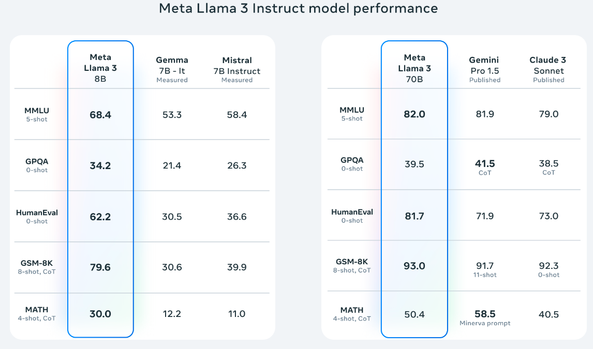
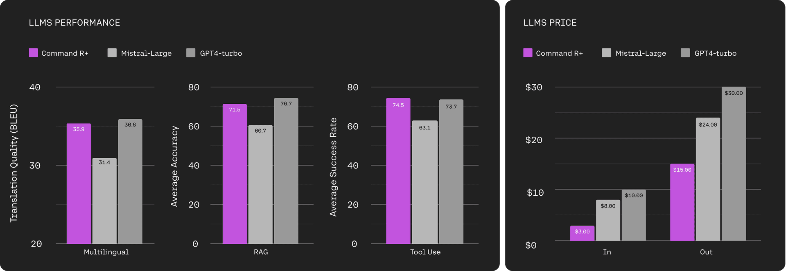

# Free Huggingface Assistants Updated with Llama-3-Instruct and Cohere Command-R Models

With the release of two new Large Language Models (LLMs) that are near GPT-4 level: **Llama-3-Instruct** and **Cohere Command-R**, I have updated my free Hugging Face Assistants. These are free versions of ChatGPT's "GPTs" assistants with custom instructions and web search.  With the upgrade to models with capabilities and performance comparable to GPT-4, everyone has access to a powerful and free tool for testing and experiencing the latest advancements in LLM technology.

## New Models, New Possibilities

A variety of new features and improvements are brought by the Llama-3-Instruct and Cohere Command-R models. Although code interpreter is not supported (and therefore, the use for engineering applications is somewhat limited), but it does allow invidivuals and companies to explore open source options in lieu of the closed source and expensive options provided by OpenAI and others.  As these technologies get commoditized, identifying open source options that are good enough for specific applications can provide a competitive advantage.  

# LLama-3 Release Benchmarks

   
  <i>Llama-3 Release Benchmarks</i>

As the leading open-weights model that is released under a license that allows commercial use (in most cases), Llama3 is the State of The Art open source model.  The 70-B instruct model has performance approaching GPT-4, and the soon to be released 400B model should make for a strong contender.  Currently, context windows are limited to 8k however this is expected to increase as the open source community makes additional fine tunes available. 

# Cohere-R Release Benchmarks

   
  <i>Command R Release Benchmarks</i>

The Cohere Command R model is not released for commerical use (the model is released as weights only), therefore experimentation should be for research only.  With strong metrics and a 128k context window, this could potentially be a model option for commerical applications where a strong competitor to OpenAI/Anthropic is desired.

## Updated Hugging Face Assistants

The following Hugging Face Assistants have been updated to utilize the new models, with the ability for users to easily switch between them and experience enhanced capabilities:
  
- Water Resource Python Notebook Assistant: [https://hf.co/chat/assistant/65c93874acad45bb02e78dcb](https://hf.co/chat/assistant/65c93874acad45bb02e78dcb)
    
- Script Translator: Outline in Plain Language: [https://hf.co/chat/assistant/65d0d99566fa9d07218c4bf4](https://hf.co/chat/assistant/65d0d99566fa9d07218c4bf4)
    
- Markdown Text Assistant: GH Flavor: [https://hf.co/chat/assistant/65d0dcfaf4ede0cff60f8396](https://hf.co/chat/assistant/65d0dcfaf4ede0cff60f8396)
    
- Voice Notes Transcription Assistant: [https://hf.co/chat/assistant/65d0de7e0650231c0f279feb](https://hf.co/chat/assistant/65d0de7e0650231c0f279feb)
    
- Jupyter Notebook Portability Enhancer: [https://hf.co/chat/assistant/65d0df9c1a0734a9345fafba](https://hf.co/chat/assistant/65d0df9c1a0734a9345fafba)
    
- Python Notebook GUI Builder: [https://hf.co/chat/assistant/65d0e11b1a0734a9345fb000](https://hf.co/chat/assistant/65d0e11b1a0734a9345fb000)
  

To try other models, click "Settings" at the start of a conversation.

