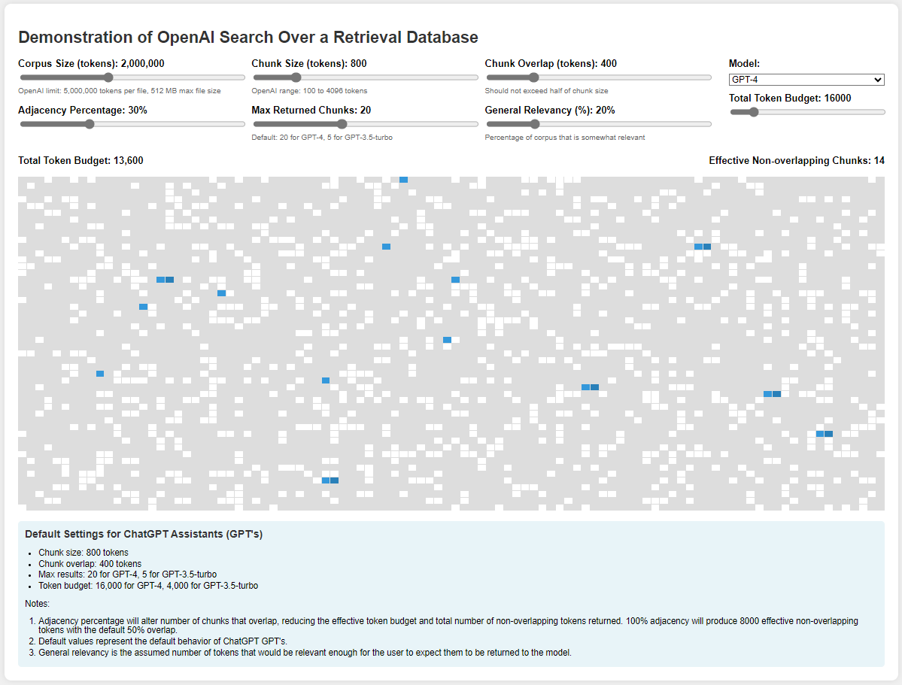

# Understanding the Limits of RAG: Dashboard Simulating OpenAI Document Retrieval

Retrieval-Augmented Generation (RAG) is the built-in feature in ChatGPT that allows you to upload large documents to enhance your chat outputs.  Despite all the new technologies and terms such as vector searches, cosine similarity, etc, there is still a fundamental limitation to the amount of actual tokens that can be retrieved, and most chat interfaces don't do a good job of showing you what it actualy retrieved (if you saw the ugly chunking you would see how naive and haphazard it is).  This is a MAJOR cause of unnecessary hallucinations in practice when using GPT's or document uploads, as the model tends to hallucinate missing content that the user resonably expects to be retrieved (but is actually not).   To explore this issue, i reviewed the OpenAI API interface to find details that provide clues about the ChatGPT web interface's capabilities.

To help explore thus visually, I utilized Anthropic's Claude to build a HTML/CSS/Javascript dashboard that allows the user to simulate the current operative limits of RAG in the context of OpenAI's powerful language models.

## Dashboard Simulating RAG Content Retrieval

Dashboard Link: [https://oai-file-retrieval-demo-dashboard.netlify.app/](https://oai-file-retrieval-demo-dashboard.netlify.app/) 

  

   
  OpenAI Retrieval Dashboard

NOTE: The dashboard only works on desktop browsers!  No ios or android support yet, although movile isere can see the demonstration in the screenshor above. 

## The OpenAI Retrieval Demonstration Dashboard: A Tool for Visual Understanding

The dashboard allows users to adjust various parameters such as corpus size, chunk size, and token budget, its primary purpose is to illustrate the limitations of current RAG implementations. By manipulating these settings, users can gain insights into how little context is actually retrieved, even from a substantial 2-million token corpus.  Ultimately, RAG retrieval will be superceded by larger context windows that can be utilized cheaply.  When context windows are not orders of magnitude too small, RAG solutions will also be able to deliver more value as there is a lot of robustness that vector search can add to model retrievals (by serving an opposite function: omitting irrelevant information).  In the meantime, the relatively small context windows of frontier-intelligence LLM's will continue to force these advanced search/limited retrieval technology stacks to be relied upon much to heavily.  By helping users understand the limited nature of RAG search and retrieval, better decisions can be made regarding when to manually curate context (especially where total relevant context exceeds the 12-16k effective token budget).

## Limitations of Current Return Augmented Generation (RAG) in OpenAI Assistants and GPT's (July 2024)

The dashboard starkly illustrates that current RAG implementations are far from a panacea for integrating large knowledge bases with language models, especialy when the total relevant context from those documents in many cases would far exceed even the full context window of the models.  Context windows are an order of magnitude larger than the effective non-overlapping token budgets currenly in place, so there is very little total context retrieved in comparison to a large (and relevant) corpus. Users would be forgiven for overestimating the amount of context that can be effectively retrieved and utilized, as the retrieved chunks are not shown to the user.  This leads to potential misunderstandings about the capabilities of the overall model's performance.  When the user is asking/expecting for more backing context than the RAG system can retrieve, the user is effectively asking the model to hallucinate the gaps in knowledge to produce the requested output.  

## Practical Implications for Users Today

1. **Start Fresh Conversations Often**: Users are encouraged to start new conversations frequently when relying on document retrieval, as token budgets are quickly exhausted.

2. **Manually Input Small Documents/Segments in their Entirety**: For documents up to 50-60k tokens, directly pasting the entire text into the web interface may be more effective than relying on RAG.

3. **Use the Web Interface/Subscription Model for Large-Context Requests**: Long-context requests for most users are best performed as copy/paste directly into the web interface for heavy but non-automated use cases.  For medium to heavy utilization, the API costs will far exceed subscription costs.  Using Anthropic's Claude and Google's Gemini are also good alternatives for large-context requests as they offer much larger (200k and 2M tokens, respectively) larger context windows which allow much larger documents to be fully inserted for optimal performance.  

## Future Outlook: Evolving RAG Capabilities and Costs

The landscape of RAG and large language models is evolving rapidly:

1. **Increasing RAG Token Budgets**: We anticipate that OpenAI and other providers will soon increase RAG token budgets, allowing for more comprehensive retrieval.

2. **Falling Costs**: The exponential decrease in API costs will make larger context windows more accessible.

3. **Persistent Limitations**: Even with expanded RAG capabilities, the fundamental limitations of context windows will continue to challenge our ability to leverage truly massive knowledge bases in real-time interactions.

**UNTIL THEN:  Manually curating your knowledge bases (time consuming) or using third-party RAG with API (expensive!) will still be the best way to optimize model outputs when large document libraries are being utilized.  
