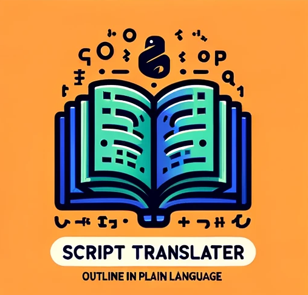

# GPT's and ChatGPT Examples for Water Resources Engineers

## README Overview
This repository is a collection of specialized GPTs designed for Water Resources Engineers. Each GPT offers unique functionalities and knowledge bases, ranging from document compilation and flood damage estimation to GIS assistance and script translation. These tools are intended to enhance productivity and understanding in various water resource management and engineering tasks, as well as productivity and GPT building tools.

# Table of GPT's and ChatGPT Examples:

| Logo | Number | Name | Description | Read More Link | GPT Link |
|------|--------|------|-------------|----------------|----------|
|  | 29 | LLM API Library Assistant | The LLM API Library Assistant provides tools for interfacing with various large language model APIs. It helps users integrate LLM functionalities into their applications, facilitating tasks such as text generation, summarization, and sentiment analysis. | [Read More](./29_LLM_API_Library_Assistant.md) | [GPT Link](https://chatgpt.com/g/g-5PxwJUJLv-llm-api-python-library-assistant) |
|  | 28 | USGS API Assistant | This assistant interfaces with various USGS APIs to retrieve and analyze hydrological and geological data. It simplifies accessing datasets such as streamflow records, water quality measurements, and topographic information. | [Read More](./28_USGS_API_Assistant.md) | [GPT Link](https://chatgpt.com/g/g-1R7TUBCwp-usgs-api-assistant) |
|  | 27 | Python HDF File Assistant | The Python HDF File Assistant facilitates working with HDF5 files, which are commonly used for storing large datasets. It provides functionalities for reading, writing, and querying HDF5 data. | [Read More](./27_Python_HDF_File_Assistant.md) | [GPT Link](https://chatgpt.com/g/g-NGFnf92v8-python-hdf-file-assistant) |
|  | 26 | Python Raster Array Assistant | This tool assists with the manipulation and analysis of raster data using Python arrays. It supports tasks such as resampling, reclassification, and statistical analysis of raster datasets. | [Read More](./26_Python_Raster_Array_Assistant.md) | [GPT Link](https://chatgpt.com/g/g-BKJnFL5dM-python-raster-array-assistant) |
|  | 25 | DSS Python Assistant | The DSS Python Assistant aids in manipulating and analyzing data stored in the HEC-DSS format, providing Python tools for reading, writing, and visualizing time-series and spatial data. | [Read More](./25_DSS_Python_Assistant.md) | [GPT Link](https://chatgpt.com/g/g-FWpQ5z0f1-dss-python-assistant) |
|  | 24 | Shapefile Simplifier for Geospatial Processing | This assistant focuses on simplifying shapefiles, making them more manageable for geospatial processing tasks. It helps reduce file size and complexity while preserving essential spatial information. | [Read More](./24_Shapefile_Simplifier_for_Geospatial_Processing.md) | [GPT Link](https://chatgpt.com/g/g-R5elOwymd-shapefile-simplifier-for-geospatial-processing) |
|  | 23 | HEC-RAS Forum Assistant | The HEC-RAS Forum Assistant helps users navigate and extract valuable information from HEC-RAS forum discussions, offering solutions to common modeling problems and enhancing the efficiency of using the HEC-RAS software. | [Read More](./23_HEC-RAS_Forum_Assistant.md) | [GPT Link](https://chatgpt.com/g/g-Go2eeZKXw-river-modeling-forum-assistant) |
|  | 22 | Hydroclimate Data Tools with HyRiver | This tool integrates HyRiver, a suite of Python libraries for accessing and analyzing hydroclimate data, providing capabilities for retrieving and processing large-scale climate and hydrological datasets. | [Read More](./22._Hydroclimate_Data_Tools_with_HyRiver.md) | [GPT Link](https://chatgpt.com/g/g-kMw7b9pqj-python-expert-hydroclimate-data-retriever-tools) |
|  | 21 | Geospatial Python Notebook Assistant using WhiteboxTools | This assistant leverages the WhiteboxTools library within a geospatial Python notebook, offering functionalities for terrain analysis, hydrological modeling, and more. It is designed to support geospatial data processing and analysis workflows. | [Read More](./21_Geospatial_Python_Notebook_Assistant_using_WhiteboxTools.md) | [GPT Link](https://chatgpt.com/g/g-fgpBB9Zbm-geospatial-python-notebook-assistant-using-wbt) |
|  | 20 | Depth Area Reduction Factor Tutorial Helper | GPT to simplify the tutorial Creating Depth-Area Reduction Curves from Gridded Precipitation Data and provide an alternative to excel plot creation. | [Read More](./20._Depth-Area_Reduction_Curve_Tutorial_Helper.md) | [GPT Link](https://chatgpt.com/g/g-DFItDJe6N-depth-area-reduction-curves-tutorial-helper) |
| | 19 | Free Huggingface Assistants Updated with Llama-3-Instruct and Cohere Command-R Models | With the release of two new Large Language Models (LLMs) that are near GPT-4 level: Llama-3-Instruct and Cohere Command-R, I have updated my free Hugging Face Assistants. These are free versions of ChatGPT's "GPTs" assistants with custom instructions and web search. With the upgrade to models with capabilities and performance comparable to GPT-4, everyone has access to a powerful and free tool for testing and experiencing the latest advancements in LLM technology. | [Multiple GPT Links Inside](./19._Free_Assistants.md) | |
| | 18 | Anthropic's Claude Prompt Examples | Anthropic's Claude Prompt Portfolios feature a selection of highly effective prompts, converted into an invite-only set of GPTs accessible only from this repository. These prompts are tailored to optimize user interaction with GPT+ platforms, enhancing task-specific AI assistance. Each prompt is designed to perform a specific function, ranging from decoding directions to enhancing prose, generating LaTeX code, formulating complex Excel functions, converting data formats, clarifying code, fabricating Python functions, optimizing Python code, and bug fixing. This collection serves as an invaluable tool for users looking to leverage the capabilities of language models for professional tasks. | [Multiple GPT Links Inside](./18_Selection_of_AC_Prompts.md) | |
| | 17 | PDF to Text Conversion and Token Counting Assistant | The PDF to Text Conversion and Token Counting Example facilitates the process of converting PDF documents to text format and counting the number of tokens, using a local environment. This example is particularly useful for preparing large document collections for ingestion by language models such as ChatGPT, Claude and Google Gemini, by analyzing token counts relative to model context window sizes. It supports a variety of document types including governmental and technical manuals, and provides detailed summaries and visualizations of token distribution, assisting users in understanding and managing the text content for better compatibility with AI models. | [ChatGPT Example](./17_Converting_PDF_To_Text_and_Count_Tokens.md) | |
|  | 16 | Weather Station Daily Summary Assistant | Expert Assistant in GHNCD Weather Station Daily Summaries from AWS Open Data. This GPT is the companion to the GHNCD DSS Comparison Tool script that allows compilation of GHNCD data from AWS and comparison of land based GHNCD stations with DSS gridded precipitation. | [Read More](./16_Weather_Station_Daily_Summary_Assistant.md) | [GPT Link](https://chat.openai.com/g/g-vzcXviTtz-weather-station-daily-summary-assistant) |
|  | 15 | Python Notebook GUI Builder | The Python Notebook GUI Builder is a specialized GPT focusing on integrating Tkinter and Tkbootstrap GUIs within Jupyter Notebooks, particularly in a Windows environment using VS Code. The assistant excels in layout design, entry box formatting, and window prioritization, and it communicates in a formal, technical tone. This tool is ideal for those looking to enhance their Jupyter Notebooks with interactive, custom GUI elements, streamlining user input and data presentation. | [Read More](./15_Notebook_GUI_Builder.md) | [GPT](https://chat.openai.com/g/g-TZ19Fr7aK-notebook-gui-builder) |
|  | 14 | River Analysis Controller Python API Expert | The River Analysis Controller: Python API Expert was introduced during the February 07 AI in Water Resources Free Webinar hosted by Australian Water School. This is an early, unexplored GPT with access to the pyras library. The intention of this GPT is to create hecrascontroller scripts in python using AI assistance, but has not yet been put to the test! | [Read More](./14_River_Analysis_Controller_Python_API_Expert.md) | [GPT Link](https://chat.openai.com/g/g-IhZ9qC7Gs-river-analysis-controller-python-api-expert) |
|  | 13 | Virtual River Modeling Vodcast Host | The Virtual River Modeling Vodcast Host, introduced during the February 07 AI in Water Resources Free Webinar by the Australian Water School, is an innovative tool for exploring topics in hydraulic engineering. With access to transcribed episodes of the RAS Solution YouTube Channel, this GPT specializes in responding to queries about past vodcasts and guiding users to specific episodes. Its unique processing of transcripts using Whisper and Mistral-medium technologies ensures intelligent, contextually aware responses. Ideal for delving into detailed discussions on hydraulic modeling, particularly for those seeking insights from the RAS Solution vodcasts. | [Read More](./13_Virtual_River_Modeling_Vodcast_Host.md) | [GPT Link](https://chat.openai.com/g/g-YaMbdBv95-virtual-river-modeling-vodcast-host) |
|  | 12 | Repo Assistant: Segment Anything Repos | The Repo Assistant: Segment Anything Repos is a specialized tool focused on the FastSAM, Segment-Anything, and Segment-Geospatial repositories. It is designed to assist users in navigating and utilizing these repositories, which are centered around advanced image segmentation technologies. | [Read More](./12_Repo_Assistant_-_Segment_Anything_Repos.md) | [GPT Link](https://chat.openai.com/g/g-NvReGFMYR-repo-assistant-segment-anything-repos) |
|  | 11 | Water Resource Python Notebook Assistant | The Water Resource Python Notebook Assistant is a specialist in Python coding for water resources engineering. It assists users in building, refactoring, and debugging Python notebooks, especially in the context of hydrological modeling and analysis. This GPT is an essential tool for water resource engineers and researchers, facilitating the use of Python for complex simulations and data analysis. | [Read More](./11_Water_Resource_Python_Notebook_Assistant.md) | [GPT Link](https://chat.openai.com/g/g-WFn2bkuya-water-resources-python-notebook-assistant) |
|  | 10 | HEC-Commander Repository Assistant | The HEC-Commander Repository Assistant is an expert in HEC-Commander scripts and markdowns, offering a comprehensive understanding of this suite. It aids users in navigating and utilizing HEC-Commander tools, providing a rich source of documentation and support. This GPT is ideal for engineers and technicians working with hydrologic modeling and analysis, enhancing their ability to leverage HEC-Commander's full potential. | [Read More](./10_HEC-Commander_Repository_Assistant.md) | [GPT Link](https://chat.openai.com/g/g-xznmjo6qb-hec-commander-repository-assistant) |
|  | 09 | Jupyter Notebook Portability Enhancer | The Jupyter Notebook Portability Enhancer makes Jupyter Notebooks more accessible and portable. It generates code cells to handle package installation inside virtual environments, streamlining the setup process. This GPT is invaluable for data scientists and educators who frequently share Jupyter Notebooks, ensuring smooth transitions and functionality across different systems. | [Read More](./09_Jupyter_Notebook_Portability_Enhancer.md) | [GPT Link](https://chat.openai.com/g/g-oazhMdfSF-jupyter-notebook-portability-enhancer) |
|  | 08 | Script Translator: Outline in Plain Language | The Script Translator takes complex scripts and outlines them in plain language, making technical content accessible to a broader audience. It's particularly useful for educators, researchers, and project managers who need to translate technical jargon into understandable terms. Whether you're working with code, research papers, or technical guides, this assistant ensures your material is clear and comprehensible. | [Read More](./08_Script_Translator_-_Outline_in_Plain_Language.md) | [GPT Link](https://chat.openai.com/g/g-WFn2bkuya-water-resource-python-notebook-assistant) |
|  | 07 | Gridded Soil Data GIS Assistant | The Gridded Soil Data GIS Assistant is an expert in handling and analyzing spatial soil data. It aids users in processing gridded soil datasets, providing insights into soil composition, properties, and distribution. This GPT is a valuable resource for environmental scientists, agricultural planners, and anyone needing detailed soil information for land management and analysis. | [Read More](./07_Gridded_Soil_Data_GIS_Assistant.md) | [GPT Link](https://chat.openai.com/g/g-6mEgJHzsU-gridded-soil-data-gis-assistant) |
|  | 06 | Voice Notes Transcription Assistant | The Voice Notes Transcription Assistant is designed to transcribe and organize voice notes efficiently. It's a valuable tool for professionals and students alike, turning spoken words into written text. This assistant is perfect for meetings, lectures, or any scenario where quick, accurate transcriptions are needed, providing a written record for reference and analysis. | [Read More](./06_Voice_Notes_Transcription_Assistant.md) | [GPT Link](https://chat.openai.com/g/g-oazhMdfSF-jupyter-notebook-portability-enhancer) |
|  | 05 | GIS Autonomous Assistant | This GPT serves as an autonomous assistant for GIS-related tasks, providing expertise in geographic information systems. It helps users understand and utilize GIS tools and data effectively. Whether you're analyzing spatial data, creating maps, or managing GIS databases, this assistant provides knowledgeable support, making complex GIS tasks more approachable and manageable. | [Read More](./05_GIS_Autonomous_Assistant.md) | [GPT Link](https://chat.openai.com/g/g-2mZE2aq07-gis-assistant) |
|  | 04 | Markdown Text Assistant: GH Flavor | The Markdown Text Assistant is specialized in GitHub Flavored Markdown, helping users to format text, create lists, embed images, and more. It's designed to assist those looking to improve their markdown documents on GitHub, providing guidance on syntax and structure. This GPT is an invaluable resource for creating more readable, professional, and functional GitHub documentation. | [Read More](./04_Markdown_Text_Assistant_-_GH_Flavor.md) | [GPT Link](https://chat.openai.com/g/g-tuwysm1j4-markdown-text-assistant-gh-flavor) |
|  | 03 | Learning Assistant: Leafmap Repository | As the 'Leafmap Examples Expert', this GPT guides users through the Leafmap package, focusing on its examples and functionalities as outlined in the provided GitHub repository and documentation. It serves as an educational tool for those looking to expand their GIS capabilities with Leafmap. This assistant is perfect for users seeking detailed, step-by-step guidance on implementing Leafmap's various features and applications. | [Read More](./03_Learning_Assistant_-_Leafmap_Repository.md) | [GPT Link](https://chat.openai.com/g/g-rcQ2xaKHj-learning-assistant-geospatial-mapping) |
|  | 02 | Structure Flooding: Depth Damage Calculator | The Structure Flooding: Depth Damage Calculator is a specialized tool for providing flood depth-damage estimates using HEC-FIA/FEMA Documentation. It assists Water Resource Engineers and Certified Floodplain Managers in estimating flood damage with established methodologies. | [Read More](./02_Structure_Flooding_-_Depth_Damage_Calculator.md) | [GPT Link](https://chat.openai.com/g/g-XZoGRmdOm-structure-flooding-depth-damage-calculator) |
|  | 01 | Knowledge Builder Agent: Compile Docs from Repo | This GPT is designed to create compiled text documents for knowledge retrieval from GitHub projects. It processes GitHub repository archives by extracting, reviewing, and compiling the content. This agent is ideal for users looking to consolidate and simplify their access to repository documentation. It's particularly useful for building custom GPT's with your own documentation, or documentation from a project you are trying to explore and utilize with AI-assisted coding. | [Read More](./01_Knowledge_Builder_Agent_-_Compile_Docs_from_Repo.md) | [GPT Link](https://chat.openai.com/g/g-v0Op0PXqN-knowledge-builder-agent-compile-docs-from-repo) |

