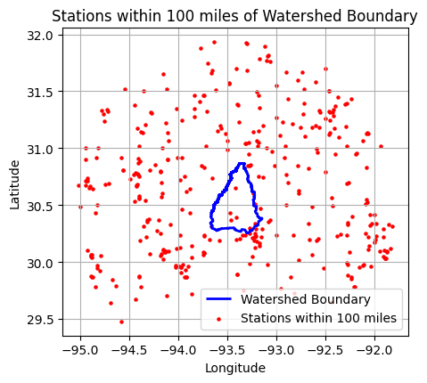

# GHNCD Precipitation Comparison Tool

## Introduction
The GHNCD Precipitation Comparison Tool consists of two Jupyter Notebook scripts designed for analyzing and comparing precipitation data from the Global Historical Climatology Network Daily (GHNCD) with gridded precipitation data from PyDSS. This tool is particularly useful for hydrologists and environmental scientists looking to assess precipitation trends, validate data models, or conduct detailed hydrological studies.

A full example with watershed shapefile and DSS input files can be found at the link below:
[GHNCD_Precipitation_DSS_Comparison_Example.zip](https://chfenstermaker-my.sharepoint.com/:u:/g/personal/billk_fenstermaker_com/EeCDcSW6G1hJgc1PxnkqYOwBnu85HWsGaL8wuvZYgqq_tw?e=Tzgk3q) 

## Requirements
To run these scripts, you will need a Python environment with specific libraries installed. The primary requirements are Jupyter Notebook, Pandas for data manipulation, Geopandas for spatial data operations, Matplotlib for plotting, and additional libraries for handling geospatial data and performing numerical operations.

### Python Version
- Python 3.9.1 or greater

### Required Libraries
- `pandas`
- `geopandas`
- `matplotlib`
- `rasterio`
- `rioxarray`
- `xarray`
- `pyproj`
- `shapely`
- `numpy`
- `scipy`
- `requests`
- `pydsstools` (for working with DSS files)


### Setup Environment
The provided Jupyter Notebook scripts include logic for automatic installation of required packages. This ensures that all dependencies are correctly installed without manual intervention. However, in case of any installation failures, you may need to install the packages manually.

#### PYDSS Installation Note
`pydsstools` is a specialized library for working with DSS files and may require additional steps to install. The scripts attempt to handle its installation, but if there are issues, you may need to install `pydsstools` and its dependencies manually. This could involve setting up a C++ build environment and ensuring that all binary dependencies are satisfied.

To manually install `pydsstools`, follow these steps:

```bash
# If necessary, install C++ build tools from the Visual Studio Build Tools installer
# Download from: https://visualstudio.microsoft.com/visual-cpp-build-tools/

# Install pydsstools using pip
pip install pydsstools

# If there are errors during the installation, consult the pydsstools documentation
# and ensure all binary dependencies are in place before retrying the installation.


## Script Summaries

### GHNCD_Precipitation_1_Data_Prep.ipynb
The `GHNCD_Precipitation_1_Data_Prep.ipynb` streamlines the initial phase of data preparation for hydrological analysis. This script automates the processing of the GHNCD raw data, preparing it for comparison with gridded datasets.

#### Key Features:
- **Data Retrieval**: Automates the download of station data from the GHNCD repository.
- **Spatial Analysis**: Utilizes geospatial libraries to align station data with watershed boundaries and buffer zones.
- **Data Filtering**: Applies user-defined date ranges to focus on relevant historical data.
- **Quality Control**: Implements an exclusion list to omit stations with known data quality issues.

The script produces a CSV file of filtered stations and a visualization of the station locations relative to the watershed boundary. This preparatory step ensures that the subsequent analysis in `GHNCD_Precipitation_2_PyDSS_Grid_Comparison.ipynb` is based on accurate and relevant precipitation data.

#### Output:
- A CSV file listing the stations within the defined buffer zone around the watershed.
- A plot displaying the spatial distribution of these stations.


## Usage

### GHNCD_Precipitation_1_Data_Prep.ipynb
This script is designed to be user-friendly and largely automated, but it does require some initial user input. Here's how to use it:

1. **Set Up the Watershed Files Directory**: 
   - Place the watershed shapefile in the designated directory. Ensure that it is a single polygon with a valid CRS.

2. **Specify Buffer Distance and Date Range**: 
   - Define the buffer distance around the watershed and the time period of interest for the analysis.

3. **Run the Script**: 
   - Execute each cell in the Jupyter Notebook. The script will handle the installation of dependencies, data retrieval, and processing.

4. **Review the Output**: 
   - Check the generated CSV file and the plots to ensure the stations fall within the expected area.

5. **Adjust Parameters if Necessary**: 
   - If the output isn't as expected, you can go back and adjust the buffer distance or the date range as needed.

6. **Proceed to the Next Script**: 
   - Once you're satisfied with the data preparation, you can proceed to `GHNCD_Precipitation_2_PyDSS_Grid_Comparison.ipynb` for further analysis.

This script is the first step in a two-part process and prepares the data necessary for the comparison with gridded precipitation datasets.


### GHNCD_Precipitation_2_PyDSS_Grid_Comparison.ipynb
The `GHNCD_Precipitation_2_PyDSS_Grid_Comparison.ipynb`performs a detailed comparison between station-based precipitation data prepared in the first script and gridded precipitation data obtained through Python's DSS utilities (PyDSS).

#### Key Functions:
- **DSS File Interaction**: Directly reads DSS files to extract gridded precipitation data.
- **Event Period Analysis**: Allows users to define specific event periods for focused analysis.
- **Spatial Interpolation**: Compares GHNCD station data with corresponding gridded data points.
- **Data Visualization**: Generates plots that overlay GHNCD data onto the gridded dataset for visual comparison.
- **Statistical Summary**: Computes and reports statistical metrics such as mean, maximum, and minimum precipitation over the watershed for the event period.

#### Expected Outputs:
- GeoTIFFs and CSVs that represent the gridded data for each defined event period.
- Visual plots illustrating the distribution of precipitation data from both sources.
- A comprehensive statistical summary comparing the GHNCD and gridded datasets.


## Usage

### GHNCD_Precipitation_2_PyDSS_Grid_Comparison.ipynb
This script, `GHNCD_Precipitation_2_PyDSS_Grid_Comparison.ipynb`, builds on the data prepared in the first script and is designed for in-depth comparative analysis. Here's a guide on how to effectively use it:

1. **Prepare the Environment**:
   - Ensure that the Python environment is set up as per the instructions in the first script.
   - Verify that PyDSS is correctly installed, as this script relies heavily on it for reading DSS files.

2. **User Inputs**:
   - Define the watershed files directory and other parameters such as the DSS folder, watershed name, and buffer distances.
   - Specify the list of DSS files and corresponding event periods for analysis.

3. **Run the Script**:
   - Execute each cell in the Jupyter Notebook. The script will process the specified DSS files and perform a comparative analysis between the GHNCD station data and the gridded precipitation data.

4. **Review the Outputs**:
   - Examine the generated GeoTIFFs, CSVs, and plots to understand the spatial distribution and comparison of precipitation data.
   - Pay special attention to the statistical summaries provided for each event period.

5. **Adjust and Rerun if Needed**:
   - If the analysis does not cover the desired aspects, or if additional event periods need to be analyzed, adjust the inputs accordingly and rerun the script.

6. **Interpreting the Results**:
   - Use the visualizations and statistical summaries to draw conclusions about the precipitation patterns and the reliability of the datasets.

This script is particularly useful for hydrologists and researchers looking to validate or enhance their understanding of precipitation data across different sources.


## Example Outputs

The following examples showcase the typical outputs generated by the scripts `GHNCD_Precipitation_1_Data_Prep.ipynb` and `GHNCD_Precipitation_2_PyDSS_Grid_Comparison.ipynb`. These visualizations are key in understanding the spatial distribution and comparative analysis of precipitation data.

### Example Output 1: GHNCD Stations

This image represents the output from the `GHNCD_Precipitation_1_Data_Prep.ipynb` script. It visualizes the GHNCD stations positioned within and around the specified watershed boundary. The distribution of these stations provides an initial overview of the geographical spread and density of the data collection points relevant to the watershed area.

### Example Output 2: GHNCD Stations with Precipitation Data

This output, also from the first script, builds upon the previous image by overlaying the precipitation data onto the mapped GHNCD stations. It offers a more detailed view, highlighting the precipitation amounts recorded at each station. This visualization is crucial for a preliminary assessment of the precipitation distribution within the watershed.

### Example Output 3: Time Series Bulk Plot

Generated by `GHNCD_Precipitation_1_Data_Prep.ipynb`, this plot provides a time series analysis of the precipitation data. Each line represents a GHNCD station, showing the variation in precipitation over the specified time period. This graph is instrumental in identifying trends, anomalies, or patterns in the precipitation data across different locations.

### Example Output 4: Report Figure - Harvey AORC 10mi

Produced by the `GHNCD_Precipitation_2_PyDSS_Grid_Comparison.ipynb` script, this image illustrates the comparison between GHNCD station data and gridded precipitation data for a specific event (e.g., Harvey). The plot includes the watershed boundary, gridded data visualization, and the precipitation measurements from the GHNCD stations. This comprehensive visualization aids in comparing and contrasting the station-based data with the gridded model output, offering valuable insights into their correlation and discrepancies.

These examples highlight the scripts' capabilities in processing, analyzing, and visualizing precipitation data, providing an essential toolset for hydrological data analysis.
