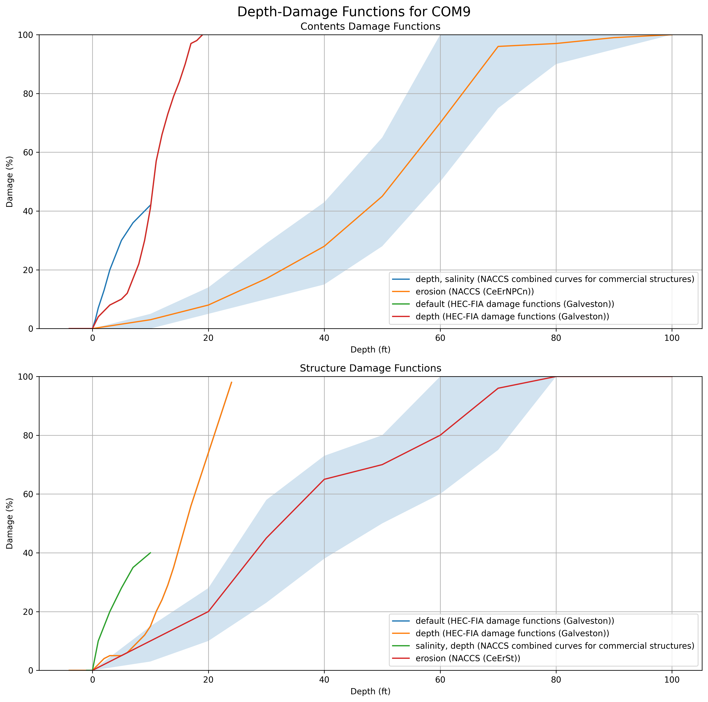

Depth Damage Functions Charted from the [Go Consequences Occupancy Types JSON](https://github.com/USACE/go-consequences/blob/main/structures/occtypes.json)

More information at the [Go Consequences Wiki](https://github.com/USACE/go-consequences/wiki/Occupancy-Types)

# Building Occupancy Type Charts

Below are fragility curves organized by occupancy type, displayed at 70% width and centered.

## Agricultural Occupancy

## Apartment Buildings

## Commercial Occupancies

## Educational Occupancies

## Government Buildings

## High Occupancy Buildings

## Industrial Occupancies

## Public Buildings

## Religious Buildings

## Residential Buildings

## Special Frame Buildings

