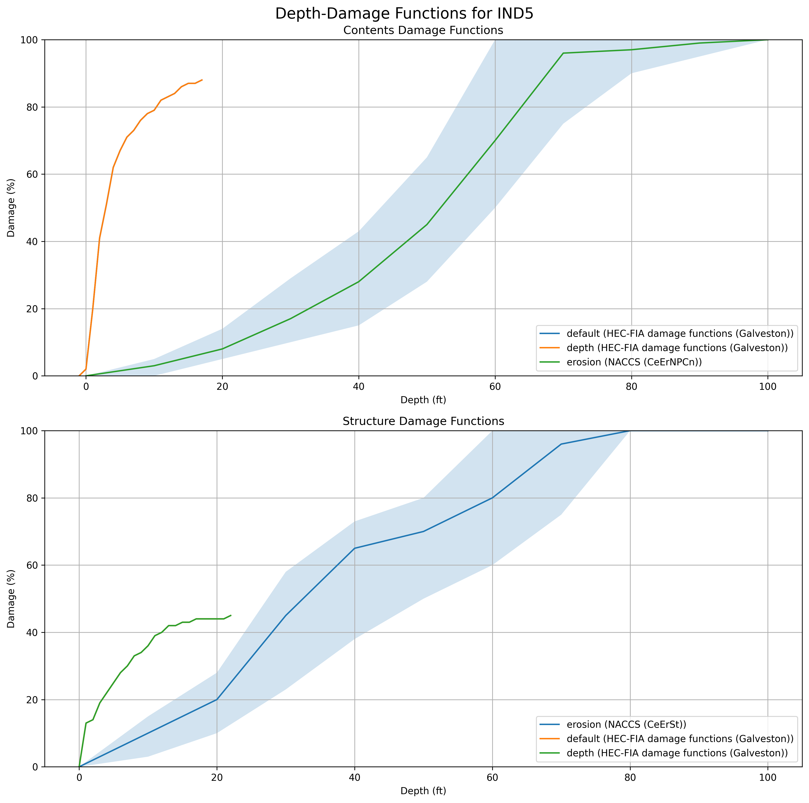

Depth Damage Functions Charted from the [Go Consequences Occupancy Types JSON](https://github.com/USACE/go-consequences/blob/main/structures/occtypes.json)

More information at the [Go Consequences Wiki](https://github.com/USACE/go-consequences/wiki/Occupancy-Types)

# Building Occupancy Type Charts and Damage Functions

Below are fragility curves organized by occupancy type, displayed at 70% width and centered, along with their corresponding damage functions.

<div align="center">

## Agricultural Occupancy


### AGR1 Damage Functions
| Category   | Function Type   | Source                               | Driver   |
|:-----------|:----------------|:-------------------------------------|:---------|
| Contents   | erosion         | NACCS (CeErNPCn)                     | erosion  |
| Contents   | default         | HEC-FIA damage functions (Galveston) | depth    |
| Contents   | depth           | HEC-FIA damage functions (Galveston) | depth    |
| Structure  | default         | HEC-FIA damage functions (Galveston) | depth    |
| Structure  | erosion         | NACCS (CeErSt)                       | erosion  |
| Structure  | depth           | HEC-FIA damage functions (Galveston) | depth    |

## Apartment Buildings


### APT Damage Functions
| Category   | Function Type   | Source          | Driver   |
|:-----------|:----------------|:----------------|:---------|
| Contents   | erosion         | NACCS (BhrErCn) | erosion  |
| Structure  | erosion         | NACCS (BhrErSt) | erosion  |

## Commercial Occupancies


### COM Damage Functions
| Category   | Function Type   | Source           | Driver   |
|:-----------|:----------------|:-----------------|:---------|
| Contents   | erosion         | NACCS (CeErNPCn) | erosion  |
| Structure  | erosion         | NACCS (CeErSt)   | erosion  |


### COM1 Damage Functions
| Category   | Function Type   | Source                                          | Driver   |
|:-----------|:----------------|:------------------------------------------------|:---------|
| Contents   | default         | HEC-FIA damage functions (Galveston)            | depth    |
| Contents   | depth           | HEC-FIA damage functions (Galveston)            | depth    |
| Contents   | erosion         | NACCS (CeErNPCn)                                | erosion  |
| Contents   | depth, salinity | NACCS combined curves for commercial structures | depth    |
| Structure  | salinity, depth | NACCS combined curves for commercial structures | depth    |
| Structure  | erosion         | NACCS (CeErSt)                                  | erosion  |
| Structure  | default         | HEC-FIA damage functions (Galveston)            | depth    |
| Structure  | depth           | HEC-FIA damage functions (Galveston)            | depth    |


### COM2 Damage Functions
| Category   | Function Type   | Source                                          | Driver   |
|:-----------|:----------------|:------------------------------------------------|:---------|
| Contents   | erosion         | NACCS (CeErNPCn)                                | erosion  |
| Contents   | depth           | HEC-FIA damage functions (Galveston)            | depth    |
| Contents   | depth, salinity | NACCS combined curves for commercial structures | depth    |
| Contents   | default         | HEC-FIA damage functions (Galveston)            | depth    |
| Structure  | depth           | HEC-FIA damage functions (Galveston)            | depth    |
| Structure  | salinity, depth | NACCS combined curves for commercial structures | depth    |
| Structure  | default         | HEC-FIA damage functions (Galveston)            | depth    |
| Structure  | erosion         | NACCS (CeErSt)                                  | erosion  |


### COM3 Damage Functions
| Category   | Function Type   | Source                                          | Driver   |
|:-----------|:----------------|:------------------------------------------------|:---------|
| Contents   | default         | HEC-FIA damage functions (Galveston)            | depth    |
| Contents   | depth           | HEC-FIA damage functions (Galveston)            | depth    |
| Contents   | depth, salinity | NACCS combined curves for commercial structures | depth    |
| Contents   | erosion         | NACCS (CeErNPCn)                                | erosion  |
| Structure  | depth           | HEC-FIA damage functions (Galveston)            | depth    |
| Structure  | depth, salinity | NACCS combined curves for commercial structures | depth    |
| Structure  | erosion         | NACCS (CeErSt)                                  | erosion  |
| Structure  | default         | HEC-FIA damage functions (Galveston)            | depth    |


### COM4 Damage Functions
| Category   | Function Type   | Source                                          | Driver   |
|:-----------|:----------------|:------------------------------------------------|:---------|
| Contents   | salinity, depth | NACCS combined curves for commercial structures | depth    |
| Contents   | default         | HEC-FIA damage functions (Galveston)            | depth    |
| Contents   | erosion         | NACCS (CeErNPCn)                                | erosion  |
| Contents   | depth           | HEC-FIA damage functions (Galveston)            | depth    |
| Structure  | salinity, depth | NACCS combined curves for commercial structures | depth    |
| Structure  | erosion         | NACCS (CeErSt)                                  | erosion  |
| Structure  | default         | HEC-FIA damage functions (Galveston)            | depth    |
| Structure  | depth           | HEC-FIA damage functions (Galveston)            | depth    |


### COM5 Damage Functions
| Category   | Function Type   | Source                                          | Driver   |
|:-----------|:----------------|:------------------------------------------------|:---------|
| Contents   | default         | HEC-FIA damage functions (Galveston)            | depth    |
| Contents   | depth           | HEC-FIA damage functions (Galveston)            | depth    |
| Contents   | salinity, depth | NACCS combined curves for commercial structures | depth    |
| Contents   | erosion         | NACCS (CeErNPCn)                                | erosion  |
| Structure  | default         | HEC-FIA damage functions (Galveston)            | depth    |
| Structure  | depth           | HEC-FIA damage functions (Galveston)            | depth    |
| Structure  | depth, salinity | NACCS combined curves for commercial structures | depth    |
| Structure  | erosion         | NACCS (CeErSt)                                  | erosion  |


### COM6 Damage Functions
| Category   | Function Type   | Source                                          | Driver   |
|:-----------|:----------------|:------------------------------------------------|:---------|
| Contents   | depth, salinity | NACCS combined curves for commercial structures | depth    |
| Contents   | erosion         | NACCS (BhrErCn)                                 | erosion  |
| Contents   | default         | HEC-FIA damage functions (Galveston)            | depth    |
| Contents   | depth           | HEC-FIA damage functions (Galveston)            | depth    |
| Structure  | default         | HEC-FIA damage functions (Galveston)            | depth    |
| Structure  | depth           | HEC-FIA damage functions (Galveston)            | depth    |
| Structure  | salinity, depth | NACCS combined curves for commercial structures | depth    |
| Structure  | erosion         | NACCS (BhrErSt)                                 | erosion  |


### COM7 Damage Functions
| Category   | Function Type   | Source                                          | Driver   |
|:-----------|:----------------|:------------------------------------------------|:---------|
| Contents   | salinity, depth | NACCS combined curves for commercial structures | depth    |
| Contents   | erosion         | NACCS (CeErNPCn)                                | erosion  |
| Contents   | default         | HEC-FIA damage functions (Galveston)            | depth    |
| Contents   | depth           | HEC-FIA damage functions (Galveston)            | depth    |
| Structure  | default         | HEC-FIA damage functions (Galveston)            | depth    |
| Structure  | depth           | HEC-FIA damage functions (Galveston)            | depth    |
| Structure  | depth, salinity | NACCS combined curves for commercial structures | depth    |
| Structure  | erosion         | NACCS (CeErSt)                                  | erosion  |


### COM8 Damage Functions
| Category   | Function Type   | Source                                          | Driver   |
|:-----------|:----------------|:------------------------------------------------|:---------|
| Contents   | erosion         | NACCS (CeErNPCn)                                | erosion  |
| Contents   | default         | HEC-FIA damage functions (Galveston)            | depth    |
| Contents   | depth           | HEC-FIA damage functions (Galveston)            | depth    |
| Contents   | salinity, depth | NACCS combined curves for commercial structures | depth    |
| Structure  | default         | HEC-FIA damage functions (Galveston)            | depth    |
| Structure  | depth           | HEC-FIA damage functions (Galveston)            | depth    |
| Structure  | salinity, depth | NACCS combined curves for commercial structures | depth    |
| Structure  | erosion         | NACCS (CeErSt)                                  | erosion  |


### COM9 Damage Functions
| Category   | Function Type   | Source                                          | Driver   |
|:-----------|:----------------|:------------------------------------------------|:---------|
| Contents   | depth, salinity | NACCS combined curves for commercial structures | depth    |
| Contents   | erosion         | NACCS (CeErNPCn)                                | erosion  |
| Contents   | default         | HEC-FIA damage functions (Galveston)            | depth    |
| Contents   | depth           | HEC-FIA damage functions (Galveston)            | depth    |
| Structure  | default         | HEC-FIA damage functions (Galveston)            | depth    |
| Structure  | depth           | HEC-FIA damage functions (Galveston)            | depth    |
| Structure  | salinity, depth | NACCS combined curves for commercial structures | depth    |
| Structure  | erosion         | NACCS (CeErSt)                                  | erosion  |


### COM10 Damage Functions
| Category   | Function Type   | Source                                          | Driver   |
|:-----------|:----------------|:------------------------------------------------|:---------|
| Contents   | default         | HEC-FIA damage functions (Galveston)            | depth    |
| Contents   | depth           | HEC-FIA damage functions (Galveston)            | depth    |
| Contents   | salinity, depth | NACCS combined curves for commercial structures | depth    |
| Structure  | default         | HEC-FIA damage functions (Galveston)            | depth    |
| Structure  | depth           | HEC-FIA damage functions (Galveston)            | depth    |
| Structure  | salinity, depth | NACCS combined curves for commercial structures | depth    |

## Educational Occupancies


### EDU1 Damage Functions
| Category   | Function Type   | Source                               | Driver   |
|:-----------|:----------------|:-------------------------------------|:---------|
| Contents   | default         | HEC-FIA damage functions (Galveston) | depth    |
| Contents   | depth           | HEC-FIA damage functions (Galveston) | depth    |
| Contents   | erosion         | NACCS (CeErNPCn)                     | erosion  |
| Structure  | erosion         | NACCS (CeErSt)                       | erosion  |
| Structure  | default         | HEC-FIA damage functions (Galveston) | depth    |
| Structure  | depth           | HEC-FIA damage functions (Galveston) | depth    |


### EDU2 Damage Functions
| Category   | Function Type   | Source                               | Driver   |
|:-----------|:----------------|:-------------------------------------|:---------|
| Contents   | default         | HEC-FIA damage functions (Galveston) | depth    |
| Contents   | depth           | HEC-FIA damage functions (Galveston) | depth    |
| Structure  | default         | HEC-FIA damage functions (Galveston) | depth    |
| Structure  | depth           | HEC-FIA damage functions (Galveston) | depth    |

## Government Buildings


### GOV1 Damage Functions
| Category   | Function Type   | Source                               | Driver   |
|:-----------|:----------------|:-------------------------------------|:---------|
| Contents   | default         | HEC-FIA damage functions (Galveston) | depth    |
| Contents   | depth           | HEC-FIA damage functions (Galveston) | depth    |
| Contents   | erosion         | NACCS (CeErNPCn)                     | erosion  |
| Structure  | default         | HEC-FIA damage functions (Galveston) | depth    |
| Structure  | depth           | HEC-FIA damage functions (Galveston) | depth    |
| Structure  | erosion         | NACCS (CeErSt)                       | erosion  |


### GOV2 Damage Functions
| Category   | Function Type   | Source                               | Driver   |
|:-----------|:----------------|:-------------------------------------|:---------|
| Contents   | default         | HEC-FIA damage functions (Galveston) | depth    |
| Contents   | depth           | HEC-FIA damage functions (Galveston) | depth    |
| Contents   | erosion         | NACCS (CeErNPCn)                     | erosion  |
| Structure  | default         | HEC-FIA damage functions (Galveston) | depth    |
| Structure  | depth           | HEC-FIA damage functions (Galveston) | depth    |
| Structure  | erosion         | NACCS (CeErSt)                       | erosion  |

## High Occupancy Buildings


### HIGH Damage Functions
| Category   | Function Type   | Source          | Driver   |
|:-----------|:----------------|:----------------|:---------|
| Contents   | erosion         | NACCS (BhrErCn) | erosion  |
| Structure  | erosion         | NACCS (BhrErSt) | erosion  |

## Industrial Occupancies


### IND Damage Functions
| Category   | Function Type   | Source           | Driver   |
|:-----------|:----------------|:-----------------|:---------|
| Contents   | erosion         | NACCS (CeErNPCn) | erosion  |
| Structure  | erosion         | NACCS (CeErSt)   | erosion  |


### IND1 Damage Functions
| Category   | Function Type   | Source                               | Driver   |
|:-----------|:----------------|:-------------------------------------|:---------|
| Contents   | erosion         | NACCS (CeErNPCn)                     | erosion  |
| Contents   | depth           | HEC-FIA damage functions (Galveston) | depth    |
| Contents   | default         | HEC-FIA damage functions (Galveston) | depth    |
| Structure  | depth           | HEC-FIA damage functions (Galveston) | depth    |
| Structure  | default         | HEC-FIA damage functions (Galveston) | depth    |
| Structure  | erosion         | NACCS (CeErSt)                       | erosion  |


### IND2 Damage Functions
| Category   | Function Type   | Source                               | Driver   |
|:-----------|:----------------|:-------------------------------------|:---------|
| Contents   | default         | HEC-FIA damage functions (Galveston) | depth    |
| Contents   | depth           | HEC-FIA damage functions (Galveston) | depth    |
| Contents   | erosion         | NACCS (CeErNPCn)                     | erosion  |
| Structure  | default         | HEC-FIA damage functions (Galveston) | depth    |
| Structure  | depth           | HEC-FIA damage functions (Galveston) | depth    |
| Structure  | erosion         | NACCS (CeErSt)                       | erosion  |


### IND3 Damage Functions
| Category   | Function Type   | Source                               | Driver   |
|:-----------|:----------------|:-------------------------------------|:---------|
| Contents   | depth           | HEC-FIA damage functions (Galveston) | depth    |
| Contents   | default         | HEC-FIA damage functions (Galveston) | depth    |
| Contents   | erosion         | NACCS (CeErNPCn)                     | erosion  |
| Structure  | default         | HEC-FIA damage functions (Galveston) | depth    |
| Structure  | depth           | HEC-FIA damage functions (Galveston) | depth    |
| Structure  | erosion         | NACCS (CeErSt)                       | erosion  |


### IND4 Damage Functions
| Category   | Function Type   | Source                               | Driver   |
|:-----------|:----------------|:-------------------------------------|:---------|
| Contents   | default         | HEC-FIA damage functions (Galveston) | depth    |
| Contents   | depth           | HEC-FIA damage functions (Galveston) | depth    |
| Structure  | depth           | HEC-FIA damage functions (Galveston) | depth    |
| Structure  | default         | HEC-FIA damage functions (Galveston) | depth    |



### IND5 Damage Functions
| Category   | Function Type   | Source                               | Driver   |
|:-----------|:----------------|:-------------------------------------|:---------|
| Contents   | default         | HEC-FIA damage functions (Galveston) | depth    |
| Contents   | depth           | HEC-FIA damage functions (Galveston) | depth    |
| Contents   | erosion         | NACCS (CeErNPCn)                     | erosion  |
| Structure  | erosion         | NACCS (CeErSt)                       | erosion  |
| Structure  | default         | HEC-FIA damage functions (Galveston) | depth    |
| Structure  | depth           | HEC-FIA damage functions (Galveston) | depth    |


### IND6 Damage Functions
| Category   | Function Type   | Source                               | Driver   |
|:-----------|:----------------|:-------------------------------------|:---------|
| Contents   | default         | HEC-FIA damage functions (Galveston) | depth    |
| Contents   | depth           | HEC-FIA damage functions (Galveston) | depth    |
| Contents   | erosion         | NACCS (CeErNPCn)                     | erosion  |
| Structure  | default         | HEC-FIA damage functions (Galveston) | depth    |
| Structure  | depth           | HEC-FIA damage functions (Galveston) | depth    |
| Structure  | erosion         | NACCS (CeErSt)                       | erosion  |

## Public Buildings


### PUB Damage Functions
| Category   | Function Type   | Source           | Driver   |
|:-----------|:----------------|:-----------------|:---------|
| Contents   | erosion         | NACCS (CeErNPCn) | erosion  |
| Structure  | erosion         | NACCS (CeErSt)   | erosion  |


### PUB-Masonry Damage Functions
| Category   | Function Type   | Source           | Driver   |
|:-----------|:----------------|:-----------------|:---------|
| Contents   | erosion         | NACCS (CeErNPCn) | erosion  |
| Structure  | erosion         | NACCS (CeErSt)   | erosion  |


### PUB-Wood Damage Functions
| Category   | Function Type   | Source           | Driver   |
|:-----------|:----------------|:-----------------|:---------|
| Contents   | erosion         | NACCS (CeErNPCn) | erosion  |
| Structure  | erosion         | NACCS (CeErSt)   | erosion  |

## Religious Buildings


### REL1 Damage Functions
| Category   | Function Type   | Source                               | Driver   |
|:-----------|:----------------|:-------------------------------------|:---------|
| Contents   | default         | HEC-FIA damage functions (Galveston) | depth    |
| Contents   | depth           | HEC-FIA damage functions (Galveston) | depth    |
| Contents   | erosion         | NACCS (CeErNPCn)                     | erosion  |
| Structure  | default         | HEC-FIA damage functions (Galveston) | depth    |
| Structure  | depth           | HEC-FIA damage functions (Galveston) | depth    |
| Structure  | erosion         | NACCS (CeErSt)                       | erosion  |

## Residential Buildings


### RES1-1SNB Damage Functions
| Category   | Function Type                                 | Source                             | Driver   |
|:-----------|:----------------------------------------------|:-----------------------------------|:---------|
| Contents   | depth                                         | EGM damage functions               | depth    |
| Contents   | waveheight, depth, highwaveheight             | FEMA coastal PFRA damage functions | depth    |
| Contents   | waveheight, mediumwaveheight, salinity, depth | FEMA coastal PFRA damage functions | depth    |
| Contents   | salinity, depth                               | FEMA coastal PFRA damage functions | depth    |
| Contents   | erosion                                       | NACCS (OsNbErCn)                   | erosion  |
| Contents   | default                                       | EGM damage functions               | depth    |
| Structure  | depth                                         | EGM damage functions               | depth    |
| Structure  | waveheight, depth, highwaveheight             | FEMA coastal PFRA damage functions | depth    |
| Structure  | waveheight, mediumwaveheight, salinity, depth | FEMA coastal PFRA damage functions | depth    |
| Structure  | salinity, depth                               | FEMA coastal PFRA damage functions | depth    |
| Structure  | default                                       | EGM damage functions               | depth    |
| Structure  | erosion                                       | NACCS (OsNbErSt)                   | erosion  |


### RES1-1SNB-PIER Damage Functions
| Category   | Function Type                                 | Source                             | Driver   |
|:-----------|:----------------------------------------------|:-----------------------------------|:---------|
| Contents   | default                                       | FEMA coastal PFRA damage functions | depth    |
| Contents   | depth, salinity                               | FEMA coastal PFRA damage functions | depth    |
| Contents   | waveheight, salinity, highwaveheight, depth   | FEMA coastal PFRA damage functions | depth    |
| Contents   | waveheight, mediumwaveheight, salinity, depth | FEMA coastal PFRA damage functions | depth    |
| Structure  | depth, salinity                               | FEMA coastal PFRA damage functions | depth    |
| Structure  | depth, waveheight, mediumwaveheight, salinity | FEMA coastal PFRA damage functions | depth    |
| Structure  | salinity, waveheight, depth, highwaveheight   | FEMA coastal PFRA damage functions | depth    |
| Structure  | default                                       | FEMA coastal PFRA damage functions | depth    |


### RES1-1SWB Damage Functions
| Category   | Function Type                                 | Source                                                                      | Driver   |
|:-----------|:----------------------------------------------|:----------------------------------------------------------------------------|:---------|
| Contents   | default                                       | EGM Depth Damage Curve                                                      | depth    |
| Contents   | depth                                         | EGM Depth Damage Curve                                                      | depth    |
| Contents   | depth, salinity                               | FEMA coastal PFRA damage curves (combined finished and unfinished basement) | depth    |
| Contents   | depth, salinity, waveheight, mediumwaveheight | FEMA coastal PFRA damage curves (combined finished and unfinished basement) | depth    |
| Contents   | waveheight, salinity, highwaveheight, depth   | FEMA coastal PFRA damage functions                                          | depth    |
| Contents   | erosion                                       | NACCS (SsrBErCn)                                                            | erosion  |
| Structure  | depth                                         | EGM Depth Damage Curve                                                      | depth    |
| Structure  | mediumwaveheight, salinity, waveheight, depth | FEMA coastal PFRA damage curves (combined finished and unfinished basement) | depth    |
| Structure  | depth, salinity                               | FEMA coastal PFRA damage curves (combined finished and unfinished basement) | depth    |
| Structure  | highwaveheight, depth, waveheight, salinity   | FEMA coastal PFRA damage functions                                          | depth    |
| Structure  | erosion                                       | NACCS (SsrBErSt)                                                            | erosion  |
| Structure  | default                                       | EGM Depth Damage Curve                                                      | depth    |


### RES1-2SNB Damage Functions
| Category   | Function Type                                 | Source                          | Driver   |
|:-----------|:----------------------------------------------|:--------------------------------|:---------|
| Contents   | erosion                                       | NACCS (TsrNbErCn)               | erosion  |
| Contents   | default                                       | EGM Depth Damage Curve          | depth    |
| Contents   | depth                                         | EGM Depth Damage Curve          | depth    |
| Contents   | depth, salinity                               | FEMA coastal PFRA damage curves | depth    |
| Contents   | waveheight, salinity, depth, highwaveheight   | FEMA coastal PFRA damage curves | depth    |
| Contents   | salinity, waveheight, mediumwaveheight, depth | FEMA coastal PFRA damage curves | depth    |
| Structure  | depth                                         | EGM Depth Damage Curve          | depth    |
| Structure  | depth, salinity                               | FEMA coastal PFRA damage curves | depth    |
| Structure  | depth, mediumwaveheight, salinity, waveheight | FEMA coastal PFRA damage curves | depth    |
| Structure  | waveheight, salinity, depth, highwaveheight   | FEMA coastal PFRA damage curves | depth    |
| Structure  | erosion                                       | NACCS (TsrNbErSt)               | erosion  |
| Structure  | default                                       | EGM Depth Damage Curve          | depth    |


### RES1-2SNB-PIER Damage Functions
| Category   | Function Type                                 | Source                          | Driver   |
|:-----------|:----------------------------------------------|:--------------------------------|:---------|
| Contents   | depth, waveheight, mediumwaveheight           | FEMA coastal PFRA damage curves | depth    |
| Contents   | default                                       | FEMA coastal PFRA damage curves | depth    |
| Contents   | salinity, depth                               | FEMA coastal PFRA damage curves | depth    |
| Contents   | salinity, waveheight, depth, highwaveheight   | FEMA coastal PFRA damage curves | depth    |
| Structure  | default                                       | FEMA coastal PFRA damage curves | depth    |
| Structure  | depth, salinity                               | FEMA coastal PFRA damage curves | depth    |
| Structure  | waveheight, salinity, depth, highwaveheight   | FEMA coastal PFRA damage curves | depth    |
| Structure  | waveheight, mediumwaveheight, salinity, depth | FEMA coastal PFRA damage curves | depth    |


### RES1-2SWB Damage Functions
| Category   | Function Type                                 | Source                                                                        | Driver   |
|:-----------|:----------------------------------------------|:------------------------------------------------------------------------------|:---------|
| Contents   | depth, waveheight, mediumwaveheight, salinity | FEMA coastal PFRA damage curves (combined with and without finished basement) | depth    |
| Contents   | salinity, waveheight, depth, highwaveheight   | FEMA coastal PFRA damage curves                                               | depth    |
| Contents   | default                                       | EGM Depth Damage Curve                                                        | depth    |
| Contents   | erosion                                       | NACCS (TsrBErCn)                                                              | erosion  |
| Contents   | depth                                         | EGM Depth Damage Curve                                                        | depth    |
| Contents   | depth, salinity                               | FEMA coastal PFRA damage curves (combined with and without finished basement) | depth    |
| Structure  | highwaveheight, depth, waveheight, salinity   | FEMA coastal PFRA damage curves                                               | depth    |
| Structure  | default                                       | EGM Depth Damage Curve                                                        | depth    |
| Structure  | depth                                         | EGM Depth Damage Curve                                                        | depth    |
| Structure  | erosion                                       | NACCS (TsrBErSt)                                                              | erosion  |
| Structure  | depth, waveheight, mediumwaveheight, salinity | FEMA coastal PFRA damage curves (combined with and without finished basement) | depth    |
| Structure  | salinity, depth                               | FEMA coastal PFRA damage curves (combined with and without finished basement) | depth    |


### RES1-3SNB Damage Functions
| Category   | Function Type   | Source                                           | Driver   |
|:-----------|:----------------|:-------------------------------------------------|:---------|
| Contents   | erosion         | NACCS (TsrNbErCn)                                | erosion  |
| Contents   | default         | HEC-FIA Depth Damage Curve (Based on 2story EGM) | depth    |
| Contents   | depth           | HEC-FIA Depth Damage Curve (Based on 2story EGM) | depth    |
| Structure  | depth           | HEC-FIA Depth Damage Curve (Based on 2story EGM) | depth    |
| Structure  | erosion         | NACCS (TsrNbErSt)                                | erosion  |
| Structure  | default         | HEC-FIA Depth Damage Curve (Based on 2story EGM) | depth    |


### RES1-3SWB Damage Functions
| Category   | Function Type   | Source                                           | Driver   |
|:-----------|:----------------|:-------------------------------------------------|:---------|
| Contents   | default         | HEC-FIA Depth Damage Curve (Based on 2story EGM) | depth    |
| Contents   | depth           | HEC-FIA Depth Damage Curve (Based on 2story EGM) | depth    |
| Structure  | depth           | HEC-FIA Depth Damage Curve (Based on 2story EGM) | depth    |
| Structure  | default         | HEC-FIA Depth Damage Curve (Based on 2story EGM) | depth    |


### RES1-SLNB Damage Functions
| Category   | Function Type   | Source                 | Driver   |
|:-----------|:----------------|:-----------------------|:---------|
| Contents   | erosion         | NACCS (TsrBErCn)       | erosion  |
| Contents   | default         | EGM Depth Damage Curve | depth    |
| Contents   | depth           | EGM Depth Damage Curve | depth    |
| Structure  | default         | EGM Depth Damage Curve | depth    |
| Structure  | depth           | EGM Depth Damage Curve | depth    |
| Structure  | erosion         | NACCS (TsrBErSt)       | erosion  |


### RES1-SLWB Damage Functions
| Category   | Function Type   | Source                 | Driver   |
|:-----------|:----------------|:-----------------------|:---------|
| Contents   | default         | EGM Depth Damage Curve | depth    |
| Contents   | depth           | EGM Depth Damage Curve | depth    |
| Structure  | default         | EGM Depth Damage Curve | depth    |
| Structure  | depth           | EGM Depth Damage Curve | depth    |


### RES2 Damage Functions
| Category   | Function Type   | Source                               | Driver   |
|:-----------|:----------------|:-------------------------------------|:---------|
| Contents   | default         | HEC-FIA damage functions (Galveston) | depth    |
| Contents   | depth           | HEC-FIA damage functions (Galveston) | depth    |
| Structure  | default         | HEC-FIA damage functions (Galveston) | depth    |
| Structure  | depth           | HEC-FIA damage functions (Galveston) | depth    |


### RES3A Damage Functions
| Category   | Function Type   | Source                               | Driver   |
|:-----------|:----------------|:-------------------------------------|:---------|
| Contents   | depth           | HEC-FIA damage functions (Galveston) | depth    |
| Contents   | default         | HEC-FIA damage functions (Galveston) | depth    |
| Contents   | erosion         | NACCS (BhrErCn)                      | erosion  |
| Structure  | depth           | HEC-FIA damage functions (Galveston) | depth    |
| Structure  | erosion         | NACCS (BhrErSt)                      | erosion  |
| Structure  | default         | HEC-FIA damage functions (Galveston) | depth    |


### RES3B Damage Functions
| Category   | Function Type   | Source                               | Driver   |
|:-----------|:----------------|:-------------------------------------|:---------|
| Contents   | default         | HEC-FIA damage functions (Galveston) | depth    |
| Contents   | depth           | HEC-FIA damage functions (Galveston) | depth    |
| Contents   | erosion         | NACCS (BhrErCn)                      | erosion  |
| Structure  | default         | HEC-FIA damage functions (Galveston) | depth    |
| Structure  | depth           | HEC-FIA damage functions (Galveston) | depth    |
| Structure  | erosion         | NACCS (BhrErSt)                      | erosion  |


### RES3C Damage Functions
| Category   | Function Type   | Source                               | Driver   |
|:-----------|:----------------|:-------------------------------------|:---------|
| Contents   | default         | HEC-FIA damage functions (Galveston) | depth    |
| Contents   | depth           | HEC-FIA damage functions (Galveston) | depth    |
| Contents   | erosion         | NACCS (BhrErCn)                      | erosion  |
| Structure  | default         | HEC-FIA damage functions (Galveston) | depth    |
| Structure  | depth           | HEC-FIA damage functions (Galveston) | depth    |
| Structure  | erosion         | NACCS (BhrErSt)                      | erosion  |


### RES3D Damage Functions
| Category   | Function Type   | Source                               | Driver   |
|:-----------|:----------------|:-------------------------------------|:---------|
| Contents   | default         | HEC-FIA damage functions (Galveston) | depth    |
| Contents   | depth           | HEC-FIA damage functions (Galveston) | depth    |
| Contents   | erosion         | NACCS (BhrErCn)                      | erosion  |
| Structure  | default         | HEC-FIA damage functions (Galveston) | depth    |
| Structure  | depth           | HEC-FIA damage functions (Galveston) | depth    |
| Structure  | erosion         | NACCS (BhrErSt)                      | erosion  |


### RES3E Damage Functions
| Category   | Function Type   | Source                               | Driver   |
|:-----------|:----------------|:-------------------------------------|:---------|
| Contents   | default         | HEC-FIA damage functions (Galveston) | depth    |
| Contents   | depth           | HEC-FIA damage functions (Galveston) | depth    |
| Contents   | erosion         | NACCS (BhrErCn)                      | erosion  |
| Structure  | default         | HEC-FIA damage functions (Galveston) | depth    |
| Structure  | depth           | HEC-FIA damage functions (Galveston) | depth    |
| Structure  | erosion         | NACCS (BhrErSt)                      | erosion  |


### RES3F Damage Functions
| Category   | Function Type   | Source                               | Driver   |
|:-----------|:----------------|:-------------------------------------|:---------|
| Contents   | depth           | HEC-FIA damage functions (Galveston) | depth    |
| Contents   | erosion         | NACCS (BhrErCn)                      | erosion  |
| Contents   | default         | HEC-FIA damage functions (Galveston) | depth    |
| Structure  | default         | HEC-FIA damage functions (Galveston) | depth    |
| Structure  | depth           | HEC-FIA damage functions (Galveston) | depth    |
| Structure  | erosion         | NACCS (BhrErSt)                      | erosion  |


### RES4 Damage Functions
| Category   | Function Type   | Source                               | Driver   |
|:-----------|:----------------|:-------------------------------------|:---------|
| Contents   | default         | HEC-FIA damage functions (Galveston) | depth    |
| Contents   | depth           | HEC-FIA damage functions (Galveston) | depth    |
| Contents   | erosion         | NACCS (BhrErCn)                      | erosion  |
| Structure  | default         | HEC-FIA damage functions (Galveston) | depth    |
| Structure  | depth           | HEC-FIA damage functions (Galveston) | depth    |
| Structure  | erosion         | NACCS (BhrErSt)                      | erosion  |


### RES5 Damage Functions
| Category   | Function Type   | Source                               | Driver   |
|:-----------|:----------------|:-------------------------------------|:---------|
| Contents   | default         | HEC-FIA damage functions (Galveston) | depth    |
| Contents   | depth           | HEC-FIA damage functions (Galveston) | depth    |
| Structure  | default         | HEC-FIA damage functions (Galveston) | depth    |
| Structure  | depth           | HEC-FIA damage functions (Galveston) | depth    |


### RES6 Damage Functions
| Category   | Function Type   | Source                               | Driver   |
|:-----------|:----------------|:-------------------------------------|:---------|
| Contents   | default         | HEC-FIA damage functions (Galveston) | depth    |
| Contents   | depth           | HEC-FIA damage functions (Galveston) | depth    |
| Contents   | erosion         | NACCS (TsrNbErCn)                    | erosion  |
| Structure  | depth           | HEC-FIA damage functions (Galveston) | depth    |
| Structure  | erosion         | NACCS (TsrNbErSt)                    | erosion  |
| Structure  | default         | HEC-FIA damage functions (Galveston) | depth    |

## Special Frame Buildings


### SFR1-B Damage Functions
| Category   | Function Type   | Source           | Driver   |
|:-----------|:----------------|:-----------------|:---------|
| Contents   | erosion         | NACCS (OsNbErCn) | erosion  |
| Structure  | erosion         | NACCS (OsNbErSt) | erosion  |


### SFRM-B Damage Functions
| Category   | Function Type   | Source           | Driver   |
|:-----------|:----------------|:-----------------|:---------|
| Contents   | erosion         | NACCS (TsrBErCn) | erosion  |
| Structure  | erosion         | NACCS (TsrBErSt) | erosion  |

</div>


# Python Code Used to Generate this Page:
AI-Generated, use at your own caution!

Just point the script below at the location of occtypes.json on your local machine, and you can re-create the plots above. 


### Load C:\GH\go-consequences_win\structures\occtypes.json and convert to DataFrame
```
import json
import pandas as pd

with open(r"structures/occtypes.json", "r") as file:
    structure_types = json.load(file)

# Create lists to store the flattened data
rows = []
for key, value in structure_types.items():
    if isinstance(value, dict):
        for subkey, details in value.items():
            if isinstance(details, dict):
                for detail_key, detail_value in details.items():
                    rows.append({
                        'Type': key,
                        'Subtype': subkey,
                        'Detail': detail_key,
                        'Value': detail_value
                    })
            else:
                rows.append({
                    'Type': key,
                    'Subtype': subkey,
                    'Detail': 'name',
                    'Value': details
                })

# Create DataFrame
df = pd.DataFrame(rows)
display(df)


# Filter for RES1-1SNB damage functions and display details
res1_snb_df = df[(df['Subtype'] == 'RES1-1SNB') & (df['Detail'] == 'componentdamagefunctions')]

if not res1_snb_df.empty:
    # Get the damage functions dictionary
    damage_funcs = res1_snb_df.iloc[0]['Value']
    
    print("\nRES1-1SNB Component Damage Functions:")
    print(json.dumps(damage_funcs, indent=2))
else:
    print("\nNo damage functions found for RES1-1SNB")
```

### Print DDF Information about Each Occupancy Type 
```
# Get all occupancy types with damage functions
damage_funcs_df = df[df['Detail'] == 'componentdamagefunctions']

# Iterate through each occupancy type
for _, row in damage_funcs_df.iterrows():
    damage_funcs = row['Value']
    table_rows = []
    
    # Print occupancy type header
    print(f"\n## {row['Subtype']}")
    
    # Process contents damage functions
    if 'contents' in damage_funcs and 'damagefunctions' in damage_funcs['contents']:
        for func_type, func_details in damage_funcs['contents']['damagefunctions'].items():
            table_rows.append({
                'Category': 'Contents',
                'Function Type': func_type,
                'Source': func_details.get('source', ''),
                'Driver': func_details.get('damagedriver', '')
            })
            
    # Process structure damage functions        
    if 'structure' in damage_funcs and 'damagefunctions' in damage_funcs['structure']:
        for func_type, func_details in damage_funcs['structure']['damagefunctions'].items():
            table_rows.append({
                'Category': 'Structure', 
                'Function Type': func_type,
                'Source': func_details.get('source', ''),
                'Driver': func_details.get('damagedriver', '')
            })

    # Create DataFrame and display as markdown table for this occupancy type
    if table_rows:
        table_df = pd.DataFrame(table_rows).drop_duplicates()
        print(table_df.to_markdown(index=False))
    else:
        print("No damage functions defined")
```

### Plot all DDF Distributions:
```
def plot_all_distributions(data):
    """
    Create comprehensive plots for COM3 showing all distribution types and their uncertainties
    """
    com3_funcs = data['occupancytypes']['COM3']['componentdamagefunctions']
    
    # Create figure with 3 subplots (one for each distribution type)
    fig, (ax_det, ax_tri, ax_emp) = plt.subplots(3, 1, figsize=(12, 15))
    
    # Colors for consistent plotting
    colors = {'contents': 'blue', 'structure': 'red'}
    
    # 1. Plot Deterministic Distributions (depth damage)
    ax_det.set_title('Deterministic Distributions (Depth Damage)', fontsize=12)
    for component in ['contents', 'structure']:
        if 'depth' in com3_funcs[component]['damagefunctions']:
            func_data = com3_funcs[component]['damagefunctions']['depth']
            x_vals = func_data['damagefunction']['xvalues']
            y_vals = [y['parameters']['value'] for y in func_data['damagefunction']['ydistributions']]
            ax_det.plot(x_vals, y_vals, 
                       label=f"{component.title()} ({func_data['source']})",
                       color=colors[component])
    
    # 2. Plot Triangular Distributions (erosion damage)
    ax_tri.set_title('Triangular Distributions (Erosion Damage)', fontsize=12)
    for component in ['contents', 'structure']:
        if 'erosion' in com3_funcs[component]['damagefunctions']:
            func_data = com3_funcs[component]['damagefunctions']['erosion']
            x_vals = func_data['damagefunction']['xvalues']
            
            # Get min, most likely, and max values
            y_likely = []
            y_min = []
            y_max = []
            for y in func_data['damagefunction']['ydistributions']:
                params = y['parameters']
                y_likely.append(params['mostlikely'] * 100)
                y_min.append(params['min'] * 100)
                y_max.append(params['max'] * 100)
            
            # Plot most likely line and uncertainty band
            ax_tri.plot(x_vals, y_likely, 
                       label=f"{component.title()} ({func_data['source']})",
                       color=colors[component])
            ax_tri.fill_between(x_vals, y_min, y_max, 
                              color=colors[component], alpha=0.2)
    
    # 3. Plot Empirical Distributions (depth, salinity damage)
    ax_emp.set_title('Empirical Distributions (Depth with Salinity)', fontsize=12)
    for component in ['contents', 'structure']:
        if 'depth, salinity' in com3_funcs[component]['damagefunctions']:
            func_data = com3_funcs[component]['damagefunctions']['depth, salinity']
            x_vals = func_data['damagefunction']['xvalues']
            
            # For empirical, plot min values and indicate distribution range
            y_vals = []
            y_max = []
            for y in func_data['damagefunction']['ydistributions']:
                if y['type'] == 'EmpiricalDistribution':
                    params = y['parameters']
                    y_vals.append(params['minvalue'])
                    y_max.append(params['maxvalue'])
                elif y['type'] == 'DeterministicDistribution':
                    y_vals.append(y['parameters']['value'])
                    y_max.append(y['parameters']['value'])
            
            ax_emp.plot(x_vals, y_vals, 
                       label=f"{component.title()} Min ({func_data['source']})",
                       color=colors[component])
            ax_emp.fill_between(x_vals, y_vals, y_max,
                              color=colors[component], alpha=0.2,
                              label=f"{component.title()} Range")
    
    # Customize all plots
    for ax in [ax_det, ax_tri, ax_emp]:
        ax.set_xlabel("Depth/Erosion (%)")
        ax.set_ylabel('Damage (%)')
        ax.grid(True, linestyle='--', alpha=0.7)
        ax.legend(loc='lower right')
        ax.set_ylim(0, 100)
    
    # Update x-label for depth plots
    ax_det.set_xlabel("Depth (ft)")
    ax_emp.set_xlabel("Depth (ft)")
    
    plt.tight_layout()
    plt.show()

# Load and plot
with open(r"structures\occtypes.json", "r") as file:
    data = json.load(file)
    
plot_all_distributions(data)
```

