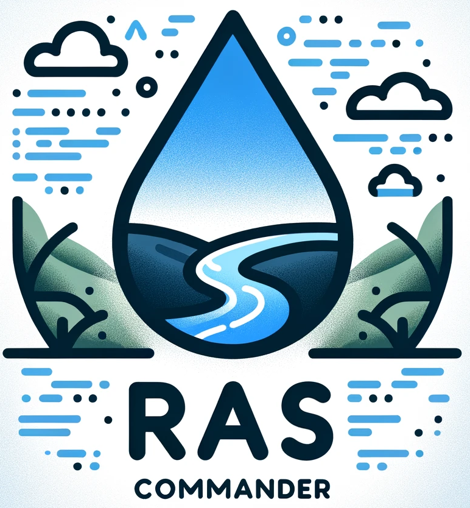
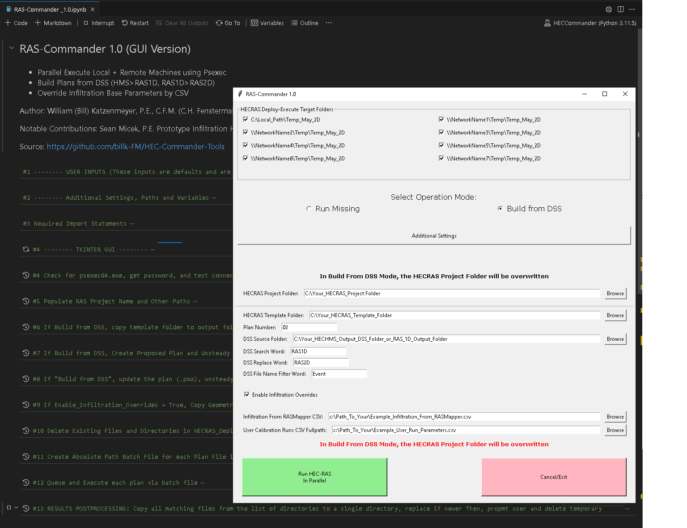
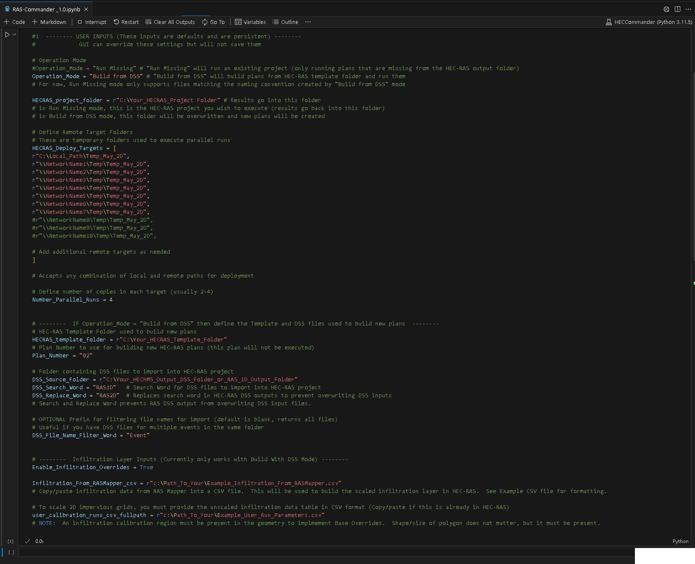
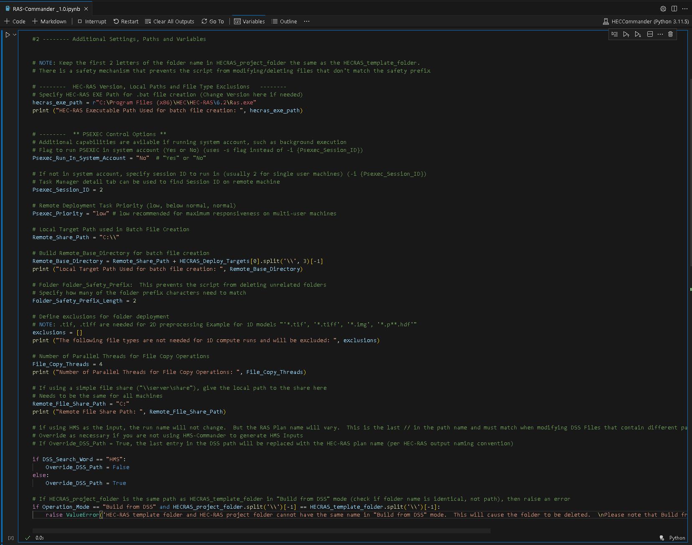
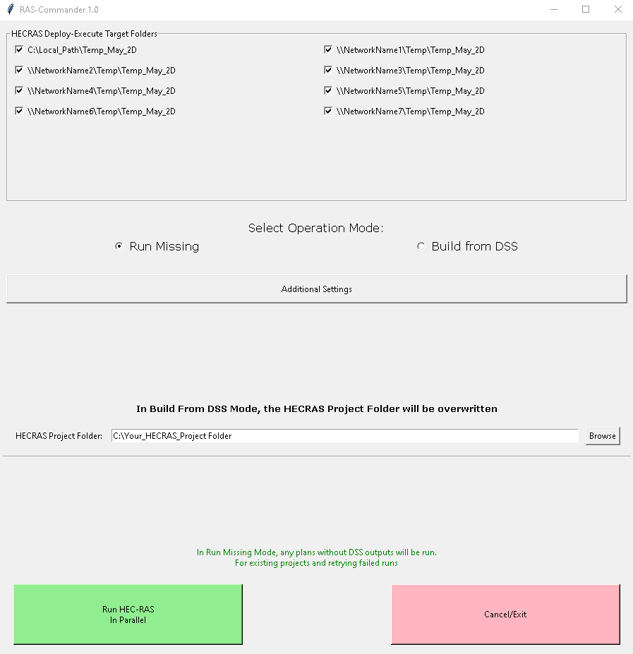
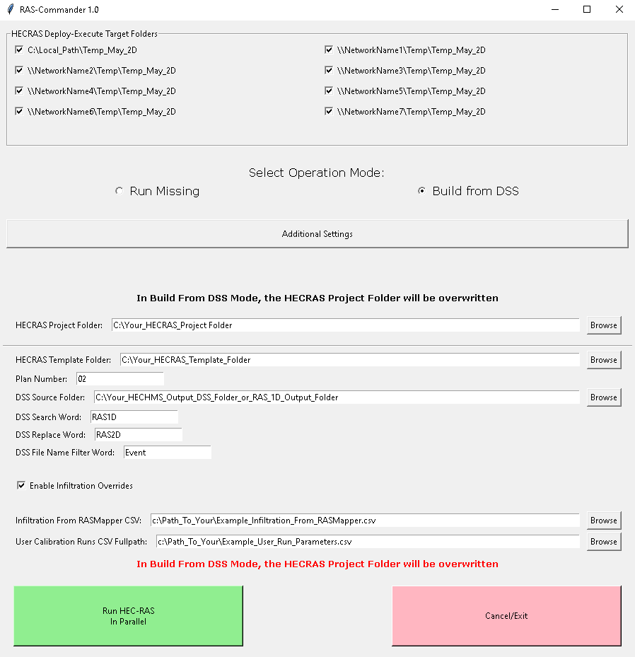
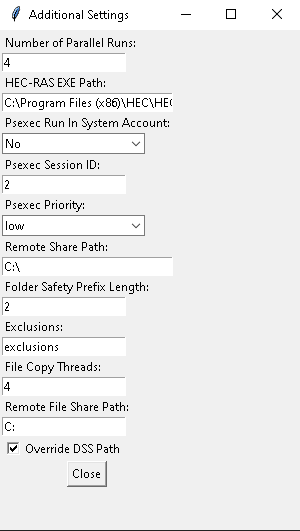

# RAS-Commander 1.0 (GUI Version)
## Jupyter Notebook Application for Parallel-Executing HEC-RAS Plans

---

<p align="center">
  
</p>

---

## Introduction

RAS-Commander has evolved to offer a more integrated and flexible solution for the parallel execution of HEC-RAS plans. This advanced tool is now encapsulated within a single Jupyter notebook, catering to various operational needs while maintaining the core functionality of efficiently managing HEC-RAS plans across multiple machines.

Prerequisites for using RAS-Commander include VSCode, Anaconda, and a Python 3.11 environment, in addition to the necessary network configurations for remote execution.

For detailed instructions and setup, please refer to the **[Quick Start Guide for RAS-Commander.pdf](./Quick%20Start%20Guide%20for%20RAS-Commander.pdf)**.

---

## Features

### Operational Modes
The new version introduces two primary operation modes:

1. **Run Missing**: Targets and executes plans that are missing from the HEC-RAS output folder within an existing project.
2. **Build from DSS**: Builds and executes plans from a HEC-RAS template folder based on DSS file inputs.

### User-Friendly Input Structure
The notebook begins with a user inputs section, allowing for a more organized and straightforward setup. These inputs, set as defaults, can be overridden through the GUI for enhanced flexibility.

---

## How to Run

1. Make sure you followed the [Quick Start Guide for RAS-Commander.pdf](./Quick%20Start%20Guide%20for%20RAS-Commander.pdf)**.
2. Download the updated script: **[RAS-Commander _1.0.ipynb](./RAS-Commander%20_1.0.ipynb)**
3. Open the notebook in VSCode.
4. Select the desired operation mode and update the necessary inputs.
5. Select the Python environment you want to use (from Quick Start)
6. Run the notebook to initiate the chosen operation.
7. Use GUI to review and edit input information before running. 

---

## Changelog

- **2024-02-13**: Integrated functionalities into a single notebook with "Run Missing" and "Build from DSS" modes; Improved user input structure for enhanced usability.

---

## RAS-Commander 1.0 User Inputs
User inputs should be placed in the first 2 cells of the notebook, "User Inputs" and "Additional Settings.  These values are then presented to the user in a GUI format, which allows non-persistent changes (to allow for testing without changing default values). 

Here is a screenshot showing notebook with all cells collapsed and the GUI visible:
<p align="center">
  
</p>

The User Inputs code cell is shown below: 
<p align="center">
  
</p>


The Additional Settings code Cell is shown below: 
<p align="center">
  
</p>

**The inputs in the first 2 code cells are treated as defaults and are persistent.** 


**The GUI can override these settings for a single run, but will not save them.**


**Operation Mode**

* `Operation_Mode`: This variable determines the operational mode of RAS-Commander. It can be set to either `"Run Missing"` or `"Build from DSS"`.

    * `"Run Missing"`: In this mode, RAS-Commander runs an existing project, executing only those plans that are missing from the HEC-RAS output folder.
      
      <p align="center">
        
      </p>

    * `"Build from DSS"`: This mode enables RAS-Commander to build plans from a HEC-RAS template folder and subsequently run them.
      
      <p align="center">
        
      </p>

    * `"Additional Settings"`: This option opens a GUI for editing additional settings.
      
      <p align="center">
        
      </p>


**General Inputs**

* `HECRAS_project_folder`: This variable specifies the path to the HEC-RAS project folder.
    * In `"Run Missing"` mode, this is the HEC-RAS project you wish to execute (results go back into this folder).
    * In `"Build from DSS"` mode, this folder will be overwritten with new plans created from the template folder.
* `HECRAS_Deploy_Targets`: This is a list of paths to remote target folders used to execute parallel runs during `"Build from DSS"` mode. These folders are temporary.
* `Number_Parallel_Runs`: This integer specifies the number of copies of each plan to run in parallel on each target machine.

**Inputs for "Build from DSS" Mode**

* `HECRAS_template_folder`: This variable specifies the path to the HEC-RAS template folder used to build new plans.
* `Plan_Number`: This string specifies the plan number in the template folder to use for building new plans. This plan itself will not be executed.
* `DSS_Source_Folder`: This variable specifies the path to the folder containing the DSS files to import into the HEC-RAS project.
* `DSS_Search_Word`: This string is used to search for DSS files to import.
* `DSS_Replace_Word`: This string is used to replace the search word in HEC-RAS DSS outputs to prevent overwriting DSS input files.
* `DSS_File_Name_Filter_Word` (optional): This string can be used to filter the names of DSS files for import. Only files containing this word will be imported.

**Infiltration Layer Inputs (for "Build from DSS" Mode only)**

* `Enable_Infiltration_Overrides`: This boolean variable controls whether to enable infiltration layer overrides.
* `Infiltration_From_RASMapper_csv`: This variable specifies the path to a CSV file containing infiltration data from RAS Mapper, used to build the scaled infiltration layer in HEC-RAS.
* `user_calibration_runs_csv_fullpath`: This variable specifies the path to a CSV file containing user-defined calibration runs (for scaling 2D impervious grids).

**Additional Settings**

* `hecras_exe_path`: This variable specifies the path to the HEC-RAS executable file.
* `Psexec_Run_In_System_Account`: This variable determines whether to run PSEXEC in the system account.
* `Psexec_Session_ID`: This variable specifies the Session ID to run PSEXEC in, if not running in the system account.
* `Psexec_Priority`: This variable sets the priority of the PSEXEC process.
* `Remote_Share_Path`: This variable specifies the local path corresponding to a simple remote file share.
* `Remote_Base_Directory`: This variable is constructed from `Remote_Share_Path` and used in batch file creation.
* `Folder_Safety_Prefix_Length`: This integer specifies the number of characters of the folder prefix that need to match for safety checks.
* `exclusions`: This list contains file extensions to exclude during folder deployment.
* `File_Copy_Threads`: This integer specifies the number of parallel threads to use for file copying.


## Example Infiltration Paramters from RASMapper
This CSV should be a direct copy/paste from RASMapper's Infiltration Layer:
```
ID,Name,Maximum Deficit,Initial Deficit,Potential Percolation Rate
0,NoData,0,0,0
1,1725696,0,0,0
10,1725684,10.49,4.11,0.57
11,1725716,15.45,6.31,0.6
12,1725726,17.47,5.25,0.34
```

# Example User Run Parameters


```
user_run_number_from_csv,initial_deficit_scale,maximum_deficit_scale,percolation_rate_scale,impervious_area_scale,recession_factor,initial_flow_area_ratio,threshold_flow_to_peak_ratio,time_of_concentration_scale,storage_coefficient_scale
1,0.9,1,0.5,1,0.1,1,0.1,1,1
2,1.15,1,0.5,1,0.1,1,0.1,1,1
3,1.1,1,0.5,1,0.1,1,0.1,1,1
4,1.05,1,0.5,1,0.1,1,0.1,1,1
```

Example_User_Run_Parameters.csv


## Contributing

Encounter any issues or have suggestions? Please open an issue on the GitHub repository or reach out to the author at billk@fenstermaker.com.

<p align="center">
  
</p>
