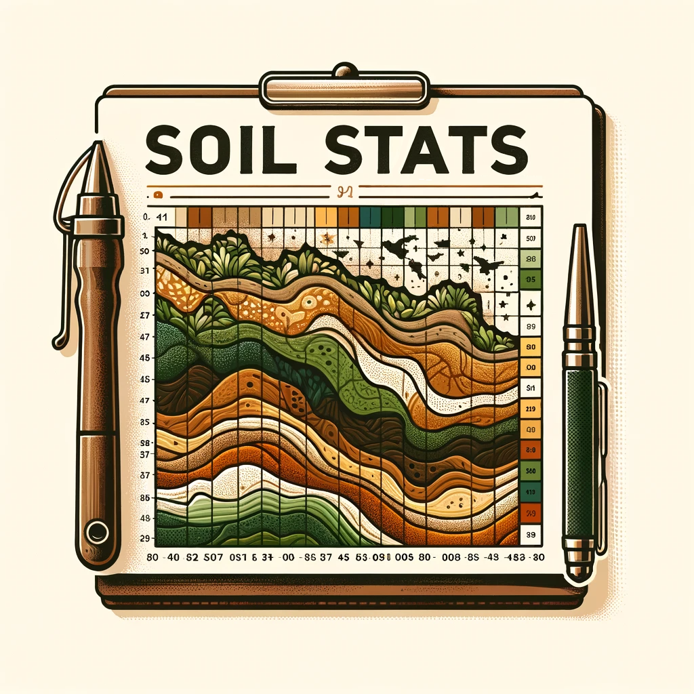

# Soil Stats Tool for RASMapper

  

## Overview
The "Soil Stats Tool for RASMapper" is a Python-based Jupyter Notebook designed to extend the capabilities of HEC-RAS's RASMapper by calculating detailed soil statistics for a specified watershed boundary. This tool is particularly useful in watershed and environmental studies where soil data analysis is essential. It processes geospatial data, including shapefiles and raster images, to provide insightful soil statistics.

## Features
- **Soil Type Analysis**: Calculates the area covered by each soil type (mukey) within the watershed.
- **Data Conversion**: Converts areas into different units (square meters, acres, square miles) and calculates their percentage in the total area.
- **Comprehensive Output**: Generates a detailed summary of soil statistics in a user-friendly CSV format.

## Prerequisites
- Python 3.x
- Jupyter Notebook

## Installation
1. Ensure Python 3.x and Jupyter Notebook are installed on your system.
2. Download or clone this repository to your local machine.
3. Open the Jupyter Notebook (Soil Stats Tool for RASMapper.ipynb) in your Jupyter environment.

## Usage
1. **Set User Inputs**:
   - Update the shp_path with the path to your watershed boundary shapefile.
   - Update the tif_path with the path to your infiltration raster file (TIFF format).
2. **Run the Notebook**:
   - Execute the cells in the notebook in sequence.
   - The script will automatically install any required dependencies.

## Input Files
- **Watershed Boundary Shapefile**: A single-part polygon shapefile representing the watershed boundary.
- **Infiltration Layer (TIFF format)**: A raster file representing soil infiltration data.

## Output Files
- **final_mukey_statistics.csv**: Contains the soil statistics with details like mukey, area percentages, and areas in different units.

